## TTS Pipeline

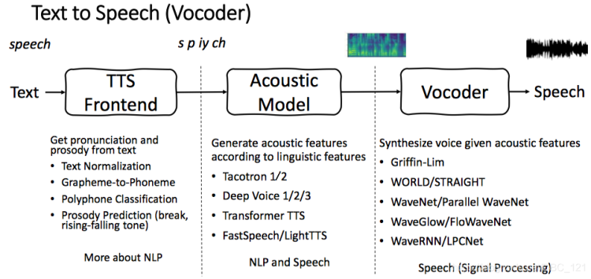

传统的TTS主要是通过组合多个模块构成流水线来实现的，整个系统可以大致分为frontend和backend。

- frontend        
    主要是文字处理，使用NLP技术，从离散到离散，包括基本的分词、text normalization、POS以及特有的pronunciation标注。     

    - segmentation & normalization         
        去噪、分句、分词以及把缩写、日期、时间、数字还有符号都换成可发音的词，这一步叫spell out。基本都基于规则
        
    - grapheme-to-phoneme     
        利用发音词典和规则，生成音素。音素一般利用ASCII编码，比如SAMPA和ARPAbet，这种编码在深度模型中也可以被支持。这里的一个问题是pronunciation一般基于上下文，因为上下文可能决定了词的词性等，比如read的过去式就有不同的读音
        
    - IPA(international Phonetic Alphabet)        
        是一个基于拉丁字母的语音标注系统。IPA只能表示口语的性质，比如因素，音调，音节等，如果还想要表示牙齿舌头的变动则还有一个extension IPA可以用。IPA中最基本两种字母是letter和diacritic(变音符号)，后者用来表示声调。IPA虽然统一了不同语言的发音，但是英语本身是stress language所以注音很少，而中文这样依赖于音调的语言就会包含很多音调。
        
    - intonation/stress generation
        这一步比较难，基本根据规则，或者构造统计模型
        
前端和后端基本独立。

- backend
    根据前端结果生成语音，从离散到连续,神经网络就是最新的参数模型                                 

## Extracting Features

### Pre-Emphasis

首先，在信号上施加预加重滤波器，以放大高频。    

$y(t)=x(t)-\alpha x(t-1)$, $\alpha$ 一般取0.95 or 0.97

作用：

1. 平衡频谱，因为高频通常比低频具有较小的幅度

2. 避免傅里叶变换过程中出现数值问题

3. 可以改善信噪比(SNR:Signal-to-Noise Ratio)      

### Time-domain features

- Amplitude envelope(AE)
    
    1. Max amplitude value of all samples in a frame      
        Amplitude envelope at frame t: 
        $$ AE_t=\max_{k=t\cdot K}^{(t+1)\cdot K-1}s(k) $$ 
        K:frame size     
        s(k): Amplitude of kth sample      
        t.K: First sample of frame t       
        (t+1).K-1: last sample of frame t .   
    2. Gives rough idea of loudness
    
    3. Sensitive to outliers
    
    4. Onset detection, music genre classification

```   
FRAME_SIZE = 1024
HOP_LENGTH = 512

def amplitude_envelope(signal, frame_size, hop_length):
    """Calculate the amplitude envelope of a signal with a given frame size nad hop length."""
    amplitude_envelope = []
    # calculate amplitude envelope for each frame
    for i in range(0, len(signal), hop_length): 
        amplitude_envelope_current_frame = max(signal[i:i+frame_size]) 
        amplitude_envelope.append(amplitude_envelope_current_frame)
    return np.array(amplitude_envelope)    

def fancy_amplitude_envelope(signal, frame_size, hop_length):
    """Fancier Python code to calculate the amplitude envelope of a signal with a given frame size."""
    return np.array([max(signal[i:i+frame_size]) for i in range(0, len(signal), hop_length)])
```

- Root-mean-square energy(RMS)   

    1. RMS of all samples in a frame          
        $RMS_t=\sqrt{\frac{1}{K}\cdot \sum_{k=t\cdot K}^{(t+1)\cdot K-1}s(k)^2}$                
        $\sum_{k=t\cdot K}^{(t+1)\cdot K-1}s(k)^2$: sum of energy of samples in frame t         
    
    2. Indicator of loudness
    
    3. Less sensitive to outliers than AE
    
    4. Audio segmentation(音频分割), music genre(流派) classification
    ```
    rms_debussy = librosa.feature.rms(debussy, frame_length=FRAME_SIZE, hop_length=HOP_LENGTH)[0]
    ```
    ```
    def rmse(signal, frame_size, hop_length):
        rmse = []
        
        # calculate rmse for each frame
        for i in range(0, len(signal), hop_length): 
            rmse_current_frame = np.sqrt(sum(signal[i:i+frame_size]**2) / frame_size)
            rmse.append(rmse_current_frame)
        return np.array(rmse)    
    ```

- Zero-crossing rate(ZCR)  

    1.Number of times a signal crosses the horizontal axis     
    $ZCR_t=\frac{1}{2}\cdot \sum_{k=t\cdot K}^{(t+1)\cdot K-1}|sgn(s(k))-sgn(s(k+1))|$  sgn:sign function
    
    2. Recognition of percussive(打击乐) vs pitched sounds
    
    3. Monophonic pitch estimation
    
    4. Voice/unvoiced decision for speech signals
    ```
    zcr_debussy = librosa.feature.zero_crossing_rate(debussy, frame_length=FRAME_SIZE, hop_length=HOP_LENGTH)[0]
    ```
### Frames

- Perceivable(可感知的) audio chunk1 
    sample@44.1kHz=0.0227ms duration 1 sample << Ear's time resolution(10ms)
    
    Power of 2 num. samples (speed up the process a lot) df:duration   
    $d_f=\frac{1}{s_r}\cdot K$                                                                        
    
音频在量化得到二进制的码字后，需要进行变换，而变换（MDCT）是以块为单位（block）进行的，一个块由多个（120或128）样本组成。而一帧内会包含一个或者多个块。帧的常见大小有960、1024、2048、4096等。一帧记录了一个声音单元，它的长度是样本长度和声道数的乘积。                            

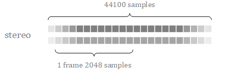

The larger analysis frame means we're able to be less precise about where in time that analysis applies to , so we get lower time resolution, so it's going to be a trade-off.

**From time to frequency domain**

Use Fourier transform,we can move from time into frequency domain but unfortunately there's a major issue which is called spectral leakage

### Spectral leakage

- Processed signal isn't an integer number of periods

- Endpoints(端点) are discontinous                         

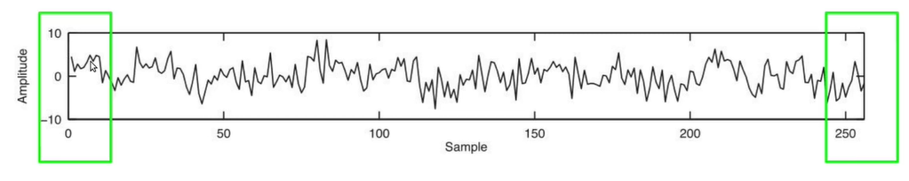
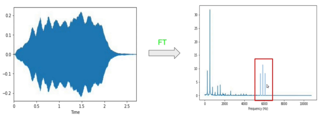

- Discontinuities appear as high-frequency components not present in the original signal,some of this discontinuities frequencies at the discontinuities are just like leaked into other higher frequencies.

**Solve the spectral leakage use windowing**

### Windowing

- Apply windowing function to each frame before we feed the frames into the FT 

- Eliminates samples at both ends of a frame

- Generates a periodic signal which minimizes special leakage 

**Why not using rectangular window functions?**

We're accidentally introduced something into the signal that wasn't there in the original, that is the sudden changes(突变) at the edge of the signal. If we analysed this signal we'd not only be analysing the speech but also those artefacts. So we don't generally use rectangular window functions because these artefacts are bad, but rather we use tapered(锥形) windows. It doesn't have those sudden discontinuous at the edges.

#### Hann window      

$w(k)=0.5\cdot(1-cos(\frac{2\pi k}{K-1})),k=1,...K$    

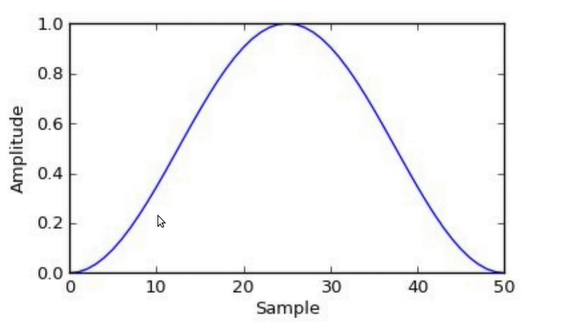
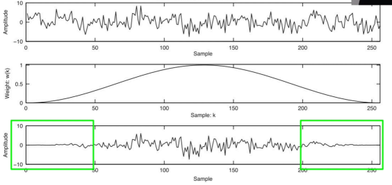
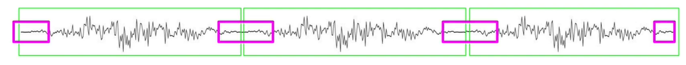

3 frames,we find the endpoints of frame lose signal,how we solve this? overlapping!     

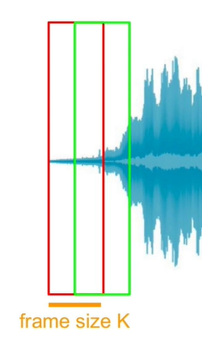 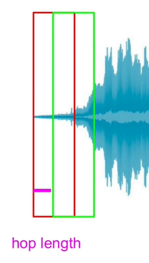

**When converting a waveform to a sequence of frames, why is the frame shift usually smaller than the frame duration?  (不懂)**

Because a tapered window is applied to each frame.

**How can series expansion be used to remove high-frequency noise from a waveform?**

By truncating the series, which means setting to zero the coefficients of all the basis functions above a  frequency of our choosing.

**In Fourier analysis, what are the frequencies of the lowest and highest basis functions?**

The lowest frequency basis function has a fundamental period equal to the analysis frame duration. The highest frequency basis function is at the Nyquist frequency.  

>**傅里叶相关理论知识在傅里叶相关知识里说明**

### FT(Fourier transform)

**Intuition**

- Decompose a complex sound into its frequency components, We can make any complex wave by adding together sine waves. 

- Compare signal with sinusoids of various frequencies

将时域上的信号转变为频域上的信号，看问题的角度也从时间域转到了频率域，因此在时域中某些不好处理的地方，在频域就可以较为简单的处理，这就可以大量减少处理信号计算量。信号经过傅里叶变换后，可以得到频域的幅度谱(magnitude)以及相位谱(phase)，信号的幅度谱和相位谱是信号傅里叶变换后频谱的两个属性。

在分析信号时，主要应用于处理平稳信号，通过傅里叶变换可以获取一段信号总体上包含哪些频率的成分，但是对各成分出现的时刻无法得知。因此对于非平稳信号，傅里叶变换就显示出了它的局限性，而我们日常生活中的绝大多数音频都是非平稳信号的。而解决这一问题的方法，就是采用短时傅里叶变换或者小波变换，对信号进行处理

### DFT(Discrete Fourier transform)

$$\hat{g(f)}=\int g(t)\cdot e^{-i2\pi ft}dt $$
----------> $$\hat {x(f)}=\sum_n x(n)\cdot e^{-i2\pi fn}=\hat{x}(k/N)=\sum_{n=0}^{N-1}x(n)\cdot e^{-i2\pi n \frac{k}{N}}$$ 
其中$k=[0,M-1]=[0,N-1]$

#frequencies(M)=#samples(N)

**why M=N?**
Invertible transformation,computational efficient

**Redundancy in DFT (Nyquist Frequency)**

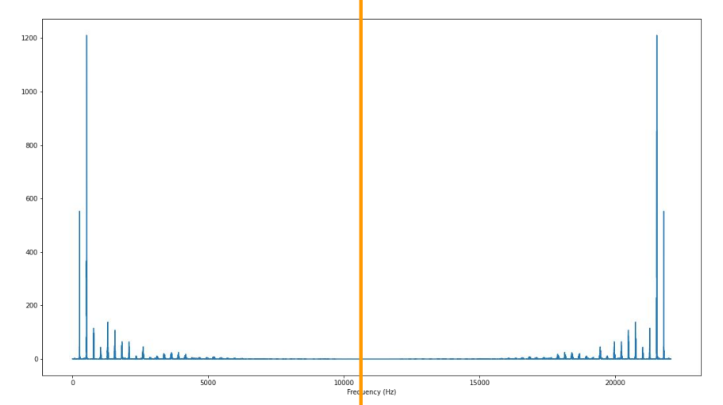

### FFT(Fast Fourier Transform)

- DFT is computationally expensive $(N^2)$ 

- FFT is more efficient $(N\text{log}_2 N)$ 

- FFT exploits redundancies across sinusoids

- FFT works when N is a power of 2

```
# fast fourier transform
violin_ft = np.fft.fft(violin_c4)
magnitude_spectrum_violin = np.abs(violin_ft)

def plot_magnitude_spectrum(signal, sr, title, f_ratio=1):
    X = np.fft.fft(signal)
    X_mag = np.absolute(X)
    
    plt.figure(figsize=(18, 5))
    
    f = np.linspace(0, sr, len(X_mag))
    f_bins = int(len(X_mag)*f_ratio)  
    
    plt.plot(f[:f_bins], X_mag[:f_bins])
    plt.xlabel('Frequency (Hz)')
    plt.title(title)
   
plot_magnitude_spectrum(violin_c4, sr, "violin", 0.1)
```
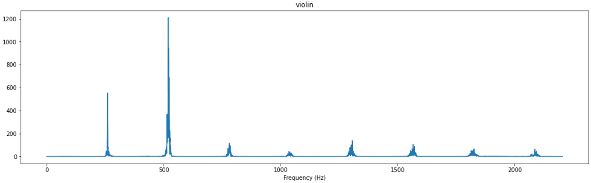


### STFT

#### Windowing

Apply windowing function to signal $x_w(k)=x(k)\cdot w(k)$

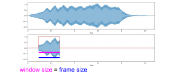

overlapping frames

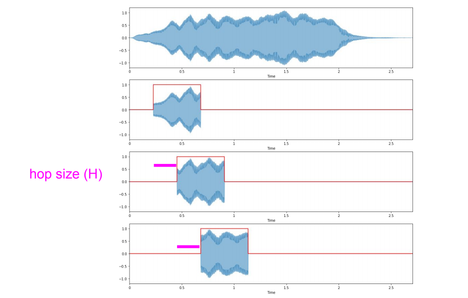

#### From DFT to STFT                                                               

$$\hat{x}(k)=\sum_{n=0}^{N-1}x(n)\cdot e^{-i2\pi n \frac{k}{n}}$$
$$ S(m,k)=\sum_{n=0}^{N-1}x(n+mH)\cdot w(n)\cdot e^{-i2\pi n \frac{k}{N}}$$

m:frame number     
n: frame size    
w(n):windowing function

#### Outputs

we get a fourier coefficient for each of the frequency components we're decomposed our original signal into and this is a one dimensional array it's just like a vector.

DFT

- Spectral vector(#frequency bins)

- N complex Fourier coefficents

STFT

- we get a complex fourier coefficient for each frequency bin that we are considering for each frame.Spectral matrix (#frequency bins, #frames)
    frequency bins=framesize/2 + 1     
    frames=(samples-framesize)/hopsize + 1
- Complex Fourier coefficients#Extracting Short-Time Fourier Transform

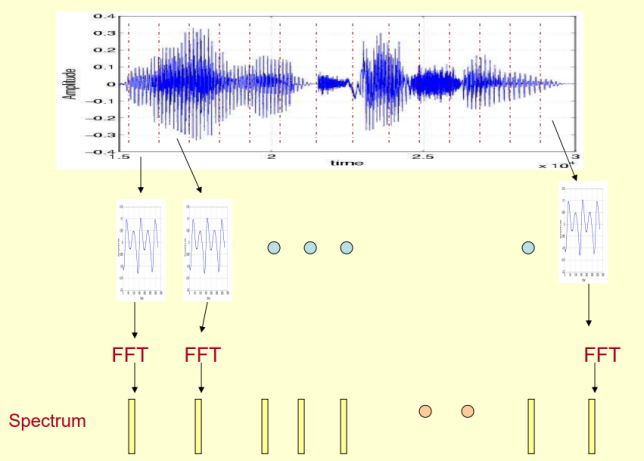

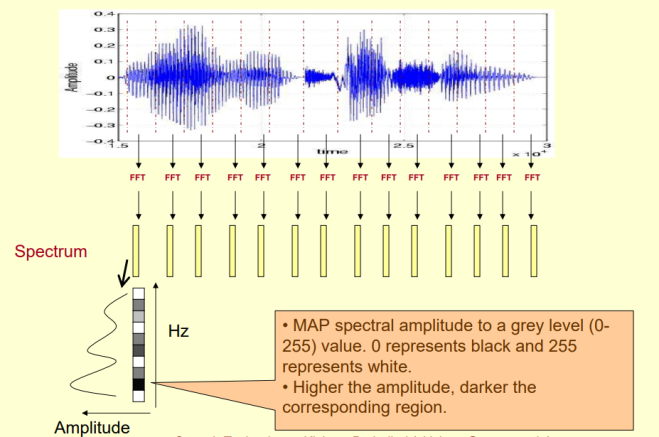

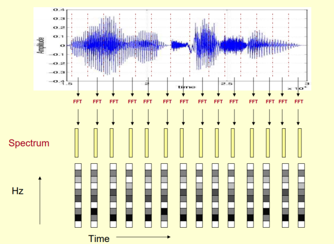

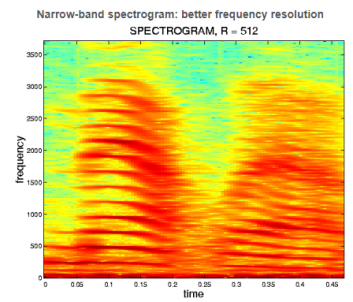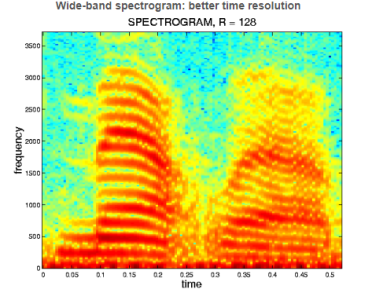
```
FRAME_SIZE = 2048
HOP_SIZE = 512
S_scale = librosa.stft(scale, n_fft=FRAME_SIZE, hop_length=HOP_SIZE)
#S_scale.shape=(1025, 342)

#Calculatiing the spectrogram
Y_scale = np.abs(S_scale) ** 2  #Y_scale.shape=(1025, 342)

#Visualizing the spectrogram 
def plot_spectrogram(Y, sr, hop_length, y_axis="linear"):
    plt.figure(figsize=(25, 10))
    librosa.display.specshow(Y, 
                             sr=sr, 
                             hop_length=hop_length, 
                             x_axis="time", 
                             y_axis=y_axis)
    plt.colorbar(format="%+2.f")
plot_spectrogram(Y_scale, sr, HOP_SIZE)
```

Linear spectrogram

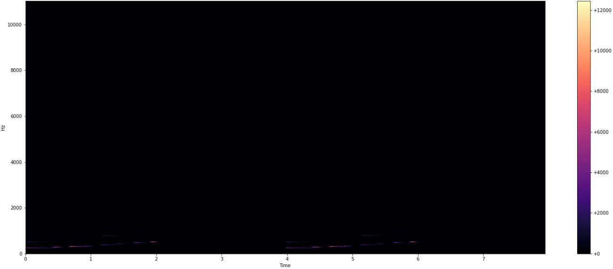

```
Y_log_scale = librosa.power_to_db(Y_scale)
plot_spectrogram(Y_log_scale, sr, HOP_SIZE, y_axis="log")
```
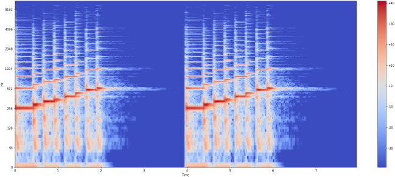

#### Time/frequency trade off

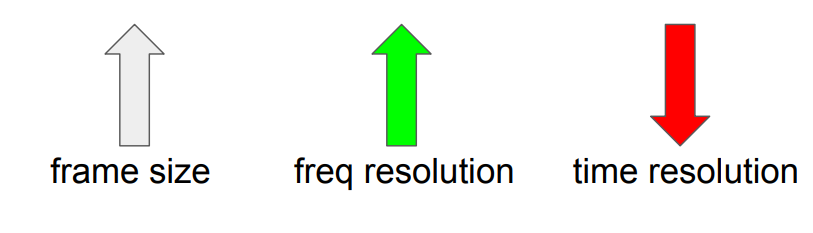
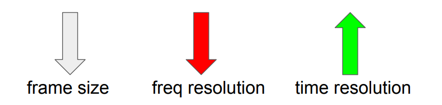

#### STFT parameters

Frame size: 一般选为256,512,1024,2048,4096

hop size: 一般为1/2 ,1/4, 1/8 framesize

Windowing function: hann window

#### Visualising sound

$$ Y(m,k)=|S(m,k)|^2$$

#### Linear-Spectrogram

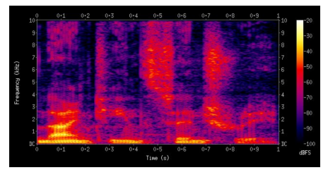

### Mel-Spectrograms

- Time-frequency representation
- Perceptually-relevant amplitude representation
- Perceptually-relevant frequency representation

#### Mel scale

Mel scale(梅尔标度):人耳能听到的频率范围是20-20000Hz，但人耳对Hz这种标度单位并不是线性感知关系

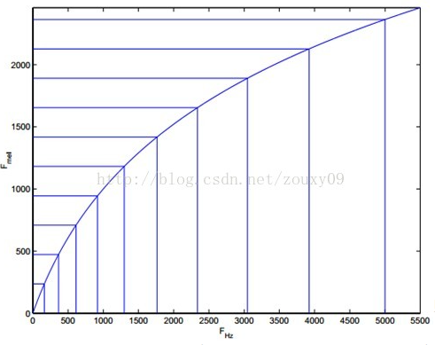

让我们观察一下从Hz到mel的映射图，由于是log的关系，当频率较小时，mel随Hz变化较快；当频率很大时，mel的上升很缓慢，曲线的斜率很小。这说明了人耳对低频音调的感知较灵敏，在高频时人耳是很迟钝的。如果将普通的频率标度转化为梅尔频率标度，则人耳对频率的感知度就成了线性关系。线性频率标度映射到梅尔频率标度公式为：

$$ m=2595log_{10}(1+\frac{f}{500})$$

$$ f=700(10^{\frac{m}{2595}}-1)$$                                                                                      
梅尔标度滤波器组启发于此。

#### Mel filter banks

1. Convert lowest/highest frequency to Mel

2. Create #bands equal spaced pointed(等间距)

3. Convert points back to Hertz  $f=700(10^{\frac{m}{2595}}-1)$

4. Round to nearest frequency bin 

5. Create triangular filters(the kind of building blocks of a mel filter bank)

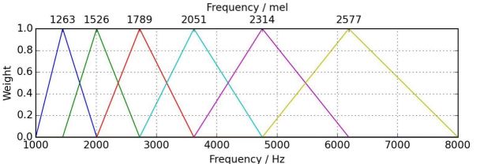

**Filter**:滤波器是具有频率选择作用的电路(模拟滤波)或运算处理系统(数字滤波)，具有滤除噪声和分离各种不同信号的功能。    
按功能分：低通 高通 带通 带阻      
最后应用triangular filters计算滤波器组(filter banks)，通常用40个滤波器nfilt=40 on a Mel-scale to the power spectrum to 提取频带(frequency bands). 

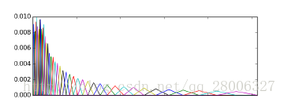

如上图所示，40个三角滤波器组成滤波器组，低频处滤波器密集，门限值大，高频处滤波器稀疏，门限值低。恰好对应了频率越高人耳越迟钝这一客观规律。上图所示的滤波器形式叫做等面积梅尔滤波器（Mel-filter bank with same bank area），在人声领域（语音识别，说话人辨认）等领域应用广泛，但是如果用到非人声领域，就会丢掉很多高频信息。这时我们更喜欢的或许是等高梅尔滤波器（Mel-filter bank with same bank height）：


通过梅尔滤波器组将线性频谱转为梅尔频谱

#### Recipe to extract Mel spectrogram

1. Extract STFT  

2. Convert amplitude to DBs

3. Convert frequencies to Mel scale      
    - a.Choose number of mel bands(超参数)    
    - b.Construct mel filter banks,Mel filter bands' matrix shape:M=(#band, framesize/2+1)      
    - c.Apply mel filter banks to spectrogram, Y=(framesize/2+1, #frames)    
    **Mel spectrogram=MY=(#bands,#frames)**
```    
#Mel filter banks
filter_banks = librosa.filters.mel(n_fft=2048, sr=22050, n_mels=10) # shape=(10, 1025)

plt.figure(figsize=(25, 10))
librosa.display.specshow(filter_banks, 
                         sr=sr, 
                         x_axis="linear")
plt.colorbar(format="%+2.f")
plt.show()
```

Mel filter banks 

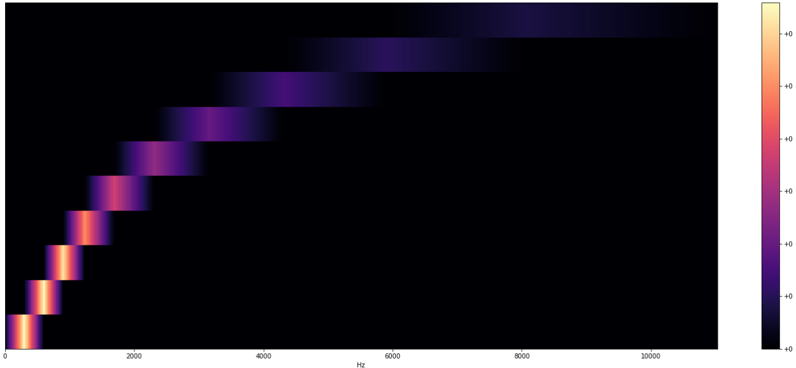

```
#Extracting Mel Spectrogram
#mel_spectrogram.shape=(10, 342)
mel_spectrogram = librosa.feature.melspectrogram(scale, sr=sr, n_fft=2048, hop_length=512, n_mels=10)
log_mel_spectrogram = librosa.power_to_db(mel_spectrogram)

plt.figure(figsize=(25, 10))
librosa.display.specshow(log_mel_spectrogram, 
                         x_axis="time",
                         y_axis="mel", 
                         sr=sr)
plt.colorbar(format="%+2.f")
plt.show()
```
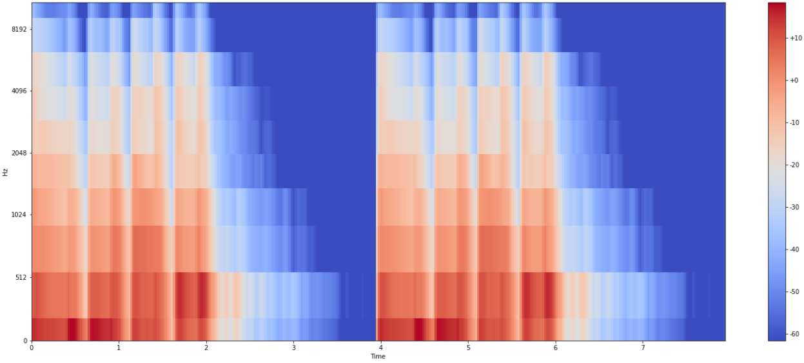

#### Mel Frequency Cepstral Coefficient(MFCC)

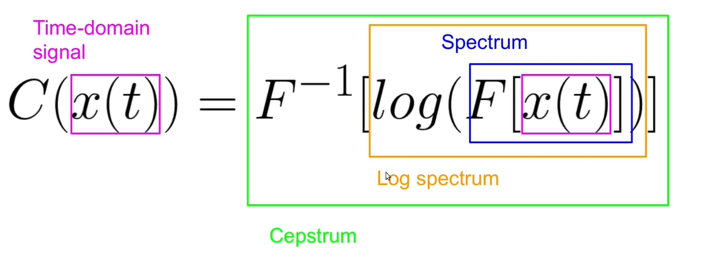

**spectrum of a spectrum=cepstrum**

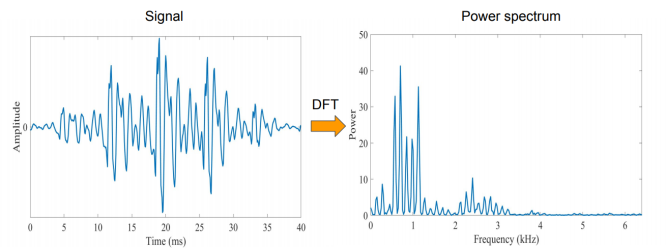
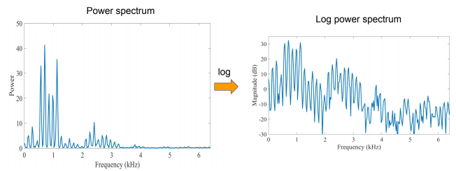

we can treat this log power spectrum as a signal at a time domain signal and we apply a inverse discrete fourier transform and we get the spectrum which is the spectrum of a spectrum.

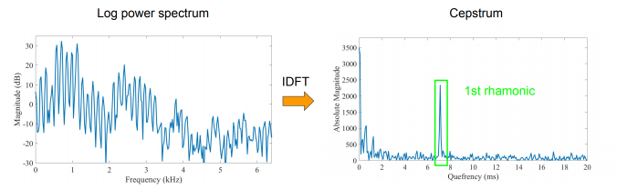

### Understanding the Cepstrum

#### Speech generation

The main point to understand about speech is that the sounds generated by a human are filtered by the shape of the vocal tract including tongue, teeth etc. This shape determines what sound comes out. If we can determine the shape accurately, this should give us an accurate representation of the phoneme being produced. The shape of the vocal tract(声带) manifests(表明) itself in the envelope(包络线) of the short time power spectrum(功率谱), and the job of MFCCs is to accurately represent this envelope. 

#### Separating the components

speech signal = Glottal pulse + vocal tract(声带)， vocal tract acts as a filter on the glottal pulse


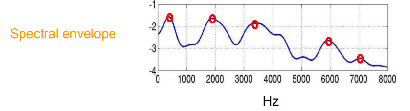

This picks in red are called formants(共振峰)，formats carry identity of sound(timbre), you're perceive certain phonemes instead of others in other words,the spectral envelope provide us information about timbre.

Log-spectrum - Spectral envelope


**Speech = Convolution of vocal tract frequency response with glottal pulse.**
**Formalising speech**

$$ x(t)=e(t)\cdot h(t) \longrightarrow X(t)=E(t)\cdot H(t)$$

**fourier transfrom**

$$ log(X(t))=log(E(t)\cdot H(t))=log(X(t))=log(E(t))+log(H(t))$$  
$log(X(t))$: log-spectrum     
$log(H(t))$: spectral envelope       
$log(E(t))$: glottal pulse

Decompose that signal into its queferancy components and see how presence of the different frequency components are.         
4Hz                                   100Hz             
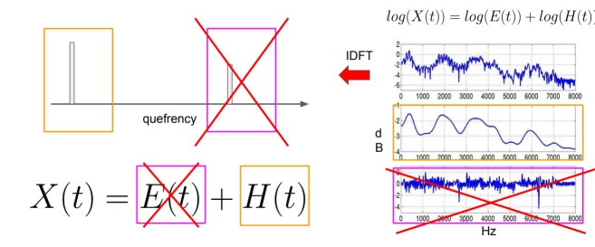

the low quefrency values represent the slowly change spectral information in speech spectral signal.

#### Computing Mel-Frequency Cepstral Coefficients    

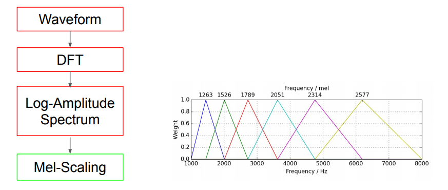
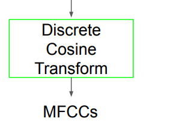

Using the discrete cosine transform instead of the inverse fourier transform,.we get a number of coefficients(mfcc).

**Why?**

- Simplified version of Fourier Transform

- Get real-valued coefficient  (discrete fourier transform get complex-valued coefficient)

- Decorrelate energy in different mel bands

- Reduce #dimensions to represent spectrum

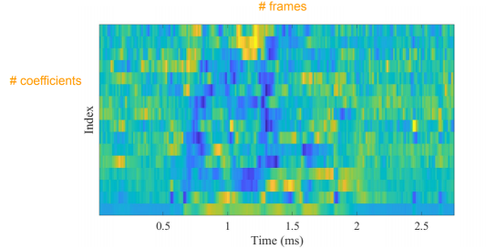

#### MFCCs advantage

Describe the "large" structures of the spectrum,we take like the first mfcc's which focusing on the spectral envelope on the formants about phonemes. Ignore fine spectral structures. Work well in speech and music processing.
```
#Extract MFCCs
mfccs = librosa.feature.mfcc(signal, n_mfcc=13, sr=sr )

#calculate the first and second derivatives of the mfcc's
delta_mfccs = librosa.feature.delta(mfccs)
delta2_mfccs = librosa.feature.delta(mfccs, order=2)

comprehensive_mfccs = np.concatenate((mfccs, delta_mfccs, delta2_mfccs))
```
### Extracting frequency-domain features

#### Math conventions 

- $m_t(n):$ Magnitude of signal at frequency bin n and frame t.

- N: #frequency bins

#### Band energy ratio

- Comparison of energy in the lower/higher frequency bands

- Measure of how dominant low frequencies are 
$$BER_t=\frac{\sum_{n=1}^{F-1}m_t(n)^2}{\sum_{n=F}^{N}m_t(n)^2}$$ 
F: split frequency, 一般取2000Hz

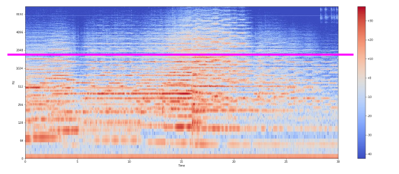

#### Band energy ratio applications

(1)Music/speech discrimination      
(2)Music classification(eg.music genre classification)         
```
debussy_spec.shape=(1025, 1292)  # the spectrum of debussy audio
debussy_spec_transpose = debussy_spec.T   #(1292, 1025)
#1025:the number of freqency bins
#Calculate Band Energy Ratio
def calculate_split_frequency_bin(spectrogram, split_frequency, sample_rate):
    frequency_range = sample_rate / 2
    frequency_delta_per_bin = frequency_range / spectrogram.shape[0]
    #mapping this continuous frequency onto the closest frequency being available
    #np.floor:10.4->10.0, 10.9->10.0
	split_frequency_bin = np.floor(split_frequency / frequency_delta_per_bin)
    return int(split_frequency_bin)

split_frequency_bin = calculate_split_frequency_bin(debussy_spec, 2000, 22050) #185
```
```
def calculate_band_energy_ratio(spectrogram, split_frequency, sr):
    split_frequency_bin = calculate_split_frequency_bin(spectrogram, split_frequency, sr)
    # move to the power spectrogram
    power_spec = np.abs(spectrogram) ** 2
    power_spec = power_spec.T
    
    band_energy_ratio = []
    
    #calculate BER for each frame
    for frequencies_in_frame in power_spec:
        sum_power_low_frequencies = np.sum(frequencies_in_frame[:split_frequency_bin])
        sum_power_high_frequencies = np.sum(frequencies_in_frame[split_frequency_bin:])
        ber_current_frame = sum_power_low_frequencies / sum_power_high_frequencies
        band_energy_ratio.append(ber_current_frame)
    return np.array(band_energy_ratio)

ber_debussy = calculate_band_energy_ratio(debussy_spec, 2000, sr)
frames = range(len(ber_debussy))
t = librosa.frames_to_time(frames, hop_length=HOP_SIZE)
plt.figure(figsize=(25, 10))

plt.plot(t, ber_debussy, color="b")
```
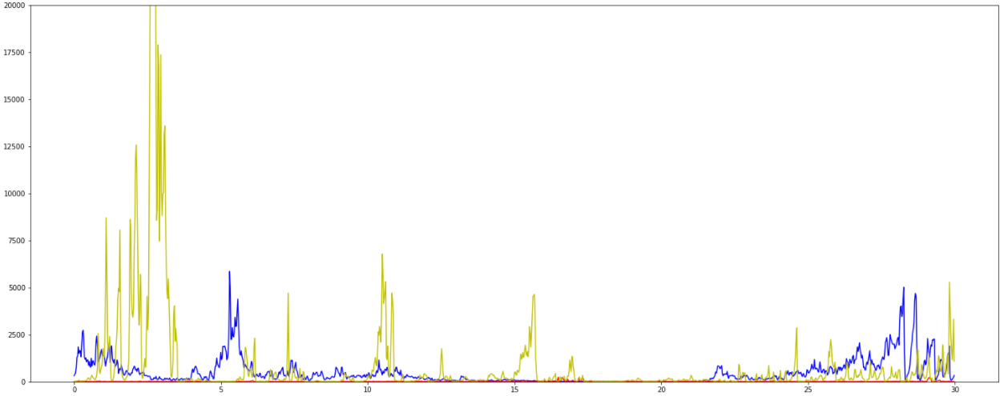

#### Spectral centroid(谱质心)

- Centre of gravity of magnitude spectrum, weighted mean of the frequencies

- Frequency band where most of the energy is concentrated

- Measure of "brightness" of sound
$$SC_t=\frac{\sum_{n-1}^{N}m_t(n)\cdot n}{\sum_{n-1}^{N}m_t(n)}$$
n: frequency bin  
$m_t(n)$: weight of n

**Spectral centroid applications**

(1)Audio classification       
(2) Music classification         
```
sc_debussy = librosa.feature.spectral_centroid(y=debussy,sr=sr,n_fft=FRAME_SIZE,hop_length=HOP_SIZE)
```
#### Bandwidth

- Derived from spectral centroid

- Spectral range around the centroid

- Variance from the spectral centroid

- Describe perceived timbre

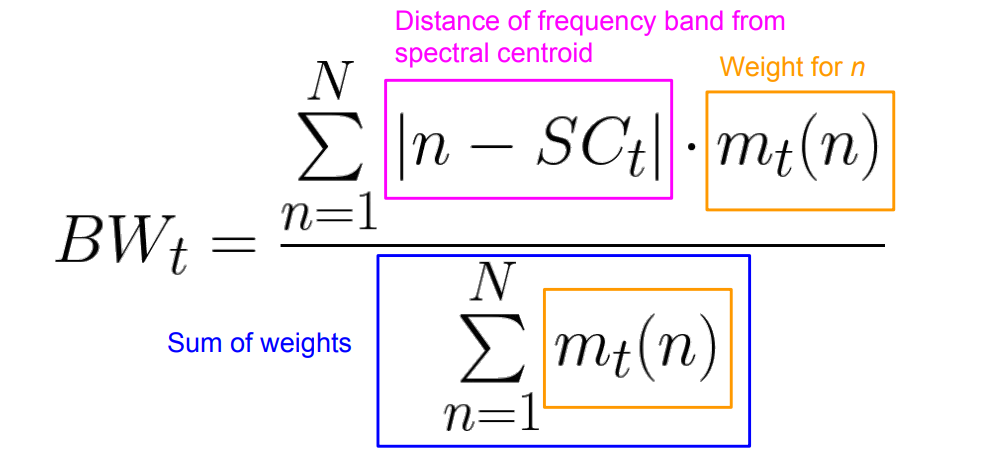

Energy spread across frequency band(spectral spread) upper , $BW_t$ upper, Energy spread across frequency band lower , $BW_t$ lower.

##### Bandwidth applications

Music processing(eg. music genre classification)
```
ban_debussy = librosa.feature.spectral_bandwidth(y=debussy, sr=sr, n_fft=FRAME_SIZE, hop_length=HOP_LENGTH)[0]
```