# Basics knowledge of TTS

## Foundations for Speech Processing

1.Get the signal into digital form.This involves converting an analogue(continuous) value into digital(discrete) one. Discretization(离散化) in time is called sampling and discretization in amplitude is called quantisation(量化).
2.Analyse the signal in some way, and for signals that change over time, that requires short-term analysis.

### 1.Sampling

Sampling is the process of recording the amplitude of a signal only at specific moments in time.(generally, the means a fixed number of times per second, evenly spaced in time(间隔均匀)). Each recorded value is called a sample.

- Time axis: the sound pressure is sampled at fixed intervals(thousands of time per second)

- Vertical axis: continuous value(representing sound pressure) is encoded as one of a fixed number of discrete levels.

### 2.Quantisation

Quantisation is the process of storing the amplitude of each sample with a fixed precision(generally, that means as a binary number with a fixed number of bits)
**Sampling rates,bit rate and bit depth(采样位数，位深度，分辨率)**

bit rate:	每秒传输速度

- The Nyquist frequency: represent frequencies up to half the sampling frequency.
    eg: To capture frequencies up to 8kHz we must sample at (a minimum of) 16kHz.Whenenver we sample on analogue signal, we must first remove all frequencies above the Nyquist frequency, otherwise we'll get aliasing.
    
    Alias(混叠)：采样率过低时，信号在频域上会出现混叠，混叠的信号无法复原：即你可以知道1+1=2但不能知道2=1+1，为了最好的复原信号就是让两个信号不出现混叠。
    
- Resolution = num.of bits
- CDs use a 44.1kHz sampling rate.
- Current studio equipment records at 48,96, or 192kHz.
- Each sample is represented as a binary number.
- Number of bits in this number determines number of different amplitude levels we can represent
- Most common bit depth is 16 bits  
    - $2^16 = 65536$ (-32768，+32767）
    
IPA: The International Phonetic Alphabet Keyboard

### 采样位数, 采样率, 比特率

采样位数主要针对的是信号的**强度特性**，采样率针对的是信号的**时间（频率）**特性这是两个不一样的概念。

把量化所得的结果，即单个声道的样本，以二进制的码字进行存放

大多数格式的PCM样本数据使用整型来存放，而在对一些对精度要求高的应用方面，则使用浮点型来表示PCM 样本数据.

在pre-emphasis之后，我们需要将信号切分成短时帧。

理论依据：信号的频率是随着时间改变的，在大多数情况下，将整个信号进行傅里叶变换是没有意义的。为了避免这个问题，我们假设信号在短时间内是固定不变的，因此在短时间内做傅里叶变换我们可以通过连接相邻帧来得到一个好的近似信号频率轮廓

**采样率，采样位数，比特率三者之间的关系**

譬如 "Windows XP 启动.wav" 的文件长度是 424,644 字节, 它是 "22050HZ / 16bit / 立体声" 格式(这可以从其 "属性->摘要" 里看到),那么它的每秒的传输速率(位速, 也叫比特率、取样率)是 $22050 \times 16 \times 2 = 705600(bit/s)$, 换算成字节单位就是 $705600/8 = 88200$(字节/秒), 播放时间：424644(总字节数) / 88200(每秒字节数) ≈ 4.8145578(秒)。但是这还不够精确, 包装标准的 PCM 格式的 WAVE 文件(\*.wav)中至少带有 42 个字节的头信息, 在计算播放时间时应该将其去掉, 所以就有：$(424644-42) / (22050*16*2/8) ≈ 4.8140816 $(秒). 这样就比较精确了。也就是：（文件总大小 - 头信息）/ (采样率 * 采样位数 * 通道数 / 8) [也就是比特率] ≈ 文件时长。

### Phonetics

声道(vocal tract)、软颚(palate，即将嘴的上半部分和鼻子分开的部分)、口腔(oral cavity)和舌头(lip)等器官，这些器官相当于一个大的滤波器，调整了原始声波的频率，从而生成了最终的语音。

- phone/sound
    任何清晰的语音都是phone/sound

- phoneme音素
    能区分意义的最小声音单元，如dog和fog中，d和f只要改变一个就改变了意义
    
- voiced/unvoiced
    voiced:汉语一般称这个为浊音，发音时声带震动为浊音。辅音有清有浊，而多数语言中的元音均为浊音，鼻音、边音、半元音也是浊音。
    
    unvoiced:清音，简单来说，发清音时声带不振动，因此**清音没有周期性**。如：[p]pea豌豆、[t]tea茶、[k]key钥匙、[f]fat肥胖、[s]seat座位
    
- vowel元音
    Sound produced with open vocal tract(声道)，一般都是voiced，元音的清晰度主要取决于声道的形状
    
- consonant辅音
    Sound produced with (partially) closed vocal tract，辅音可以是清音也可以是浊音（voice/voiceless)。辅音的质量同样取决于声道关闭的形状，且有很多种类的发音
    
    - 爆破音Stops/plosives: total closing + “explosive” release，比如p
    
    - 鼻音Nasals：停止的时候鼻腔会张开, 比如n
    
    - 摩擦音fricatives：声道半张半开，因此产生震动，比如s, z
    
    - 半元音approximants：发音时声道先闭合然后再张开，比如w, j

### 语音的频率

- pitch
    pitch is a part of a collection of other acoustic features that speakers use, which collectively we call prosody.声音的尖锐程度，在频域中表现为频率的高低。
    Periodic signals are perceived as(被认为) having a pitch(音调). That means that periodic signals are perceived as having a musical note: a tone. Pitch is a perceptual phenomenon(感知现象). The physical property of fundamental frequency(基频) relates to the perceptual quantity of pitch.

    The physical signal property and the perceptual property pitch is not linear, actually logarithmic.
    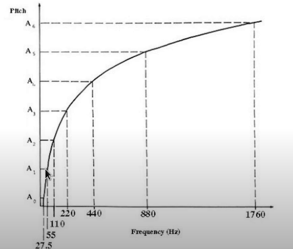

    Because there's a very simple relationshion between fundamental frequency and pitch.But that's not technically correct! They are not the same thing. The fundamental frequency is a physical property, it's the rate of vibration of the vocal folds. It could be done on speech signals analytically, but pitch is the perceptual phenomenon. It only exists in the mind of a listener, and so to do experiments about pitch would have to involve humens listening to speech.

    Mapping pitch to frequency

    $$F(p)=2^{\frac{p-69}{12}}\cdot440 $$
    $$F(p+1)/F(p)=2^{1/12}=1.059$$

    **Nyquist frequency**:  $f_N=\frac{s_r}{2}$
    
- timbre
    音色音色在广义上是指声音不同于其它的特点，在语音中不同的音节都有不同的特点，这可以通过频域观察出来，另外，特别地，对于元音我们可以通过共振峰来分辨音色。
    
    a. Timbre is multidimensional, 音色在广义上是指声音不同于其它的特点，在语音中不同的音节都有不同的特点，这可以通过频域观察出来，另外，特别地，对于元音我们可以通过共振峰来分辨音色            
    b. Sound envelope：Attack-Decay-Sustain-Release Model.             
    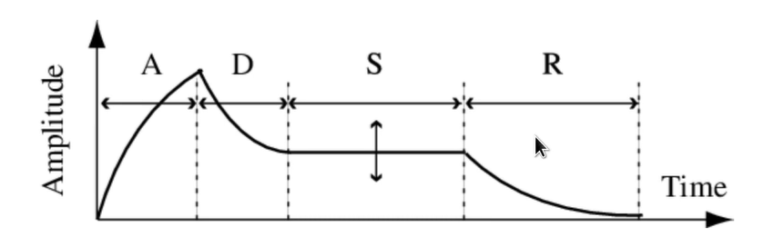
    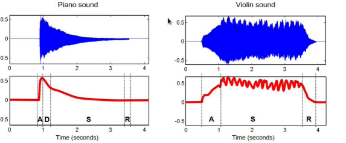
    c. Harmonic content(谐波含量)complex sound:superposition(叠加) of sinusoids,a partial is a sinusoid used to describe a sound,the lowest partial is called fundamental frequency(基频)，a harmonic partial is a frequency that's a multiple of the fundamental frequency.Inharmonicity indicates a deviation(偏差) from a harmonic partial
    d. Amplitude/frequency modulation(调制)
    
- noise
    噪音、辅音(摩擦音)都会有 broad spectrum，也就是说我们无法通过共振峰来识别它们。

- envelope
    包络在波的时域和频域图中，用来形容图形的整体形状的叫做包络。比如在时域中，如果时间的分辨率较低，我们可以看到语音被分成一个一个菱形，上半部分三角形的轮廓就叫做包络。
    
下图展示了各种声音在时频域中的样子：

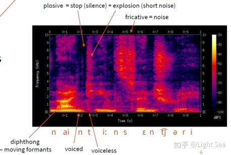
    
### Sound source 

#### 1.voicing

Voicing means that the vibration(震动) of the vocal folds(声带) and the results in a periodic(周期) signal. They are predictable, this type of signal is called "**deterministic**"

All periodic signals have a repeating pattern.

#### 2.frication

It's unpredictable, stochasic, we called this "aperiodic(非周期性的)"

### Utterance

#### 1.hierarchy(等级制度) of phone

如下图所示：

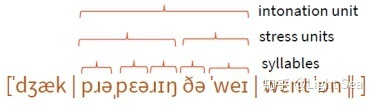

可以看到Utterance满足层次结构，一般提取特征也是基于多个层次来做的。

- syllables        
    最小的可以发声(pronounceable)的单元。
    - open syllable(音节)：以元音为结尾的音节
        
    - closed syllable：以辅音为结尾的音节
        
    - consonant辅音 cluster：很多个辅音连接在一起，英文中常见
        
- accent / stress units       
    发音的特性，有些语言通过声调来区分意义，比如日语或者中文，而英语是通过重音来区分意义的。
    
- rhythm(韵律) / isochrony
    也就是发声时候的节奏,中文是汉字，英文是由重音来作为分隔的。
    
- prosodic(韵律) / intonation units(语调单元)
    韵律、声调，针对单词和短语
    
- utterances（发声）
    一般是句子，但也可以变长。标点符号分隔。neighboring phones influence each other a lot。

### Features of Sound

- Frequency        
    Hz(the number of times per second) higher frequency->higher sound

- Intensity(强度)       
    larger amplitude->louder

- Sound power         
    Rate at which energy is transferred(转入)   
    
    Energy per unit of time(时间单元) emitted(发出) by a sound source in all directions   
    
    Measured in watt(W) 
    
- Sound intensity         
    sound power per unit area    --->louder
    
    Measured in $W/m^2$
    
    threshold of hearing:human can perceive sounds with very small intensities $TOH=10^{-12}W/m^2$,threshold of pain(hearing pain): $TOP=10\cdot W/m^2$ 
    
    Intensity level

    a. Logarithmic scale       
    b. Measured in decibels(dB)         
    c.Ratio(比率) between two intensity values          
    d.Use an intensity of reference(TOH)        
    $dB(I)=10\cdot log_{10}(\frac{1}{I_{TOH}})$ I:intensity level       
    $dB(I_{TOH})=10\cdot log_{10}(\frac{I_{TOH}}{I_{TOH}})=0$      
    
    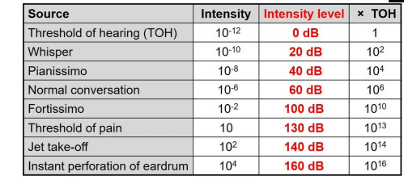
    
- Loudness
    
    a. Subjective(主观) perception of sound intensity        
    b. Depends on duration/frequency of a sound          
    c. Depends on age             
    d. Measured in phons    

    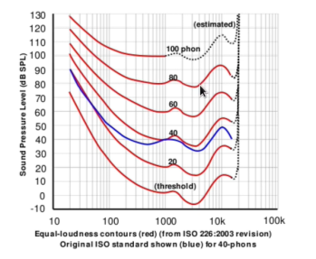                                        
    
   PCM(编码方式) and WAV(文件格式)WAV：wav是一种无损的音频文件格式，WAV符合 PIFF(Resource Interchange File Format)规范。所有的WAV都有一个文件头，这个文件头音频流的编码参数。WAV对音频流的编码没有硬性规定，除了PCM之外，还有几乎所有支持ACM规范的编码都可以为WAV的音频流进行编码。PCM:PCM（Pulse Code Modulation----脉码调制录音)。所谓PCM录音就是将声音等模拟信号变成符号化的脉冲列，再予以记录。PCM信号是由[1]、[0]等符号构成的数字信号，而未经过任何编码和压缩处理。与模拟信号比，它不易受传送系统的杂波及失真的影响。动态范围宽，可得到音质相当好的影响效果。简单来说：wav是一种无损的音频文件格式，pcm是没有压缩的编码方式。wav可以使用多种音频编码来压缩其音频流，不过我们常见的都是音频流被pcm编码处理的wav，但这不表示wav只能使用pcm编码，mp3编码同样也可以运用在wav中，和AVI一样，只要安装好了相应的Decode，就可以欣赏这些wav了。在Windows平台下，基于PCM编码的WAV是被支持得最好的音频格式，所有音频软件都能完美支持，由于本身可以达到较高的音质的要求，因此，WAV也是音乐编辑创作的首选格式，适合保存音乐素材。因此，基于PCM编码的WAV被作为了一种中介的格式，常常使用在其他编码的相互转换之中，例如MP3转换成WMA。简单来说：pcm是无损wav文件中音频数据的一种编码方式，但wav还可以用其它方式编码。

### Digital signal

**Why cannot computers store analogue values?**

Because computers only store binary numbers. It has to be placed in the finite amount of storage available inside the computer. The amplitude of our waveform has to be stored as a binary number. 

### Fourier analysis

Fourier analysis simply means finding the coefficients of the basis functions.

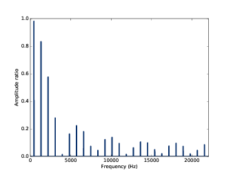

The vertical axis, I'm going to write the value of the coefficient, called that magnitude. It is normally written on a log scale and we give it units of decibels.But like waveform, it's uncalibrated(未校准的) because, for example we don't know how sensitive the microphone was, it doesn't matter because it's all about the relative amount of energy at each frequency, not the absolute value. 

Phase is simply the point in the cycle where the waveform starts. So when we are performing Fourier analysis, we don't just need to calculate the magnitude of each of the basis functions, but also their phase. Our hearing is not sensitive to phase difference. so the magnitudes are the important parts.

Spectrum is the amount of(大量的) energy in our original signal at each of the frequencies of the basis functions.

#### Essential property of Fourier analysis

The basis functions are sine waves (in other words pure tones纯音). They contain energy at one and only one frequency. That means that any pair of sine waves in our series are orthogonal(正交的,即两个函数各点对应相乘求和为0). The correlation between them is 0. This property of orthogonality between the basis functions means that when we decompose a signal into a weighted sum of these basis functions, there is a unique solution to that(唯一解). That is very important. It means that there's same information in the set of coefficients as there is in the original signal. It's invertible(可逆的).

## Speech Production

### Harmonics(谐波)

The voiced sounds have something in common

- 1.There's a very obvious repeating pattern in the time domain

- 2.In the frequency domain, the signal has energy at the corresponding fundamental frequency and at every multiple of that frequency.(信号在相应的基本频率以及该基本频率的每一个倍数处都有能量).This is called harmonics.

A signal that is periodic in the time domain always has harmonic structure in the frequency domain. That's already enough information for us to construct the first component(第一个组件) of a computational model of speech signals. We could make an artificial sound source that has the essential(基本) properties that we're just seen (harmonic).

Impulse train has that property and it is the simplest possible signal.

### Impulse train

Our destination is a model that can generate speech. So now we're going to devise(设计) a sound source for voiced speech and we know the key property that it must have. It needs to contain energy at the fundamental frequency - that's called $F_0$ - and at every multiple of that frequency, so that we have the harmonics. So let's devise a signal that has the correct harmonic structure. It's going to be an impulse train.

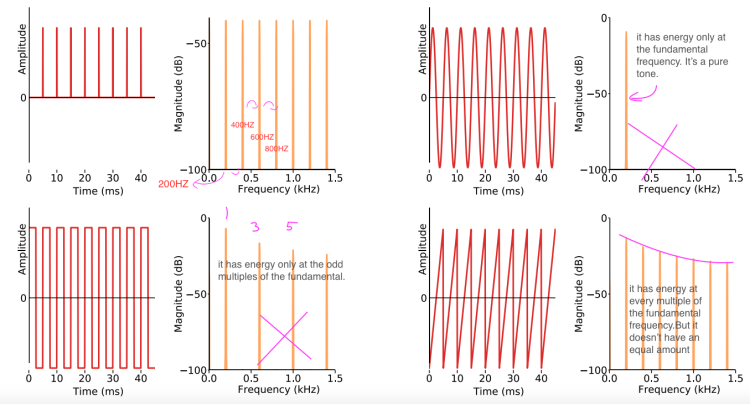

We're going to go with the impulse train because it has energy at every multiple of the fundamental, and it has an equal amount of energy. So, it's the simplest possible signal. The impulse train is, then, the first essential part of the model that we're working towards. The model is called the 'Source Filter Model'. We're going to take this impulse train and we're going to pass it through a filter. By filtering this very simple sound, we're going to make speech sounds.Then we'll be synthesising speech with a model! Whenever that model needs to generate voiced speech, the source of sound will be an impulse train. 

### Spectral envelope

Inspecting speech signals in the frequency domain revealed a really important property: the spectral envelope. Speakers manipulate the spectral envelope as part of conveying the message to the listener. 

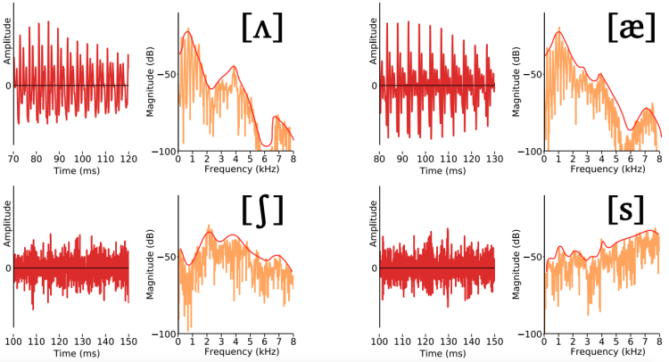

### Vocal tract resonance & formants(声道共振&共振峰)

We're now going to develop an explanation of where and how the spectral envelope is created. To do that, we need to start with an understanding of how sound-for example. Created by the vocal folds(声带)-behaves inside the vocal tract(声道) and how the vocal tract modifies that basis sound source by acting as a resonator(共振管). 

Simply by introducing one impulse into this tube, and allowing that sound wave to bounce backwards and forwards end-to-end along the tube, we have a standing wave at a frequency of 1000Hz. If I keep adding tiny amounts of energy to this system at just the right moment in time, I can obtain larger and larger amplitude sound waves, it the power of resonance.

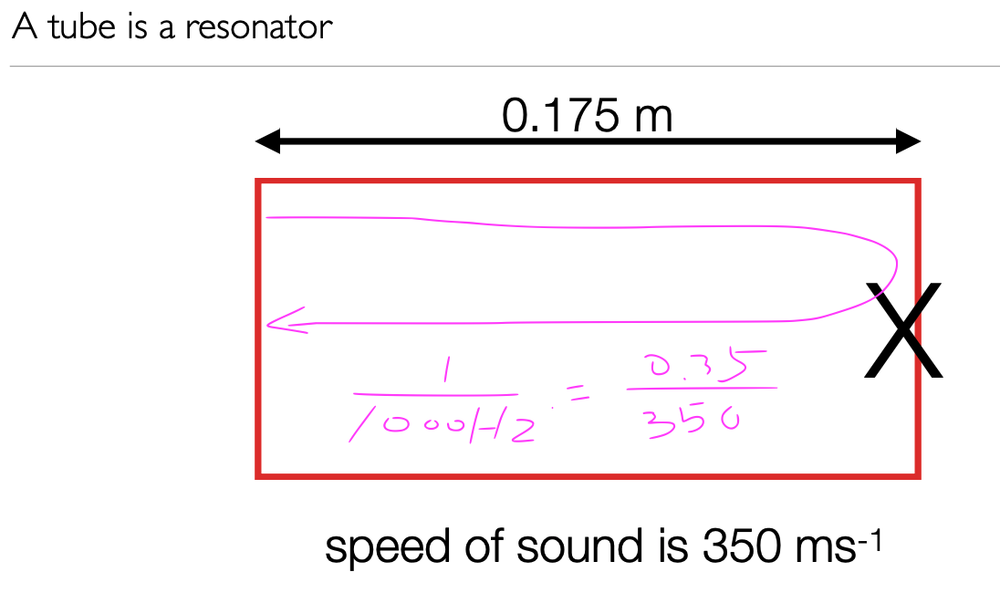

Any tube is a resonator and will have a resonant frequency related to its length. The vocal tract is a tube, so it must have that property. A speaker can vary the shape of their vocal tract, and that's going to vary its resonant frequency depending on the shape of the tube.you have conscious control over your vocal tract shape, and therefore you have control over its resonant frequencies. Those resonant frequencies are used by speakers to carry linguistic messages. In linguistics,they called formants(共振峰)

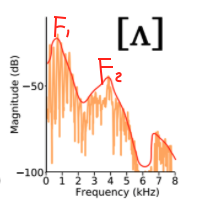

The peaks are called formants and their frequencies are the formant frequencies.

F1: first formant .    
F2: second formant .     
F0: the fundamental frequency of the vocal folds.       

F0-F2 are all frequencies,but they're coming from different sources. F0 is the rate of vibration of the vocal folds, F1 and F2 and any higher formants are properties of the vocal tract(声道).

**formants共振峰**

是一种元音特有的在频域中的现象，因为只有元音有基础频率。每个元音都有两个共振峰，可以用来区分元音，记为F1和F2。F1,F2取决于基础频率，如果基础频率太高，共振峰可能会消失，这种情况下就区分不出来元音，这种现象在各种女高音身上比较常见。

基础频率$F_0$  $f=1/T$    $Hz=1/s$ 

正如我们之前介绍的，浊音中存在基础频率，而清音中不存在，决定了声音的音高。

### Filter

We're going to model the behavior of the vocal tract. That means we're going to model how it modifies an input sound source, for example, from the vocal folds to turn that into speech. 

That modification is a process of filtering through the resonances of the vocal tract. We're going to build a filter that models the behavior of the vocal tract. 

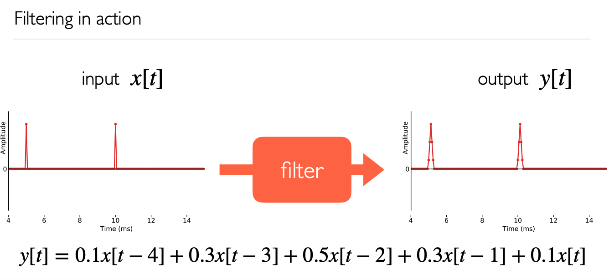
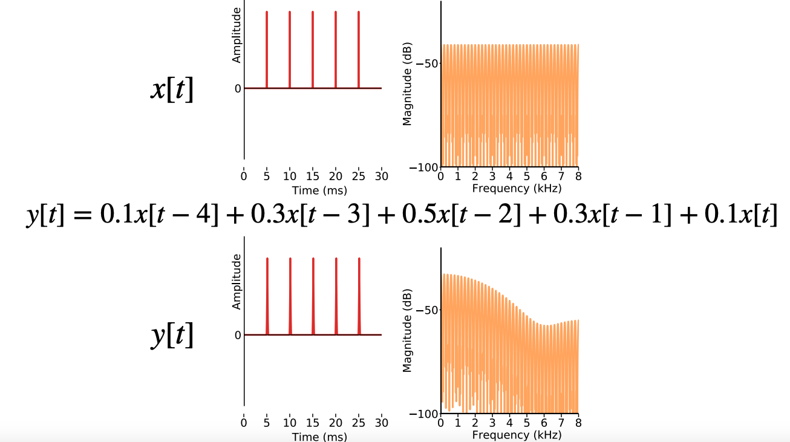
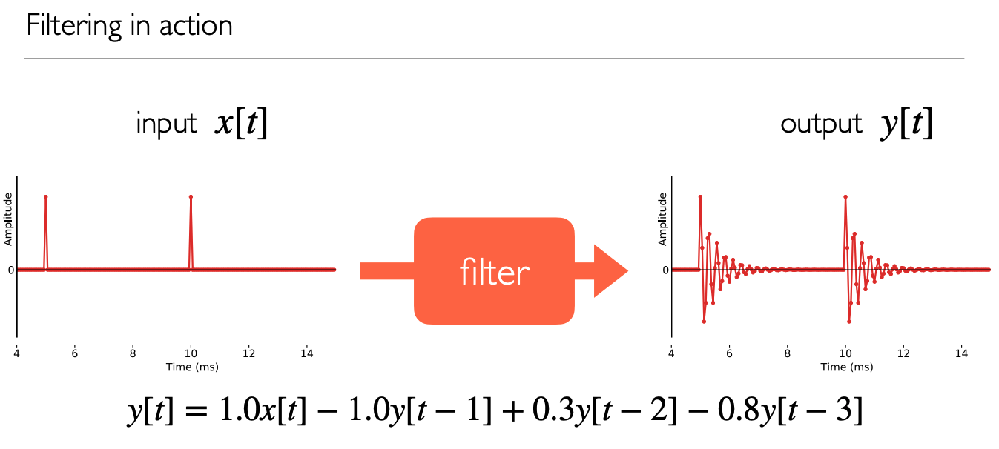
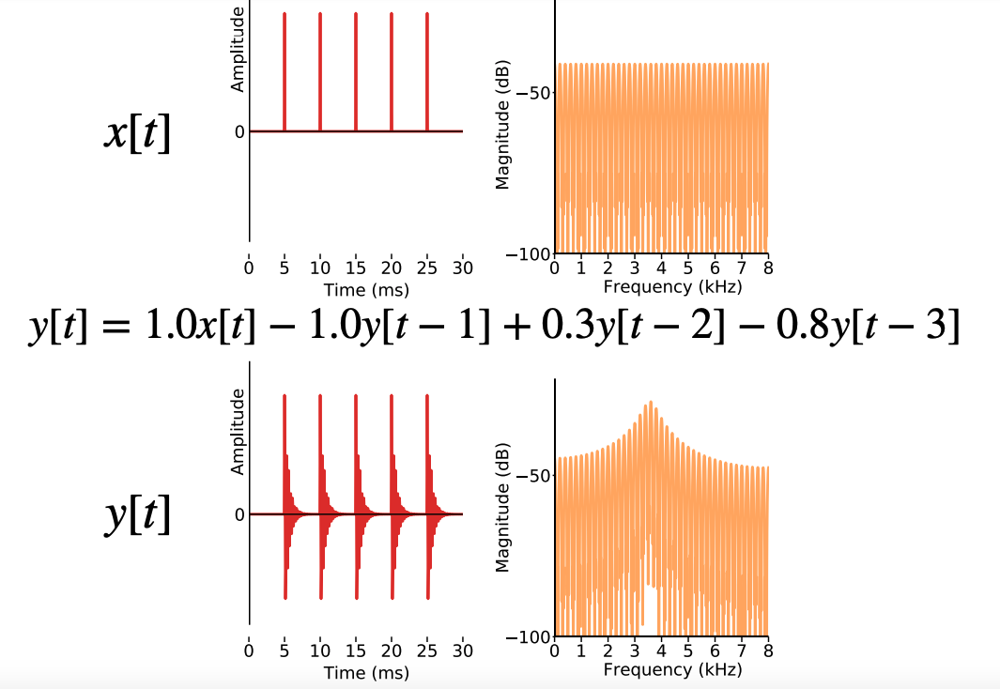
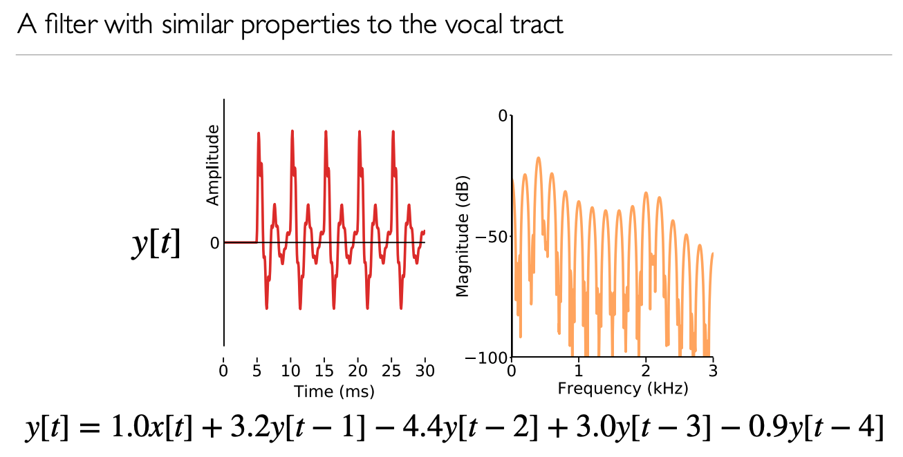

### Impulse response

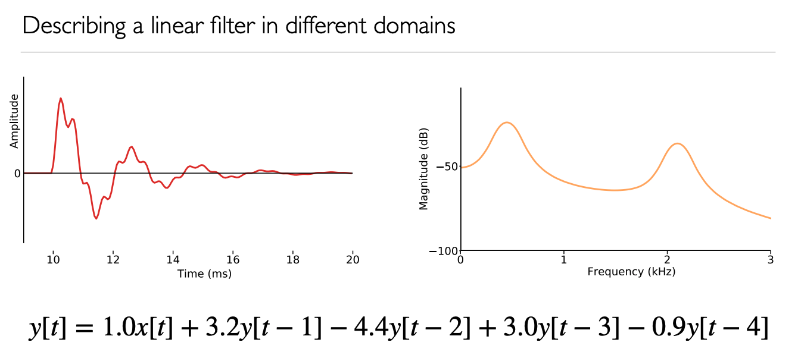

分析滤波器有三种形式：1.方程（如上）2.左图waveform 3.右图magnitude spectrum

All that we have evidence for on the left is the oscillating behavior(震荡) caused by the resonances(共振) of the filter.

On the left we have a signal that we call the impulse response of the filter. On the right we have the frequency response of the filter.

The magnitude spectrum is the most useful representation of all, because it shows us this filter is a resonator and that it has two resonances. The impulse response of the vocal tract filter is given a special name called a "pitch period(音高周期)". It's a period of output for one impulse input. I warned you a while ago that the terms "fundamental frequency F0" and "pitch" are used interchangeably in our field, even though they are not the same thing.  "pitch period " = 'fundamental period',文献常用 pitch period

The pitch period is a fragment of waveform coming out of the filter, and that's going to offer us another route to using our source-filter model to modify speech without having to solve explicitly for the filter coefficients, because the pitch period completely characterises the filter.

### Source-filter model

.png)
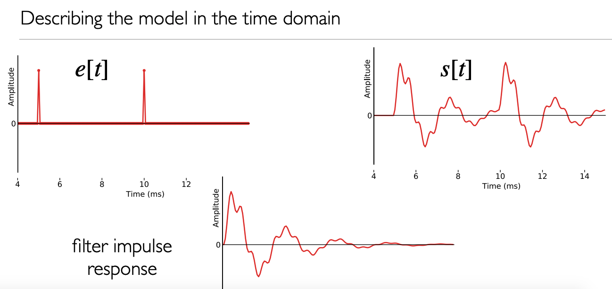

We can see that the second impulse response just overlapped and added to the first impulse response.

**Why did we just overlap-and-add that second impulse response?**

The linear filter tells us that the output is just a sequence of overlapped-and-added impulse responses. The whole process of taking this time domain signal and using it to provoke impulse responses and then overlap-and-adding them in the output is called **"convolution"**.

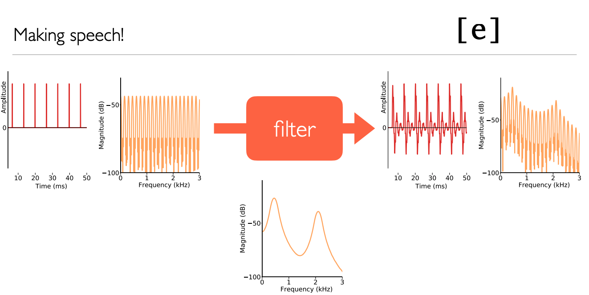

**Now how about keeping the filter the same and changing the source?**

The source only has one thing that you can change and that's the fundamental frequency. the pitch is changing but the vowel quality is the same. We've independently controlled source and filter.

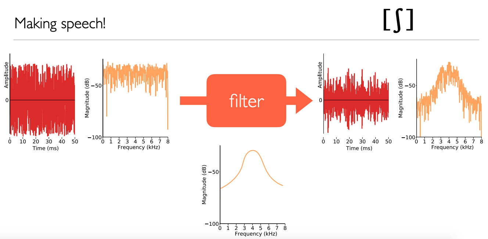
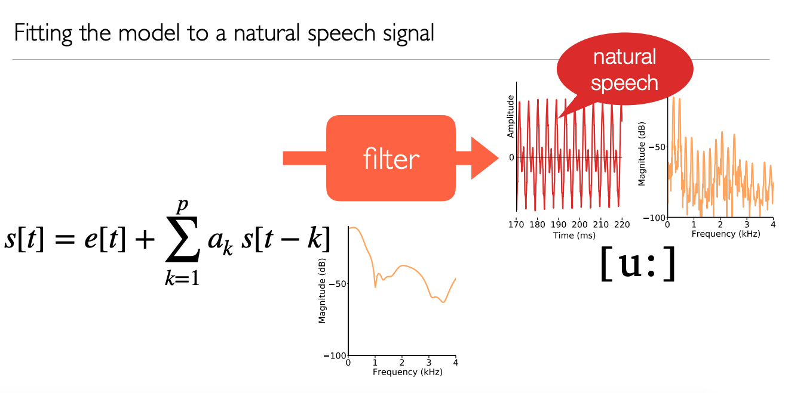

So, what have we achieved?

We've taken natural speech, we've fitted the source-filter model to it, in particular we solved for the filter coefficients, then we've excited that filter with synthetic impulse trains at a fundamental frequency of our choice.

Our source-filter model decomposes speech signals into a source component(that's either an impulse train for voiced speech, or white noise for unvoiced speech) and a filter (which has a frequency response determined by its coefficients)