## 傅立叶变换系列知识

### 1.傅立叶级数

Any continuous signal in the time domain could be represented by a sum of carefully chosen sinusoids(不同相位不同振幅的正弦波叠加).But **why is sinusoids?**

Because they are the only waveform that doesn't change shape when subjected to(服从于) a linear time-invariant system .

如果函数f(x)是周期函数，那么f(x)可以展开成以正弦和余弦为基的线性组合。
假设f(x)的周期为,选哪些频率呢？直觉上是选择
$sin(x),cos(x)$ 可以, $sin(x/2),cos(x/2)$ 不可以       
$sin(2x),cos(2x)$ 可以,$sin(x/3),cos(x/3)$ 不可以
$\cdots$ 
$sin(8x/3),cos(8x/3)$ 不可以         
$sin(nx),cos(nx)$ 可以                            
$cos(0x)$ 常数 可以

可以的 $2\pi$ 是周期, 不可以的 $2\pi$ 不是周期, 不能选为基

**选sin,还是cos,还是两个都要？**

高中函数知识：函数f(x)可以表示成一个偶函数和一个奇函数的和

$$ f(x)=\frac{f(x)+f(-x)}{2}+\frac{f(x)+f(-x)}{2}$$

f为偶函数：只用cos         
f为奇函数：只用sin          
f非奇非偶：两个都要           
根据以上可以得到周期为函数的傅里叶级数（实数形式）            

$$ f(x)=a_0+\sum_{n=1}^{\infty}a_ncos(nx)+\sum_{n=1}^{\infty}b_nsin(nx),n\in N,a_n,b_n\in R$$

**那么如何求出 $a_n, b_n$?**           

**计算函数相关性**

$f(x)$ 与 $g(x)$ 是两个 $R->C$ 的函数，积分 $ \int_a^b f(x)\overline{g(x)}dx$：表征了他们在区间[a,b]上的相似程度

假设我们有一个函数

$$ f(x)=a_0+a_1cos(x)+a_2cos(2x)+b_1sin(x)+b_2sin(2x)$$
$f(x)=f(x+2\pi)$ $T=2\pi$
$$ \int_{-\pi}^{\pi}f(x)dx=\int_{-\pi}^{\pi}a_0dx=2a_0\pi\longrightarrow a_0=\frac{1}{2\pi}\int_{-\pi}^{\pi}f(x)dx$$
$$ \int_{-\pi}^{\pi}f(x)cos(x)dx=a_0\int_{-\pi}^{\pi}cos(x)dx+a_1\int_{-\pi}^{\pi}cos(x)cos(x)dx+a_2\int_{-\pi}^{\pi}cos(2x)cos(x)dx+b_1\int_{-\pi}^{\pi}sin(x)cos(x)dx+b_2\int_{-\pi}^{\pi}sin(2x)cos(x)dx=a_1 \pi\longrightarrow a_1=\frac{1}{\pi}\int_{-\pi}^{\pi}f(x)cos(x)dx$$
  
这里应用了三角函数的正交性。

类似的 
$$ a_2=\frac{1}{\pi}\int_{-\pi}^{\pi}f(x)cos(2x)dx $$
$$ b_1=\frac{1}{\pi}\int_{-\pi}^{\pi}f(x)sin(x)dx$$
$$ b_2=\frac{1}{\pi}\int_{-\pi}^{\pi}f(x)sin(2x)dx$$

所以傅里叶系数可求，也就是:

$$ a_n=\frac{1}{\pi}\int_{-\pi}^{\pi}f(x)cos(nx)dx$$
$$ b_n=\frac{1}{\pi}\int_{-\pi}^{\pi}f(x)sin(nx)dx$$

### 2.三角函数的正交性

用到了积化和差公式，正交基和向量空间

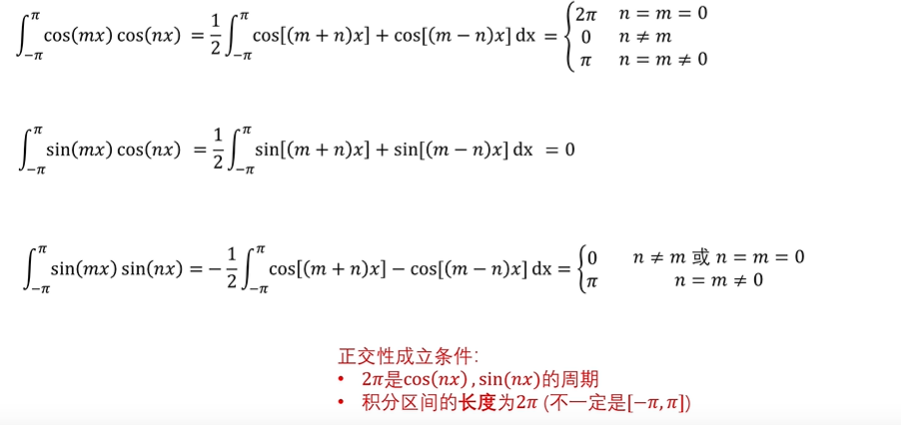

推广到任意非 $2\pi$ 周期

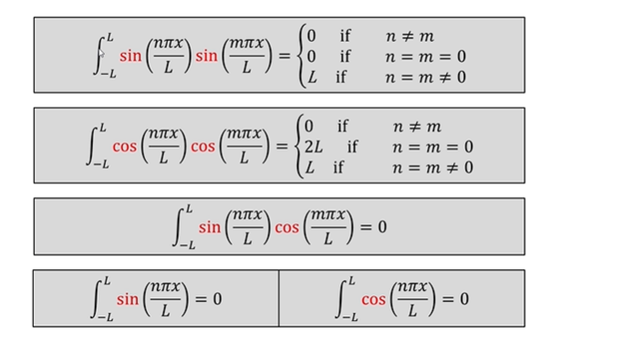

正交基与向量空间

进行映射

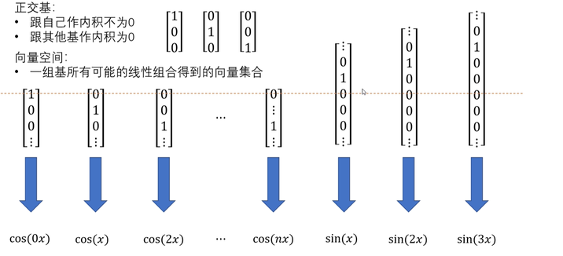

由向量空间映射到了函数空间

$ \int_{-\pi}^{\pi}f(x)g(x)dx$ 可以当作是两个函数之间的内积，$\sqrt{\int_{-\pi}^{\pi}|f(x)|^2dx}$ 是函数的模

向量空间与函数空间对比

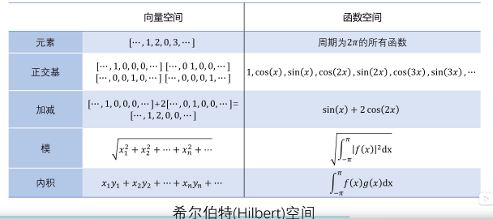

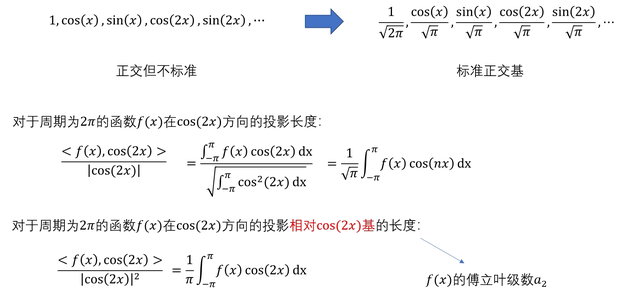

### 3.傅里叶级数的复数形式

f(x)为实数形式：

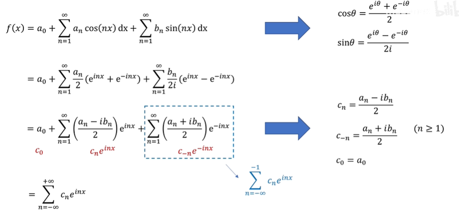

如何求 $c_n$ ?

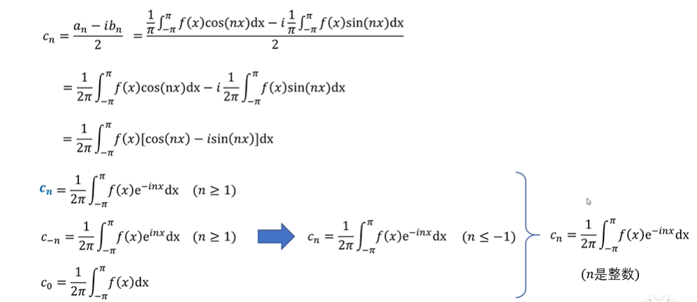

**f(x)为复数形式：**

**为什么要用复数形式的傅里叶级数？**

人们需要在 $f(x)$ 的值为实数的复数形式下也有一套理论，当 $f(x)$ 为实数的时候，复数形式的傅里叶级数是两两共轭的，保证 $c_n$ 和 $c_{-n}$共轭,保证他们加起来可以是一个实数函数，当$f(x)$为复数的时候，$k_n$ 和$k_{-n}$ 就不是共轭的了

**复数基是什么？**

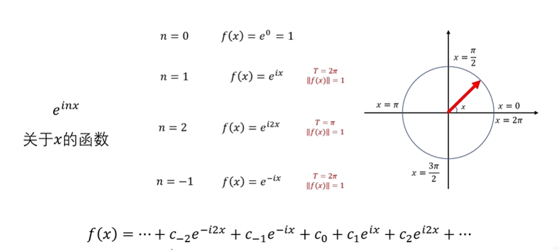

$...,e^{-i3x},e^{-i2x},e^{-ix},1,e^{ix},e^{i2x},e^{i3x},...$ 为复数形式下的正交基但不是标准的

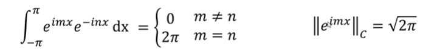

除以模之后可变为标准正交基

复数基的正交性：具有正交性的性质

### 4.周期函数的傅里叶变换

周期 $f(x)=\sum_{-\infty}^{\infty}c_ne^{inx}$ :(任何函数都可表示为这种复数形式) 这里的x表示角度值

f(x)--傅里叶变换-->$[...,c_{-k},c_{-k+1},...,c_{-2},c_{-1},c_0,c_1,...,c_{k-1},c_{k},...]$ 

周期为T： $f(x)=\sum_{-\infty}^{\infty}c_ke^{ikx}$

f(x)--傅里叶变换--> $[...,c_{-k},c_{-k+1},...,c_{-2},c_{-1},c_0,c_1,...,c_{k-1},c_{k},...]$

### 5.Discrete Time Fourier Transform(DTFT)

从连续函数到离散函数

f(x) 周期为 $2\pi$ 的函数：$f(x)=\sum_{-\infty}^{\infty}c_ke^{ikx}$
假设f(n)是f(x)在一个周期内的等距离采样， $[f_0,f_1,...,f_{N-1}]$ N个点

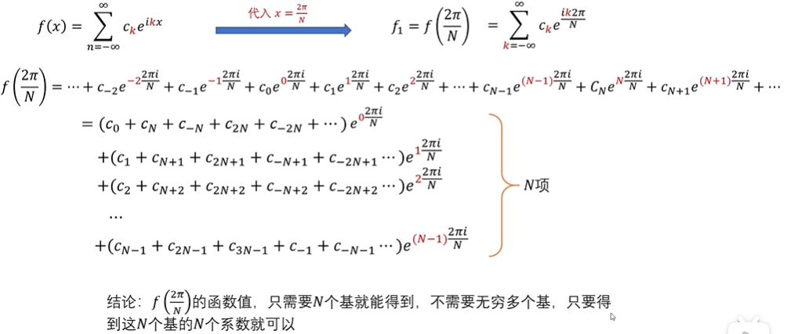
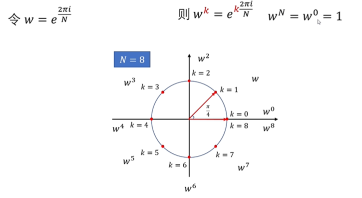
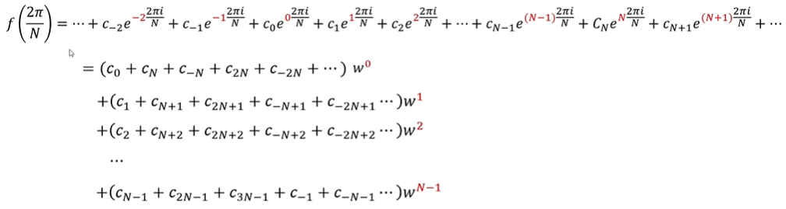
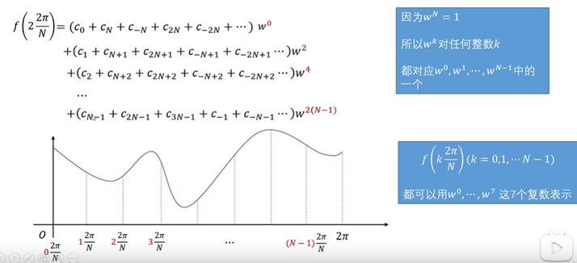

如果f(x)的傅里叶级数只包含 $c_0,c_1,...c_{N-1}$

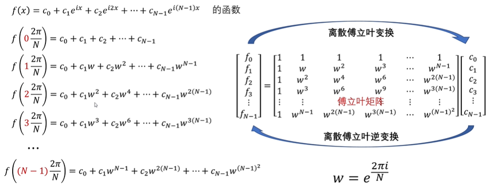

**傅里叶矩阵的性质**

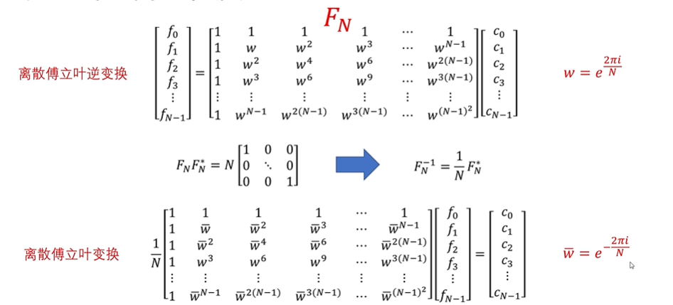

$$ F_N{i,j}=\overline{w}^{(i-1)(j-1)}$$

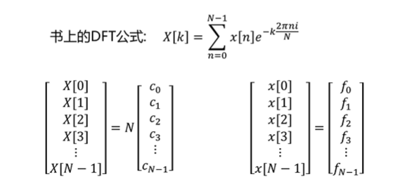

### 6.快速傅里叶变换

矩阵乘法定理：对于N\*N矩阵与N\*1列向量的乘积，交换矩阵的列，再交换向量对应的行，乘积保持不变。
举例：

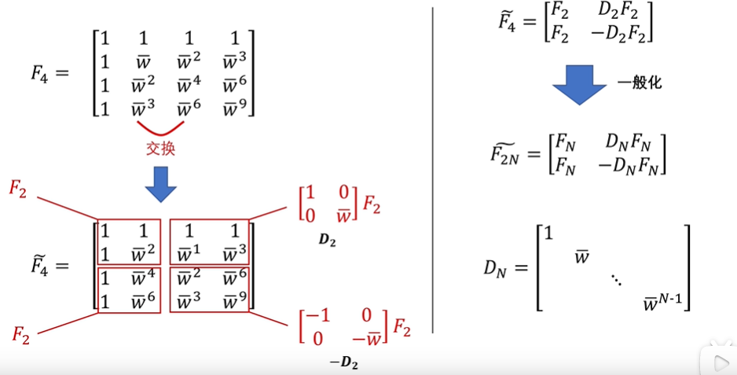

N是信号长度，默认大家都选择2的k次幂

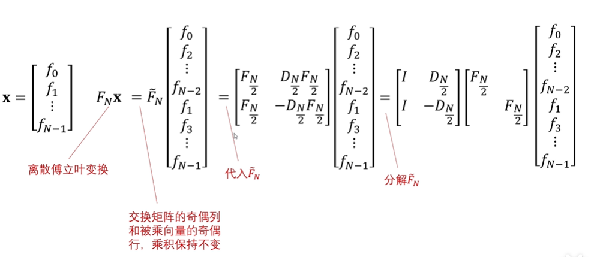

对角矩阵乘以列向量只进行了N次乘法

zero-pad our FFT input buffers to the next power of 2 in length (thereby interpolating(内插) our spectra(光谱) somewhat) in order to enjoy the power-of-2 speed advantage.  Finer spectral sampling(精细的光谱采样) is a typically welcome side benefit of increasing N to the next power of 2.

### 7.卷积

#### (1).从线性时不变系统角度说明卷积

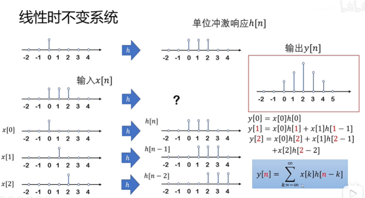

$y[n]=\sum_{k=-\infty}^{\infty}x[k]h[n-k]$ 为离散卷积公式

任何信号的输出都是输入信号与单位冲激的卷积

#### (2).从傅里叶级数角度说明卷积

$f(x)=\sum_{k=-\infty}^{\infty}c_ke^{ikx}$,$g(x)=\sum_{k=-\infty}^{\infty}d_ke^{ikx}$ 求 $f(x)g(x)=?$

令 $e^{ix}=z\longrightarrow e^{ikx}=z^k$

则：$f(x)=\sum_{k=-\infty}^{\infty}c_kz^{k}$ ,$g(x)=\sum_{k=-\infty}^{\infty}d_kz^{k} $     

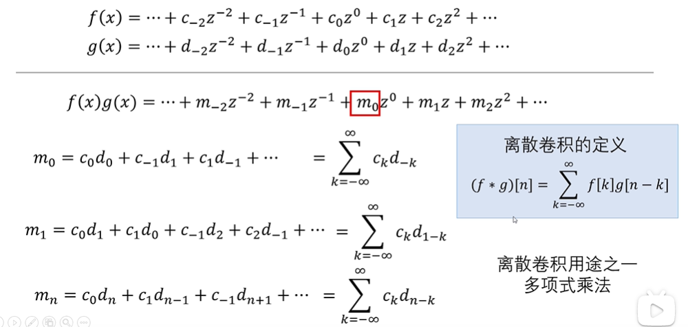

卷积——多项式乘法

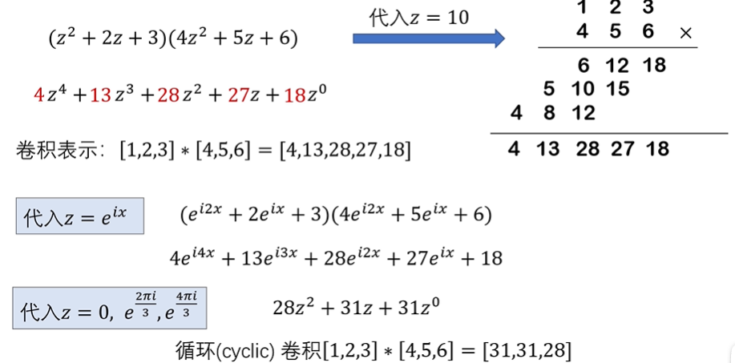

连续函数的卷积

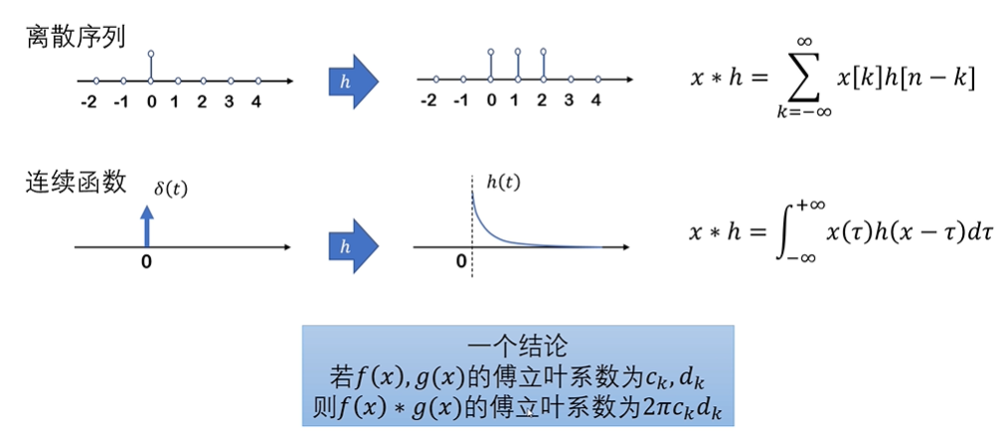