# NLP+TTS

## RNN(Recurrent Neural Networks)

### What are Dynamical Systems?

I know the state of the system now at time t.What will be the state at time t+n?

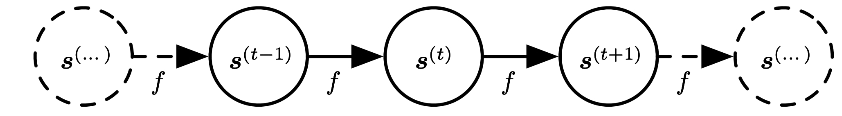

### RNN 

**Back Propagation Through Time(BPTT) Problem**:speed,storage

**Equal sized input and output sequence**

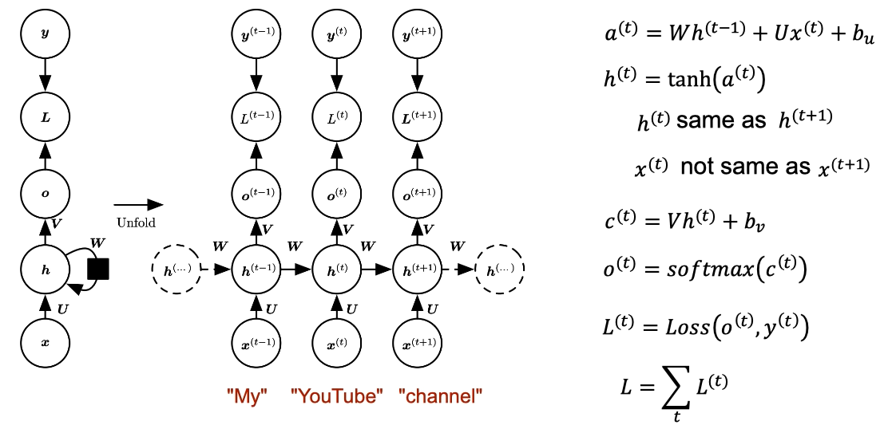

There's **a problem** with back propagation through time at every time step we need to perform back propagation so deep layers have significantly larger computation costs they take longer and activations need to be stored at every time step so the amount of storage you need. 

To avoid training with back propagation through time, we use an algorithm called **teacher forcing**,  so during training time instead of feeding the hidden layer of the previous state to the hidden layer of the next state we feed the output Y the actual label Y from the previous state to the Hidden layer of the next state. 

#### Teacher Forcing

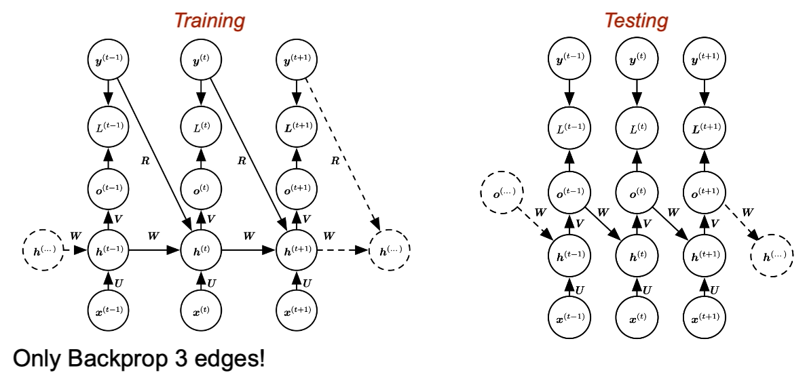

### Sequence to Vector Model

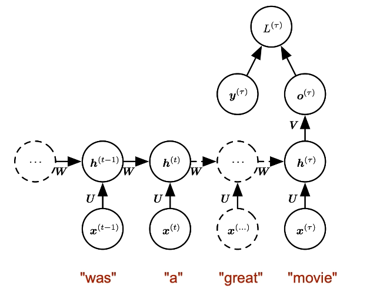

Application:  Sentiment Analysis       
### Vector to Sequence Model 

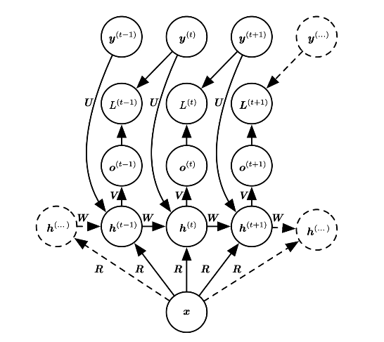     

Application:Image Captioning          

**Vector to sequence model**

A single vector X into a sequence, all of any length usually a vector is an internal representation that's understood by computers not by humans. Converting these into sequences, we can make sense of(理解) the abstract vector representation to give an example X could be some parameter of genterative model that generates sentences in English. The output sequence could be the result of sampling from this generative model at different time steps. So from output we actually get a meaningful sequence or sentences.

### Bi-directional RNN

Application: Language Translation, Text Summarization

Input sequence length=output sequence length

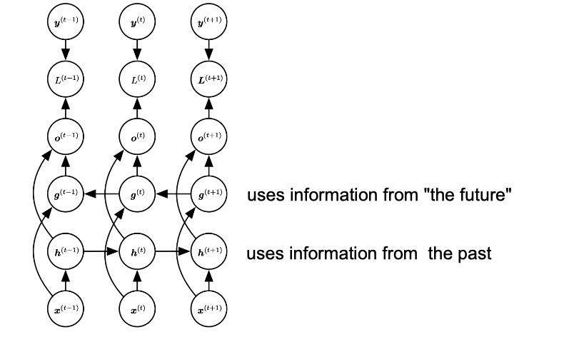

### Sequence-to-Sequence

The seq2seq model,it aims to transform an input sequence (source) to a new one (target) and both sequences can be of arbitrary lengths. The seq2seq model normally has an encoder-decoder architecture, composed of:

- An **encoder** processes the input sequence and compresses the information into a context vector (also known as sentence embedding or "thought" vector) of a fixed length. This representation is expected to be a good summary of the meaning of the whole source sequence.

- A **decoder** is initialized with the context vector to emit the transformed output. The early work only used the last state of the encoder network as the decoder initial state.Both the encoder and decoder are RNN, i.e. using LSTM or GRU units.
**Unequal sized input and output sequence**

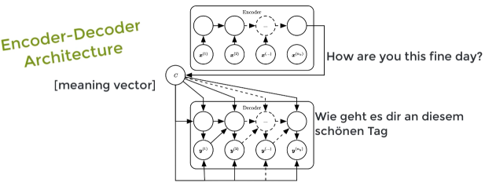

**Encoder**将输入的句子(a sequence of vectors)编码成一个固定长度的向量。如果使用RNN作为Encoder的话 
$$ h_t=f(x_t,h_{t-1})$$
$$ c=q({h_1,...,h_{T_x}})$$

$h_t$是t时刻的hidden state, $c$ 是hidden states的序列产生的context vector, $f$ 和 $q$ 是一些非线性函数，例如 $f$ 使用LSTM, $c$ 取最后一层 hidden state $q({h_1,...,h_{T_x}})=h_T $.

**Decoder** 根据上下文vector $c$ 和之前所预测的单词 ${y_1,...,y_{T_{t'}}}$ 来预测下一个单词 $y_{t'}$. 整个序列的概率如下：   
$$ p(Y)=\prod_{t=1}^{T}p(y_t|\{y_1,...,y_{t-1}\},c)$$

其中 $Y=(y_1,...,y_{T_y})$ .如果使用RNN作为Decoder,当前的输出单词 $y_t$ 的条件概率表示为：
$$ p(y_t|\{y_1,...,y_{t-1}\},c)=g(y_{t-1},s_t,c)$$
其中 $g$ 是非线性函数，$y_{t-1}$ 是上一个单词，$s_t$ 是RNN当前的hidden state, $c$ 是context vector.

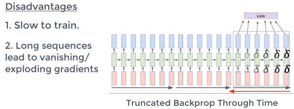

**Potential problem:information bottleneck**

The encoder-decoder approach is that a neural network needs to be able to compress all the necessary information of a source sentence into a fixed-length vector.A critical and apparent disadvantage of this fixed-length context vector design is incapability of remembering long sentences. Often it has forgotten the first part once it completes processing the whole input.  Paper showed that the performance of a basic encoder-decoder deteriorates(恶化) rapidly as the length of an input sentence increases.

### LSTM

**Isn't Vanish/Exploding gradient a problem in DNN too?**

Much worse in RNN than DNN

**How deal with this in RNN?** lstm

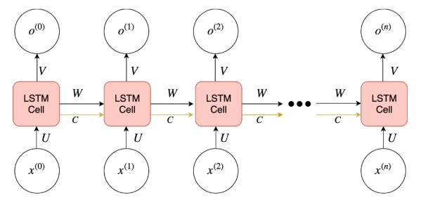

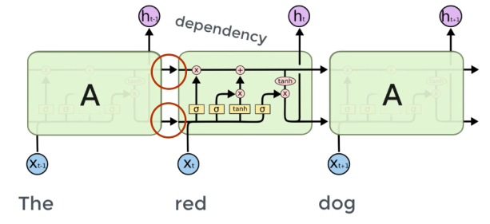

Three Gates of LSTM Cell:

Input Gate:   Is Cell Updated?   

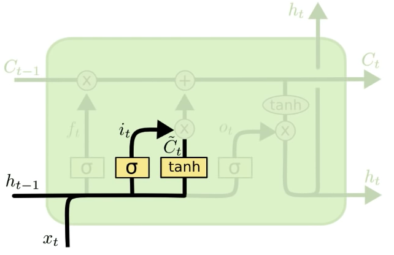
$$ i^{(t)}=\sigma (W^i[h^{(t-1)},x^{(t)}]+b^i)$$
$$ \bar{C}^{(t)}=tanh(W^C[h^{(t-1)},x^{(t)}]+b^C)$$

Output Gate: Is current info visible? 

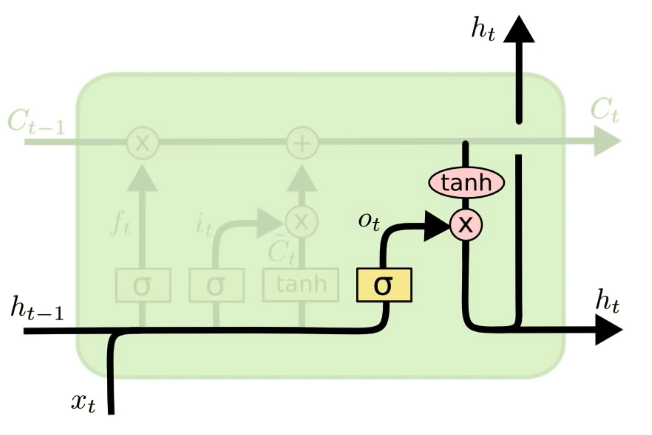
$$ o^{(t)}=\sigma(W^o[h^{(t-1)},x^{t}]+b^o)$$            
Forget Gate:  Is memory set to 0?                                                

$$ f^{(t)}=\sigma(W^f[h^{(t-1)},x^{(t)}]+b^f)$$
$$ C^{(t)}=f^{(t)}C^{(t-1)}+i^{(t)}\bar{C}^{(t)}$$
$$ h^{(t)}=tanh(C^{(t)}) \times o^{(t)}$$

They all have sigmoid activation. **Why?**

They constitute smooth curves in the range 0 to 1 and the model remains differentiable.

LSTM Parameters: $b^i,W^i,b^f,W^f,b^c,W^C,b^o,W^o$

### GRU

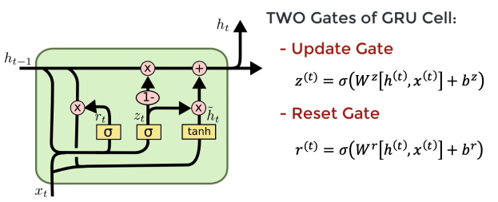

#### Attention Mechanism

The attention mechanism was born to help memorize long source sentences in NMT.Rather than building a single context vector out of the encoder’s last hidden state, the secret sauce invented by attention is to create shortcuts between the context vector and the entire source input. The weights of these shortcut connections are customizable(定制) for each output element.

While the context vector has access to the entire input sequence, we don’t need to worry about forgetting. The **alignment** between the source and target is learned and controlled by the context vector. Essentially the context vector consumes three pieces of information:

- encoder hidden states;

- decoder hidden states;

- alignment between source and target.

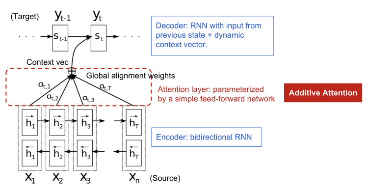

**Encoder**:Bi-directional RNN for annotation sequences

**Why Bi-directional RNN ?**

we would like the annotation of each word to summarize not only the preceding words, but also the following words. 将前向和后向的hidden state拼接得到每个单词 $x_j$ 的annotation $h_j$ ,$h_j=[h_j^T;h_j^T]^T$ 

**Decoder**

定义每一个输出的预测单词 $y_i$ 的条件概率分布为
$$ p(y_i|\{y_1,...,y_{i-1}\},x)=g(y_{i-1},s_i,c_i)$$
其中 $g$ 是非线性函数，$y_{i-1}$ 是上一个单词，$s_i$ 是RNN当前的hidden state, $c_i$ 是当前的context vector.

那么 $c_i$ 是怎么计算得来的呢？目前常用的两种方法BahdanauAttention和LuongAttention.

#### Bahdanau Attention
https://arxiv.org/pdf/1409.0473.pdf

The first type of Attention commonly refered to as Additive(加法) Attention.     

The entire step-by-step process of applying Attention in Bahdanau’s paper is as follows:

##### 1.Producing the Encoder Hidden States

We have a source sequence $X$ of length $n$ and try to output a target sequence $Y$ of length $m$:
$$ X=[x_1,x_2,...,x_n]$$
$$ Y=[y_1,y_2,...,y_m]$$

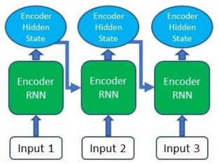

将前向和后向的hidden state拼接得到每个单词的annotation  ,  2.Calculationg Alignment ScoresAfter obtaining all of our encoder outputs, we can start using the decoder to produce outputs. At each time step of the decoder, we have to calculate the alignment score of each encoder output with respect to the decoder input and hidden state at that time step. The alignment score is the essence of the Attention mechanism, as it quantifies the amount of "Attention" the decoder will place on each of the encoder outputs when producing the next output.The alignment model assigns a score  to the pair of input at position i and output at position t, , based on how well they match. The set of  are weights defining how much of each source hidden state should be considered for each output. In Bahdanau’s paper, the alignment score  is parametrized by a feed-forward network with a single hidden layer and this network is jointly trained with other parts of the model. The score function is therefore in the following form, given that tanh is used as the non-linear activation function:where both  and  are weight matrices to be learned in the alignment model.                 Note: As there is no previous hidden state or output for the first decoder step, the last encoder hidden state and a Start Of String (<SOS>) token can be used to replace these two, respectively.3.Softmaxing the Alignment ScoresAfter generating the alignment scores vector in the previous step, we can then apply a softmax on this vector to obtain the attention weights. The softmax function will cause the values in the vector to sum up to 1 and each individual value will lie between 0 and 1, therefore representing the weightage each input holds at that time step.                                                                     how well  and  are aligned4.Calculating the Context VectorNow we can generate the context vector by doing an element-wise multiplication of the attention weights with the encoder outputs.其中 取决于encoder map the input sequence的annotations ,由annotation vector加权得到                                                 ; context vector for output                                   5.Decoding the OutputThe context vector we produced will then be concatenated with the previous decoder output. It is then fed into the decoder RNN cell to produce a new hidden state and the process repeats itself from step 2. The final output for the time step is obtained by passing the new hidden state through a Linear layer, which acts as a classifier to give the probability scores of the next predicted word.                           Luong Attentionhttps://arxiv.org/pdf/1508.04025.pdf1.Producing the Encoder Hidden StatesJust as in Bahdanau Attention, the encoder produces a hidden state for each element in the input sequence.2.Decoder RNNUnlike in Bahdanau Attention, the decoder in Luong Attention uses the RNN in the first step of the decoding process rather than the last. The RNN will take the hidden state produced in the previous time step and the word embedding of the final output from the previous time step to produce a new hidden state which will be used in the subsequent steps.3.Calculating Alignment ScoresIn Luong Attention, there are three different ways that the alignment scoring function is defined- dot, general and concat. These scoring functions make use of the encoder outputs and the decoder hidden state produced in the previous step to calculate the alignment scores.Dot                                                 General                                                 Concat                                           4.Softmaxing the Alignment ScoresSimilar to Bahdanau Attention, the alignment scores are softmaxed so that the weights will be between 0 to 1.5.Calculating the Context VectorAgain, this step is the same as the one in Bahdanau Attention where the attention weights are multiplied with the encoder outputs.6.Producting the Final OutputIn the last step, the context vector we just produced is concatenated with the decoder hidden state we generated in step 2. This combined vector is then passed through a Linear layer which acts as a classifier for us to obtain the probability scores of the next predicted word.A Family of Attention Mechanismshttps://arxiv.org/pdf/1506.07503.pdfCorresponding alignment score function:The output  is a sequence of phonemes, and the input  is a sequence of feature vectors.  is often processed by encoder(BiRNN) which outputs a sequential input representation  more suitable for the attention mechanism to work with and .  Each feature vector is extracted from a small overlapping window of audio frame.受Neural Turing Machines启发，我们将Attention mechanism分成三种根据不同的score函数可以分为不同的attention mechanism1.content-based attention                                     : 上一个时间步的解码器输出(解码器隐状态 decoder hidden states)，是编码器此刻输入(编码器隐状态 encoder hidden states j)，、和是待训练参数张量。The issue of similar speech fragmentsthis main limitation is the identical(相等) or similar elements of  are scored equally而没有考虑他们处于不同的位置.This issue is partially alleviated by an encoder such as e.g. a BiRNN or a deep convolutional network that encode contextual information into every element of   . However, capacity of  elements is always limited, and thus disambiguation by context(上下文) is only possible to a limited extent.2.location-based attention                                    是之前注意力权重经卷积得到的位置特征，，、和是待训练参数张量。Problem:This  attention mechanism would have to predict the distance between consequent phonemes using  only, which we expect to be hard due to large variance of this quantity.3.hybrid attention                                    : 上一个时间步的解码器输出(解码器隐状态 decoder hidden states)，是之前的注意力权重，是第个编码器此刻输入(编码器隐状态 encoder hidden states j)，为其添加偏置值，、、和是待训练参数张量，是之前注意力权重经卷积得到的位置特征，，hybrid attention同时考虑了内容和输入元素的位置4.location sensitive attention                           : 当前解码器输出(解码器隐状态 decoder hidden states)，是第个编码器此刻输入(编码器隐状态 encoder hidden states j)，使用累加注意力权重卷积而来，Score Normalization : Sharpening and Smoothing在每一步用attention机制筛选输入特征时可能会遇到两个情况。一方面，如果输入的序列长度很大，存在很多噪声，筛选信息时可能会引入许多不相关的特征，我们希望让attention更加集中；另一方面，有时我们又希望attention比较平滑(输入序列长度较小)，而计算attention系数用的是softmax函数，很可能让attention集中在几帧特征上。基于以上两种不同的情况，我们分别提出让attention更加集中(Sharpening)或更加平滑(Smoothing)的方法。的其他实现方式 There are three potential issues with the normalization in Eq. (6). 1.when  is long,  is likely to contain noisy information from many irrelevant feature vectors  , as  . This makes it difficult for the proposed ARSG to focus clearly on a few relevant frames at each time . 2. The attention mechanism is required to consider all the  frames each time it decodes a single output while decoding the output of length , leading to a computational complexity of . This is too expensive when input utterances are long. This issue is less serious for machine translation, because in that case the input sequence is made of words, not of 20ms acoustic frames. 3.The use of softmax normalization in Eq. (6) prefers to mostly focus on only a single feature vector  . This prevents the model from aggregating multiple top-scored frames to form a glimpse .Sharpening针对第一个问题：       但是他的复杂度依旧为We also propose and investigate a windowing technique. At each time i, the attention mechanism considers only a subsequence  of the whole sequence ,  is the median(中位数) of the alignment . .This windowing technique is similar to taking the top-k frames, and similarly, has the effect of sharpening.Smoothing                                                       Self-AttentionRelating different positions of the same input sequence. Theoretically the self-attention can adopt any score functions above, but just replace the target sequence with the same input sequence. The self-attention mechanism enables us to learn the correlation between the current words and the previous part of the sentence.                  Global/Soft & Local/Hard AttentionGlobal/Soft AttentionEssentially the same type of attention as in Bahdanau et al., 2015.Pro: the model is smooth and differentiable.Con: exprensive when the source input is large.                                               Local/Hard AttentionOnly selects one patch of the inputs to attend to at a timePro: less calculation at the inference time.Con: the model is non-differentiable and requires more complicated techniques such as variance reduction or reinforcement learning to train.                                           

#### GMMAttention

### Transformers

LSTM slower than RNN ,input data needs to be passed sequentially or serially one after the other, we need inputs of the previous state to make any operations on the current state. Such sequential flow doesn't make use of today's GPUs very well which are designed for parallel computation. **So how can we use parallelization for sequential data?**

Transformer neural network architecture was introduced the network employs an encoder decoder architecture. The difference from RNN is the input sequence can be passed in parallel.

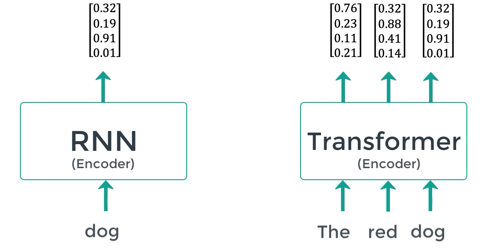
word embedding are generated one time&emsp;&emsp;&emsp;&emsp;&emsp;&emsp;&emsp;&emsp;&emsp;&emsp;there is no concept of time step for the input.

step at a time   &emsp;&emsp;&emsp;&emsp;&emsp;&emsp;&emsp;&emsp;&emsp;&emsp;&emsp;&emsp;&emsp;&emsp;&emsp;&emsp;&emsp;&emsp;we pass in all the words of the sentence simultaneously 

&emsp;&emsp;&emsp;&emsp;&emsp;&emsp;&emsp;&emsp;&emsp;&emsp;&emsp;&emsp;&emsp;&emsp;&emsp;&emsp;&emsp;&emsp;&emsp;&emsp;&emsp;&emsp;&emsp;&emsp;&emsp;&emsp;and determine the word embeddings simultaneously

#### Transformer Components

**Encoder block**

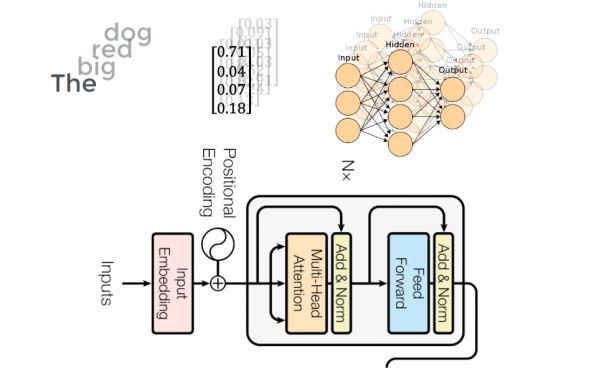

**1.Input embedding--vectors and matrices**

The idea is to map every word to a point in space where similar words in meaning are physically closer to each other. The space in which they are present is called an embedding space. We can train this embedding space to save time or even just use an already pre-trained embedding space.

**2.Positional Encoder** 

Embedding space maps a word to a vector but the same word in different sentences may have different meanings this is where positional encoders come in. It's a vector that has information on distances between words and the sentence. 

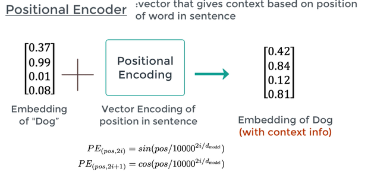

**3.Attention**

What part of the input should we focus?

Attention vectors are computed in the attention block for every word. We can have an attention vector generated which captures contextual relationships between words in the sentence.

Attention block computes the attention vectors for each word only have a problem here is that the attention vector may not be too strong for every word, the attention vector may weight its relation with itself much higher. It's true but it's useless we are more interested in interactions with different words and so we determine like eight such attention vectors per word and take a weighted average to compute the final attention vector for every word. We call it the **multi-head attention**.

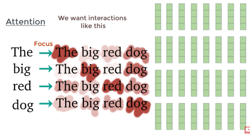

averaged vectors

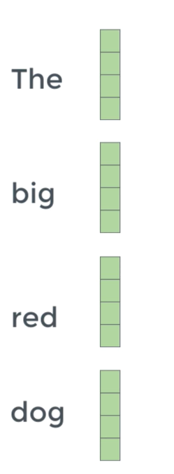

The attention vectors are passed in through a feed-forward net one vector at a time. The cool thing is that each of the attention nets are independent of each other so we can use parallization here.

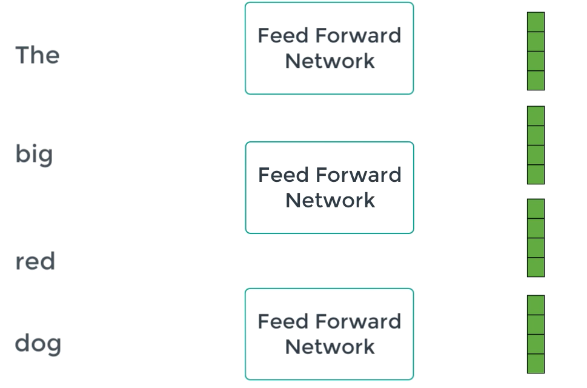
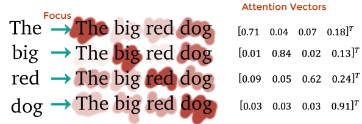

**Decoder block**

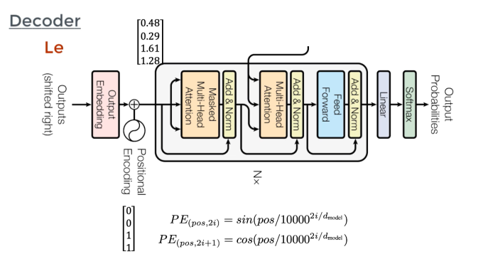

Encode-Decode Attention

Masked attention block