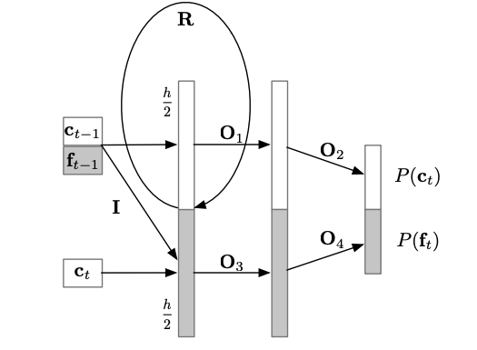
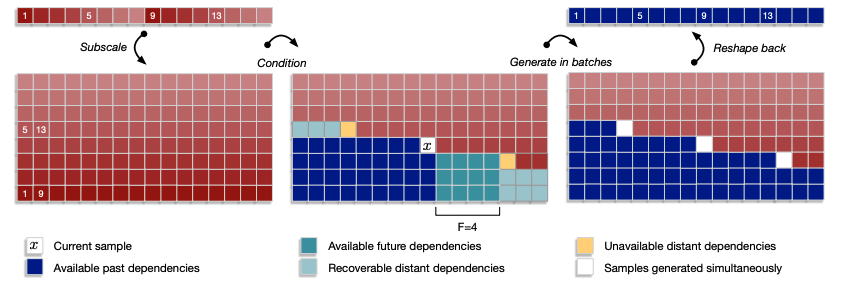
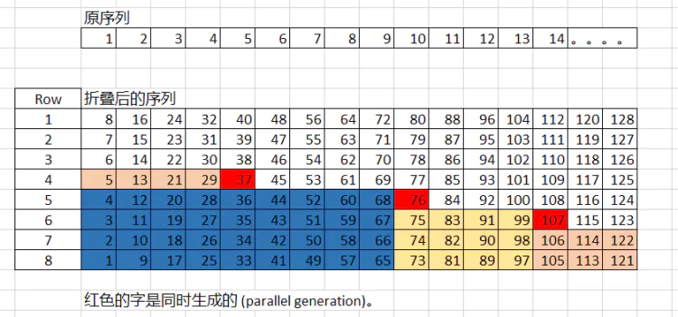

## WaveRNN

将声学特征转换为语音波形的这类模型通常被称作vocoder，一般来说，目前的端到端语音合成首先由声学模型生成声学特征，比如梅尔频谱、线性谱等，再由声码器转换为最终的语音。生成语音中的韵律、表现力等由声学模型决定，而清晰度则由声码器决定，声码器限制了最终合成语音的音质，同时也是整个语音合成模型的计算瓶颈。序列模型在文字和语音领域的任务中都有较好的结果，但是如何更快速地进行采样仍然是一个比较困难的问题。  

WaveRNN是WaveNet的进化版。wavenet is a generative model operating directly on the raw audio waveform. the joint probability of a waveform $ X={x_1, ...,x_T}$ is factorised as a product of conditional probabilities as follows:  

$$ p(X)=\prod _{t=1}^{T}p(x_t|x_1, ...,x_{t-1})$$

This structure lets the models allot(分配) significant capacity to estimate each conditional factor, makes them robust during training and easy to evaluate. The ordering encoded in the structure also makes the sampling process strictly serial: a sample can be generated only after samples on which it depends have been produced in accordance with根据 the ordering. The sampling process is slow and impractical to use these models to generate high-dimensional data like speech and video. Our goal is to increase the efficiency of sampling from sequential models without compromising their quality.  

### 序列模型的生成耗时分析

$$ T(u)=|u|\sum_{i=1}^N(c(op_i)+d(op_i))$$ 
$ T(u)$ 发音需要的时间，其中 $u$ 表示序列长度一共有 $ |u|$个sample，$N$ 表示网络层数，$c(op_i)$ 表示每一层的计算时间（wide layer or a large number of parameters,则计算时间长）, $d(op_i)$ 表示硬件执行程序的overhead时间，包含了调用程序，提取对应参数之类的时间。要想语音生成的快，上面的每个参数都要尽量小。对于波形重建而言，序列长度|𝑢|本身就很大，特别对于高质量的语音进行重建时，每秒包括24000个16bit位深的样本点。因此为了提高效率，可以通过：  

**1. Reduce N**:The WaveRNN model is a single-layer RNN with a dual双 softmax layer that is designed to efficiently predict 16-bit raw audio samples.The WaveRNN achieves this performance by requiring just N = 5 matrix-vector products in sequence for each 16-bit sample; however, WaveNet that has 30 residual blocks of two layers each requiring a series of N = 30 ∗ 2 = 60 matrix-vector products.  

**2. Reduce $c(op_i)$ --Sparse WaveRNN**:reducing the number of parameters in the network by weight pruning to sparsify the weights on WaveRNN. For a fixed parameter count, we discover that large sparse WaveRNNs significantly outperform small dense WaveRNNs  

**3. Reduce $d(op_i)$**: We sidestep回避 the overhead by implementing custom GPU operations for the sampling process.针对所进行实验的GPU型号(P100)设计了hidden units的个数896，使得所有参数都可以load到GPU的寄存器中，从而大幅度减少了overhead 时间(d)，模型的速度达到了96000 samples/second。  

**4. Propose a generation process based on subscaling--subscale WaveRNN**  
$|u|$固然不能减小，A tensor of scale $L$ is folded into $B$ sub-tensors of scale $L/B$. The $B$ sub-tensors are generated in order, each conditioned on the previous sub-tensors. Subscaling lets us generate multiple samples at once in a batch. 实践中，每个子向量的生成仅需要很小的下文信息，不需要依赖遥远的未来信息，因此下一个子向量的生成，可以在上一个子向量生成过程开始的不久之后就进行。实验中，subscale WaveRNN能够在每一步产生𝐵=16个样本，而不会损失音频清晰度。

#### 1.WaveRNN structure

每个音频样本点要生成16bit，如果直接使用softmax需要个标签，We split the state of the RNN in two parts that predict respectively the 8 coarse (or more significant) bits  and the 8 fine (or least significant) bits  of the 16-bit audio sample. 从而将输出空间压缩到$2^8=256$个值上。

The overall computation in the WaveRNN is as follows:

$$ x_t = [c_{t-1},f_{t-1},c_t]$$
$$ u_t=\sigma(R_uh_{t-1}+I_u^*x_t)$$
$$ r_t=\sigma(R_rh_{t-1}+I_r^*x_t)$$
$$ e_t=\tau(r_t)\circ(R_eh_{t-1}+I_e^*x_t)$$
$$ h_t=u_t \circ h_{t-1}+(1-u_t) \circ e_t$$
$$ y_c,y_f=\text{split}(h_t)$$
$$ p(c_t)=\text{softmax}(O_2relu(O_1y_c))$$
$$ p(f_t)=\text{softmax}(O_4relu(O_3y_f))$$

由于$f_t$ 的值依赖于 $c_t$，因此需要先计算 $c_t$，注意到公式第1行中既作为输入，公式第7行又作为了输出。这就是带有$∗$的这些矩阵的屏蔽作用了，矩阵𝐼其实是一个掩蔽矩阵（mask matrix），用于切断输入中的 $c_t$ 和输出中的 $c_t$ 的一切连接，最终作为输入的粗8位 $c_t$仅仅与细8位 $f_t$ 的状态 $u_t,r_t,e_t,h_t$ 相连接，而不会在求 $c_t$ 时，将 $c_t$ 作为输入，因此上式中除了最后两个之外，其实都需要计算两遍。

上图中，输入门首先从输出分布 $p(c_t)$ 中采样出 $c_t$，$c_t$ 被采样出来之后，$f_t$ 才能被计算和采样出来。注意，上图中的 $c_t$ 并没有作为 $p(c_t)$ 的输入

### 2.Sparse WaveRNN

#### 2.1 Weight Sparisification Method

为了降低模型大小和提高生成速率，必须减小模型的参数量。通过实验发现，在同样参数量的情况下，大而参数“稀疏”的模型要比小而参数“密集”的模型效果好得多。所谓参数“稀疏”是指在参数矩阵中，值为0的参数比较多，WaveRNN采用weight pruning方法减少模型中的非零权重。具体的做法是，对每一个参数矩阵都维护一个binary mask矩阵，开始时二元掩蔽矩阵的元素值全为1，每训练一段时间(500steps)，就会对参数矩阵的元素进行排序，将参数矩阵值最小的𝑘个元素对应的mask置为0。𝑘的计算需要考虑想要的稀疏度𝑍和参数矩阵中的元素总量，因此想要计算一个比例𝑧，这个比例𝑧乘上参数总量就是𝑘的值，在训练过程中，从0开始逐渐增加到目标稀疏度𝑍，比例系数𝑧的计算公式如下：  
$$ z=Z(1-(1-\frac{t-t_0}{S})^3)$$ 
其中，𝑡为此时的训练步数，$t_0$ 为参数裁剪开始时的训练步数，𝑆是总的裁剪步数。在该文的实验中，设置 $𝑡_0=1000,𝑆=200𝑘,$ 共训练500𝑘步。文中使用该策略稀疏GRU单元的3个门矩阵。  
 
#### 2.2 Structured Sparsity

我们探索结构化稀疏是为了减少内存开销,可以通过编码稀疏矩阵的方法提高计算效率。作者使用4x4 block作为单位来压缩矩阵，也就是说，原有的参数矩阵被压缩为多个4x4矩阵，这样binary mask的大小就可以缩小为原来的十六分之一，且不会损失表现。作者尝试的另一个结构是16x1 block，这种压缩方法只需要一个dot product就可以得到activation value，因此在效率上表现更好。  

#### 2.3 Sparse WaveRNN Sampling on Mobile CPU

weights converted 16-bit floating point to 32-bit floating point.The low memory overhead afforded by small blocks allows the sparse matrix-vector products to match the performance of dense matrix-vector products with the same parameter count.  

### 3.Subscale WaveRNN

如果可以一次同时生成多个样本点，就可以“减小”序列长度，就是一个并行生成的概念。这里一次生成𝐵个样本点，因此序列长度就“缩小”了𝐵倍  

$$ T(u)=\frac{|u|}{B}\sum_{i=1}^N(c(op_i^B)+d(op_i^B))$$ 

**Step 1**: 首先 把一个尺度为L的张量折叠成L/B 大小的B 个张量。 以上图为例， 就是把数列， 1，2，3，4,...128 这么长的数列折叠成了8 份,每一份都是16 这么长的张量。 这里叫子规模生成的原因是本来生成的数字是1,2,3,4,5,6... 这些。但是折叠以后生成的是1,9,17,25,这样的数组， 相当于把原数列降采样，即sub-scale sampling.  

**Step 2**: 解释了声音生成过程，以及相对的依赖关系(conditioning)。这里假设每个子张量的生成需要较小的前瞻性。 首先生成的是第八行， 即 1，9，17，25，33 ...这列数组。 这列数组会先生成， 然后生成的是第七行数组， 依次生成。 但是第七行数组的生成不仅考虑第八行和第七行当前时间已经生成的数组，还要看第八行横轴未来生成的数组。 按照原论文， 这里主要解释第五行红色数字，76 的生成。 76 的生成， 需要考虑当前时刻之前的所有数字， 即第八行， 第七行， 第六行， 第五行， 1-9列蓝色标注的数值，还要考虑未来， 10-13列产生的数值， 即前瞻性为F=4.  

**Step 3**:  解释了并行生成的过程。 依照上图， 就是红色标注的37， 76， 107 是可以同时并列生成。他的前瞻性都是4， 如step 2 中的解释。  

**Step 4**: 最后一步就是把生成的矩阵，再展开变成原来的数列， 1，2，3，4，5...这样的话就实现了高度并行快速生成语音的目的。按照上图的解释，如果想生成 24kHz 的声音， 每一个子规模的生成速度就是24/16= 1.5kHz, 如果B = 16.