# 算法工程师面试

## 深度学习(CV)

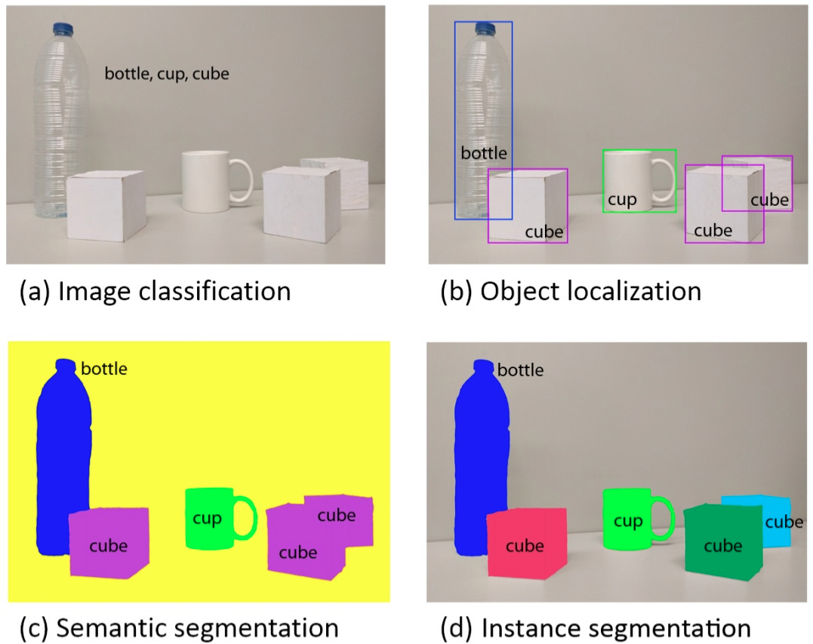

- **什么样的数据集不适合深度学习**

1.数据集太小，数据样本不足时，深度学习相对其它机器学习算法，没有明显优势。  
2.数据集没有局部相关特性，目前深度学习表现比较好的领域主要是图像／语音／自然语言处理等领域，这些领域的一个共性是局部相关性。图像中像素组成物体，语音信号中音素组合成单词，文本数据中单词组合成句子，这些特征元素的组合一旦被打乱，表示的含义同时也被改变。对于没有这样的局部相关性的数据集，不适于使用深度学习算法进行处理。举个例子：预测一个人的健康状况，相关的参数会有年龄、职业、收入、家庭状况等各种元素，将这些元素打乱，并不会影响相关的结果。

### 介绍经典的五种卷积神经网络

#### 1. LeNet

n个CNN + maxpooling layer+n个CNN + maxpoolinglayer + ...+ full layers

- 通过梯度下降训练卷积神经网络达到手写数字识别，当时最先进结果

- 交替使用卷积层和最大池化层后接全连接层来进行图像分类

- 卷积层用来识别特征，池化层用来降低位置敏感度

- 首次证明了学习到的特征可以超越设计的特征

#### 2. AlexNet

引入了 Relu 和 dropout,引入数据增广、池化相互之间有覆盖，五个卷积一个最大池化+三个全连接层.它是浅层神经⽹络和深度神经⽹络的分界线。

- 使用过多的卷积层和更大的参数空间拟合大规模数据集ImageNet

- 5层卷积，两层全连接隐藏层和1层全连接输出层

- 将sigmoid 函数换成了 Relu激活函数

- 使用dropout 控制全连接层模型的复杂度

- 引入大量的图像增广

#### 3. VGG

采用1×1和3×3的卷积核以及2×2的最大池化使得层数变得更深, 重复使⽤的卷积块来构造⽹络。

- 提出了通过重复使用简单的基础块来构造深度模型的思想

- 多个CNN与非线性激活层交替比单一CNN更能提取特征

- 3*3 小卷积可以增加网络层熟，减少参数

- AlexNet和VGG的改进是把模块加宽（增加通道数）和加深

#### 4. ResNet

非常非常深的神经网络是很难训练的，因为存在梯度消失和梯度爆炸问题。ResNet利用跳跃连接（Skip connection），从某一层网络层获取激活，然后迅速反馈给另外一层，甚至是神经网络的更深层。残差块学习恒等函数非常容易，你能确定网络性能不会受到影响，很多时候甚至可以提高效率。

- 深度网络的退化问题，高层的线性关系很难学到，因此我们将这种线性关系加入到网络的学习中

- ResNet学习的残差函数 $F(x)=H(x)-x$,这里如果 $F(x)=0$ 那么就是恒等映射

#### 5. GoogleNet

Google Inception Net：引入Inception Module，这是一个4个分支结合的结构。去除了最后的全连接层，而是用一个全局的平均池化来取代它。

- 不是单纯的加深网络，而是通过引入inception 的概念，通过多个卷积提取图像不同尺度的信息，最后融合

- 采用不同大小的卷积核意味着不同大小的感受野，最后拼接--位置不同尺度特征的融合

- 采用1*1卷积核来绛维，同时实现跨通道信息交互

- inception可以保持网络结构的稀疏性，又能利用密集矩阵的高性能计算

### 常用的池化操作有哪些?有什么特点?

maxpooling,avgpooling  

### 池化在卷积神经网络里面有何作用，在引进池化后解决了什么问题？

pool 一般放在 conv_layer 之后, 通过池化来降低卷积层输出的特征维度，有效减少网络参数的同时还可以防止过拟合现象,增加特征平移不变性。**最大池化类似于PCA有效的对数据降维的同时保留关键特征**.pooling可以提高网络对微小位移的容忍能力，缓解卷积层对位置的过度敏感性。提升模型尺度不变性,旋转不变性,抑制噪声降低信息冗余 

当特征的信息都具有一定贡献时使用AvgPooling,比如网络深处

### 非线性函数的必要性

如果只是把神经元简单的连接在一起，不加入非线性处理，最终得到的仍然是线性函数，无法完成描述各种复杂的现象，可看出在神经元的输出时需要一个非线性函数是必要的。

### 列举至少三种激活函数，分别阐述他们的优缺点

#### 1. sigmoid

- 当输入稍微远离了坐标原点，函数的梯度就变得很小了，几乎为零。

- 函数输出不是以0为中心的，这样会使权重更新效率降低。???

- sigmod函数要进行指数运算，这个对于计算机来说是比较慢的。

#### 2. tanh

- 优点：这两个函数在输入很大或是很小的时候，输出都几乎平滑，梯度很小，不利于权重更新.

- 缺点：整个函数是以0为中心的，这个特点比sigmod的好。

#### 3. Relu

- 优点：在输入为正数的时候，不存在梯度饱和问题。计算速度要快很多，ReLU函数只有线性关系。

- 缺点：当输入是负数的时候，ReLU是完全不被激活的，这就表明一旦输入到了负数，ReLU就会死掉。ReLU函数也不是以0为中心的函数。

#### 4. Maxout

- 优点：克服了Relu的缺点

### 激活函数总结  

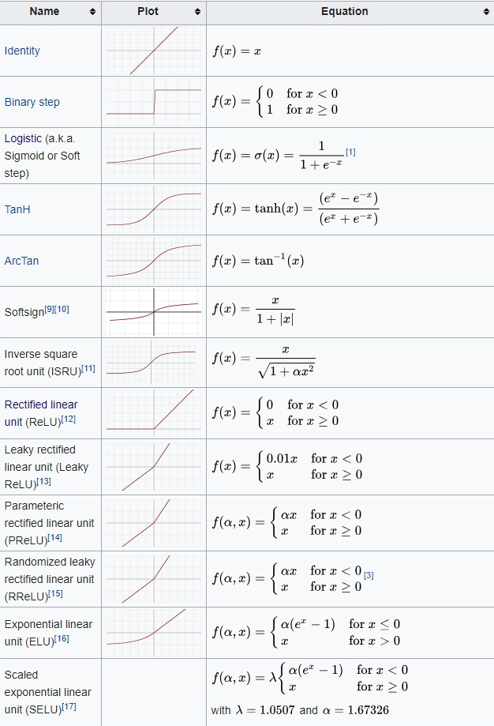
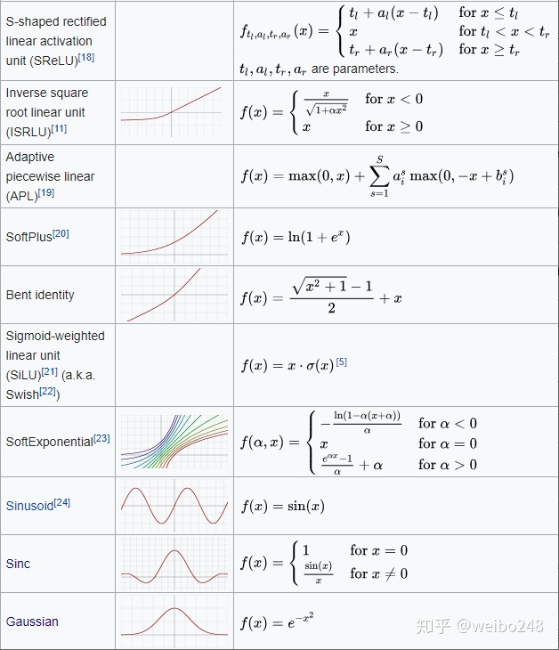

深度网络中激活函数的选择对训练过程和任务性能有很大影响。目前，最成功、使用最广泛的激活函数是修正线性单元（Rectified Linear Unit，**ReLU x = max(0,x)**）。尽管出现了很多修正 ReLU 的激活函数，但是无一可以真正替代它。我们提出了一种新型激活函数 **Swish：f(x) = x · sigmoid(x), 其中sigmoid(x)=1/(1+exp(-x))** 。我们在多个难度较高的数据集上进行实验，证明 Swish 在深层模型上的效果优于 ReLU。例如，仅仅使用 Swish 单元替换 ReLU 就能把 Mobile NASNetA 在 ImageNet 上的 top-1 分类准确率提高 0.9%，Inception-ResNet-v 的分类准确率提高 0.6%。Swish 的简洁性及其与 ReLU 的相似性使从业者可以在神经网络中使用 Swish 单元替换 ReLU。不过在 Reddit 论坛上，该激活函数的性能与优点还是有些争议的，有的开发者发现该激活函数很多情况下可以比标准的 ReLU 获得更高的性能，而有些开发者则认为 Swish 激活函数并没有什么新意，我们应该关注于更加基础的研究。  

#### 4. swish函数图像:  

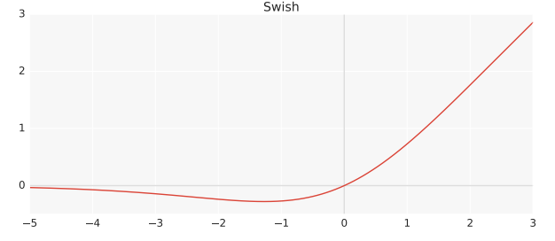
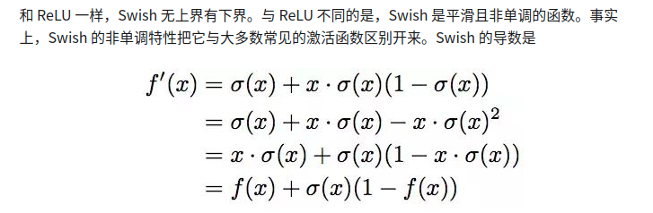
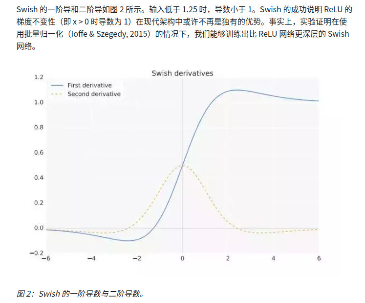


我们的实验证明 Swish 在多个深度模型上的性能持续优于或与 ReLU 函数相匹配。由于训练会受多种因素的影响，我们很难证明为什么一个激活函数会优于另一个。但是我们认为 Swish 无上界有下界、非单调且平滑的特性都是优势  

#### 5. Mish  

ReLU和Mish的对比，Mish的梯度更平滑  

**Mish=x * tanh(ln(1+e^x))**  

**为什么Mish表现这么好?**  

上无边界:避免了在训练时优于梯度为0导致的饱和。  
有下界:  
非单调:对于Mish来说是很重要的因素．我们保证了在负值区域有梯度值，它能够使网络学习的更好  
连续性:处处可微，可以有效的优化和泛化.  

尽管如此，我测试了许多激活函数，它们也满足了其中的许多想法，但大多数都无法执行。这里的主要区别可能是Mish函数在曲线上几乎所有点上的平滑度(可微)。

这种通过Mish激活曲线平滑性来推送信息的能力如下图所示，在本文的一个简单测试中，越来越多的层被添加到一个测试神经网络中，而没有一个统一的函数。随着层深的增加，ReLU精度迅速下降，其次是Swish。相比之下，Mish能更好地保持准确性，这可能是因为它能更好地传播信息  
  
更平滑的激活功能允许信息更深入地流动……注意，随着层数的增加，ReLU快速下降。

### 介绍感受野以及如何计算感受野

感受野是卷积神经网络(CNN)每一层输出的特征图(feature map)上的像素点在原始输入图像上映射的区域大小。感受野的计算从最深层开始向浅层计算，逐步计算到第一层，所以计算前要知道网络的整体结构和参数。

### 增大感受野(receptive field)的方法

较大的卷积核尺寸的卷积操作，小卷积的多层叠加，空洞卷积，池化操作  

### $1\times1$ 卷积层作用

1.降维(dimension reductionality):eg,一张500\*500且厚度depth为100 的图片在20个filter上做1\*1的卷积，那么结果的大小为500\*500\*20,降低参数数量,当然也可以升维，1x1卷积的作用是为了让网络根据需要能够更灵活的控制数据的depth的。  
2.加入非线性。卷积层之后经过激励层，1\*1的卷积在前一层的学习表示上添加了non-linear activation,提升网络的表达能力  
3.跨通道信息交互:使用1x1卷积核，实现降维和升维的操作其实就是channel间信息的线性组合变化，3x3，64channels的卷积核后面添加一个1x1，28channels的卷积核，就变成了3x3，28channels的卷积核，原来的64个channels就可以理解为跨通道线性组合变成了28channels，这就是通道间的信息交互  

### 卷积层和池化层有什么区别?

卷积层有参数，池化层没有参数，经过卷积层节点矩阵深度会改变，池化层不会改变节点矩阵的深度，但它可以缩小节点矩阵的大小  

### 什么是过拟合？深度学习解决过拟合的方法有哪些？

过拟合表现在训练好的模型在训练集上效果很好，但是在测试集上效果差。也就是说模型的泛化能力弱.  
过拟合主要两个原因造成，数据太少和模型太复杂  

解决过拟合方法: early stopping，L1 regularization，L2 regularization, dropout，数据增强，增加样本数据量。

- early stopping: 模型在验证集上的误差在一开始是随着训练集的误差的下降而下降的。当超过一定训练步数后，模型在训练集上的误差虽然还在下降，但是在验证集上的误差却不在下降了。此时我们的模型就过拟合了。因此我们可以观察我们训练模型在验证集上的误差，一旦当验证集的误差不再下降时，我们就可以提前终止我们训练的模型。

- L1 regularization

    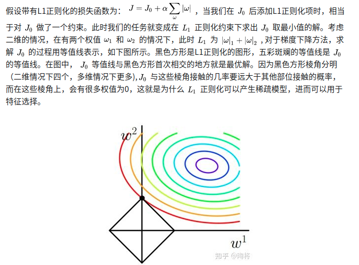            
    参数的稀疏，在一定程度实现了特征的选择.  

- L2 regularization  
    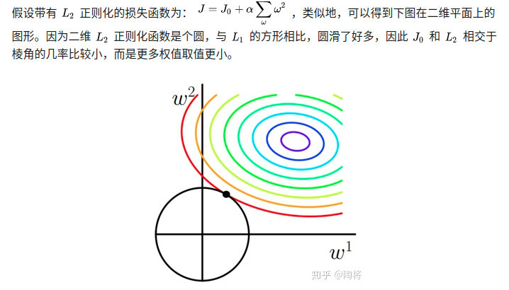 

- dropout:通过修改隐藏层神经元的个数来防止网络的过拟合，也就是通过修改深度网络本身。在每一批次数据被训练时，Dropout按照给定的概率P随机剔除一些神经元，只有没有被剔除神经元的参数被更新。每一批次数据，由于随机性剔除神经元，使得网络具有一定的稀疏性，从而能减轻了不同特征之间的协同效应。而且由于每次被剔除的神经元不同，所以整个网络神经元的参数也只是部分被更新，消除减弱了神经元间的联合适应性，增强了神经网络的泛化能力和鲁棒性。**Dropout只在训练时使用，作为一个超参数，然而在测试集时，并不能使用**

### dropout原理

Hinton认为过拟合可以通过阻止某些特征的协同作用来缓解．  
模型平均,防止参数过分依赖训练数据，增加参数对数据集的泛化能力  
1.取平均的作用(Bagging通过几个模型降低泛化误差的技术): 先回到正常的模型（没有dropout），我们用相同的训练数据去训练5个不同的神经网络，一般会得到5个不同的结果，此时我们这种“综合起来取平均”的策略通常可以有效防止过拟合问题。因为不同的网络可能产生不同的过拟合，取平均则有可能让一些“相反的”拟合互相抵消。dropout掉不同的隐藏神经元就类似在训练不同的网络（随机删掉一半隐藏神经元导致网络结构已经不同)，整个dropout过程就相当于 对很多个不同的神经网络取平均。而不同的网络产生不同的过拟合，一些互为“反向”的拟合相互抵消就可以达到整体上减少过拟合。  
bagging与dropout的不同点:Bagging所有模型都是独立的(模型之间的参数不会有相互的影响).Dropout所有模型共享参数(每个子模型继承父神经网络的不同子集)

2.减少神经元之间复杂的共适应关系： 因为dropout程序导致两个神经元不一定每次都在一个dropout网络中出现。（这样权值的更新不再依赖于有固定关系的隐含节点的共同作用，阻止了某些特征仅仅在其它特定特征下才有效果的情况）。 迫使网络去学习更加鲁棒的特征 （这些特征在其它的神经元的随机子集中也存在）。换句话说假如我们的神经网络是在做出某种预测，它不应该对一些特定的线索片段太过敏感，即使丢失特定的线索，它也应该可以从众多其它线索中学习一些共同的模式（鲁棒性）。（这个角度看 dropout就有点像L1，L2正则，减少权重使得网络对丢失特定神经元连接的鲁棒性提高）

### 解决欠拟合的方法有哪些？

通过增加网络复杂度或者在模型中增加特征  

### 深度模型参数调整的一般方法论？

- 重要性：学习率>正则值>dropout 学习率：0.001，0.01，0.1，1，10 …….以10为阶数尝试

- 小数据集上合适的参数大数据集上一般不会差，可以先减少训练类别。

- 欠拟合：增加网络层数，增加节点数，减少dropout值，减少L2正则值等等。

- 过拟合：增加数据、数据增强、参数范数惩罚L1、L2、提前终止、增加dropout值、BatchNormalization。

### 给定卷积核的尺寸，特征图大小计算方法？

假设给定： 1. 输入层宽度W，高度H 2. 卷积层尺寸F 3. 步幅为S 4. 填充边框为P 5. 滤波器数量K  
W_out = [(W−F+2P)/S]+1  
H_out = [(H-F+2P)/S]+1  
D_out = K  

### 卷积层参数量，全连接层参数量，卷积层计算量，全连接层计算量

卷积神经网络可以学习到模型的空间层次结构。  
卷积层参数量:输入28x28x192(WxHxC,C代表通道数)，然后在3x3的卷积核，卷积通道数为128，那么卷积的参数有(3x3x192+1)x128,注意!卷积核的权值共享只在每个单独通道上有效，至于通道与通道间的对应的卷积核是独立不共享的，所以这里是192x128,+1是因为bias  

CNN模型的参数数量取决于滤波器的数量和大小，而不是输入图像，因此，将图像的大小加倍并不会改变模型的参数数量。

全连接层参数量:VGG-16最后一次卷积得到的feature map为7×7×512,全连接层是将feature map展开成一维向量1×4096

### BatchNormalization

随着训练的进行，网络中的参数也随着梯度下降在不停更新。一方面，当底层网络中参数发生微弱变化时，由于每一层中的线性变换与非线性激活映射，这些微弱变化随着网络层数的加深而被放大（类似蝴蝶效应）；另一方面，参数的变化导致每一层的输入分布会发生改变，进而上层的网络需要不停地去适应这些分布变化，使得我们的模型训练变得困难。上述这一现象叫做Internal Covariate Shift.  

Internal Covariate Shift:在深层网络训练的过程中，由于网络中参数变化而引起内部结点数据分布发生变化的过程  
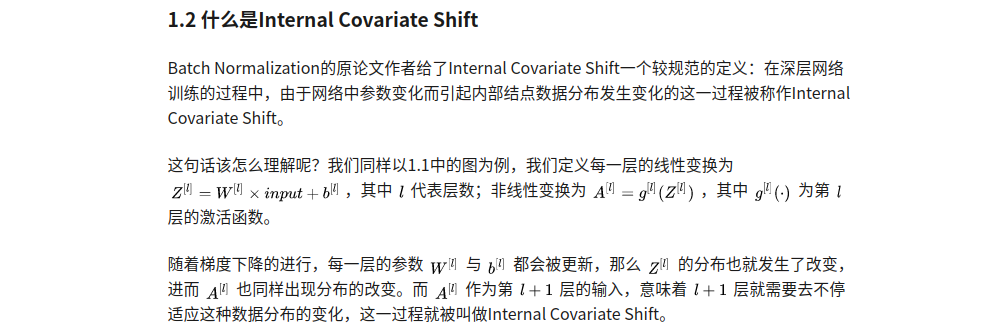 

Internal Covariate Shift Problem:  
1）上层网络需要不停调整来适应输入数据分布的变化，导致网络学习速度的降低  
2）网络的训练过程容易陷入梯度饱和区，减缓网络收敛速度  

对于激活函数梯度饱和问题，有两种解决思路。第一种就是变为非饱和性激活函数，例如ReLU可以在一定程度上解决训练进入梯度饱和区的问题。另一种思路是，我们可以让激活函数的输入分布保持在一个稳定状态来尽可能避免它们陷入梯度饱和区，这也就是Normalization的思路。  
 
### 如何减缓Internal Covariate Shift  

Batch Normalization被提出.  

在深度学习中，由于采用full batch的训练方式对内存要求较大，且每一轮训练时间过长；我们一般都会采用对数据做划分，用mini-batch对网络进行训练。因此，Batch Normalization 也就在 mini-batch 的基础上进行计算  

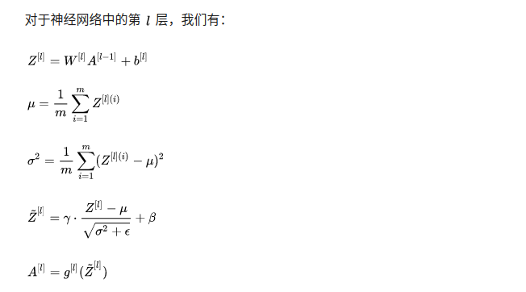  

Batch Normalization 引入了两个 learnable parameters(gamma,beta)  

### 测试阶段如何使用 Batch Normalization

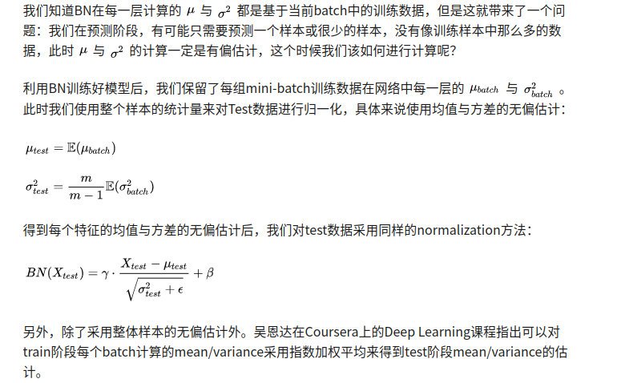  

### Batch Normalization 优势

(1)BN使得网络中每层输入数据的分布相对稳定，加速模型学习速度,BN通过规范化与线性变换使得每一层网络的输入数据的均值与方差都在一定范围内，使得后一层网络不必不断去适应底层网络中输入的变化，从而实现了网络中层与层之间的解耦，允许每一层进行独立学习，有利于提高整个神经网络的学习速度。

(2)BN使得模型对网络中的参数不那么敏感，简化调参过程，使得网络学习更加稳定  
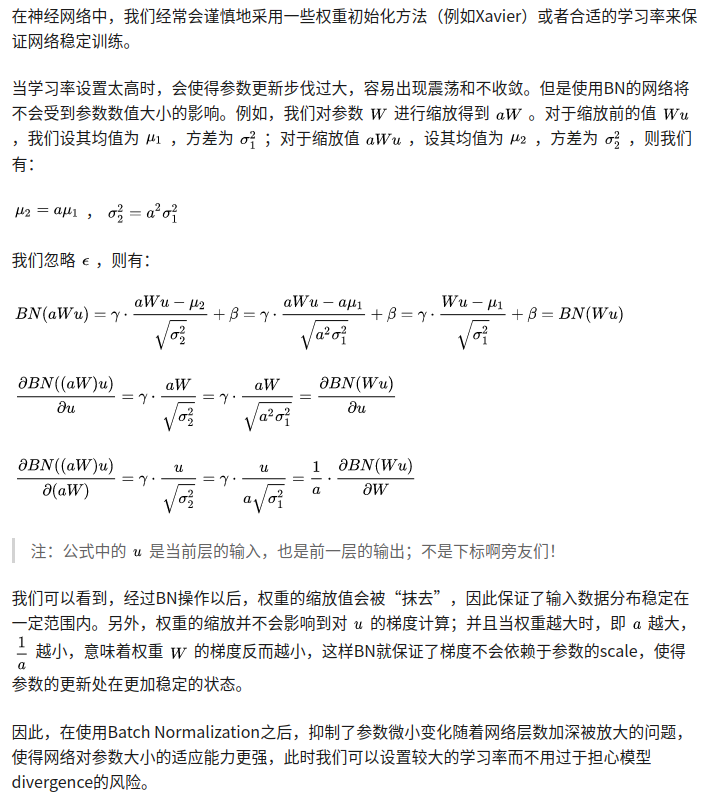  

(3)BN允许网络使用饱和性激活函数（例如sigmoid，tanh等），缓解梯度消失问题,在不使用BN层的时候，由于网络的深度与复杂性，很容易使得底层网络变化累积到上层网络中，导致模型的训练很容易进入到激活函数的梯度饱和区；通过normalize 操作可以让激活函数的输入数据落在梯度非饱和区，缓解梯度消失的问题；另外通过自适应学习 $\gamma$ 与 $\beta$,又让数据保留更多的原始信息。  

(4)BN具有一定的正则化效果  
在Batch Normalization中，由于我们使用mini-batch的均值与方差作为对整体训练样本均值与方差的估计，尽管每一个batch中的数据都是从总体样本中抽样得到，但不同mini-batch的均值与方差会有所不同，这就为网络的学习过程中增加了随机噪音，与Dropout通过关闭神经元给网络训练带来噪音类似，在一定程度上对模型起到了正则化的效果  
另外，原作者通过也证明了网络加入BN后，可以丢弃Dropout，模型也同样具有很好的泛化效果。  
可以防止过拟合，Batch Normalization 调整了数据的分布，不考虑激活函数，它让每一层的输出归一化到了均值为0方差为1的分布，这保证了梯度的有效性，可以解决反向传播过程中的梯度问题,缓解了 Internal Covariate Shift问题  

### 训练过程中模型不收敛，是否说明模型无效?是什么原因导致的模型不收敛?

不一定无效  
1.没有正确初始化权重．解决方法:"lecun"或"xavier(he_initialization)权重初始化几乎在所有情况下表现良好  
2.使用不正确的学习率  
3.没有对数据进行归一化:这是由于不同评价指标往往具有不同的量纲和量纲单位，这样的情况会影响到数据分析的结果，为了消除指标之间的量纲影响，需要进行数据标准化处理，以解决数据指标之间的可比性。原始数据经过数据标准化处理后，各指标处于同一数量级，适合进行综合对比评价  
4.没有对数据进行预处理  
没有对数据做归一化。忘了做数据预处理。忘了使用正则化。Batch Size设的太大。学习率设的不对。最后一层的激活函数用的不对。网络存在坏梯度。比如Relu对负值的梯度为0，反向传播时，0梯度就是不传播。参数初始化错误。网络太深。隐藏层神经元数量错误。

### 什么是梯度消失和梯度爆炸，分别阐述解决办法

梯度消失：这本质上是由于激活函数的选择导致的， 最简单的sigmoid函数为例，在函数的两端梯度求导结果非常小（饱和区），导致反向传播过程中由于多次用到激活函数的导数值使得整体的乘积梯度结果变得越来越小，也就出现了梯度消失的现象。

梯度爆炸：同理，出现在激活函数处在激活区，而且权重W过大的情况下。但是梯度爆炸不如梯度消失出现的机会多。

解决梯度消失和梯度爆炸问题，常用的有以下几个方案：

1.预训练模型 + 微调。

2.梯度剪切 + 正则化。

3.relu、leakyrelu、prelu等激活函数。

4.BN批归一化。

5.残差结构。

6.选用合适的学习率。

### 归一化和标准化的方法有哪些？在神经网络中归一化和标准化的作用

- 归一化：将训练集中某一列数值特征(假设是第i列)的值缩放到0和1之间。

$$\frac{x_i-\text{min}(x_i)}{\text{max}(x_i)-\text{min}(x_i)}$$

- 标准化：将训练集中某一列数值特征(假设是第i列)的值缩放成均值为0，方差为1的状态。

$$\frac{x_i-\bar{x_i}}{sd(x)}$$

### 介绍一下卷积和全连接的区别，为什么在图像领域卷积的效果要比全连接好？

和只用全连接层相比，卷积层的两个主要优势在于参数共享和稀疏连接。一是参数共享。观察发现，特征检测如垂直边缘检测如果适用于图片的某个区域，那么它也可能适用于图片的其他区域。第二个方法是使用稀疏连接，通过3×3的卷积计算得到的输出对应依赖于这个3×3的输入的单元格，而且其它像素值都不会对输出产生任何影响，这就是稀疏连接的概念。神经网络可以通过这两种机制减少参数，以便我们用更小的训练集来训练它，从而预防过度拟合。

### 如何减少参数

权值共享、VGG的感受野、GoogLeNet的inception

CNN中减少网络的参数的三个思想：

1） 局部连接（Local Connectivity）：每个神经元没有必要对全局图像进行感知，只需要对局部进行感知，然后在更高层将局部的信息综合起来就得到了全局的信息。

2） 权值共享（Shared Weights）：对于同一个卷积核，它在一个区域提取到的特征，也能适用于其他区域。在一个卷积核的情况下，进行权值共享。

3） 池化（Pooling）：池化一般分为max pooling和average pooling。定义池化窗口，最大池化为取窗口中最大的那个值，平均池化为取窗口中所有数的平均值。

4）1x1卷积核 （inception）：1x1的卷积核可以进行降维或者升维，也就是通过控制卷积核（通道数）实现，这个可以帮助减少模型参数，也可以对不同特征进行尺寸的归一化；同时也可以用于不同channel上特征的融合。一个trick就是在降维的时候考虑结合传统的降维方式，如PCA的特征向量实现，这样效果也可以得到保证。

### 神经网络不收敛的原因

- 使用不正确的学习率，如学习率过大，网络可能快要收敛了，却忽然在下一个epoch走向了错误的方向，最终导致不收敛。

- 优化算法不对，一般用adam居多

- 初始化权重错误，网络中包含坏的梯度，过深的网络，在输出层使用错误的激活函数

- 没有对数据进行预处理如归一化，正则化等

### 解释 bias 和 variance 之间的关系

什么是bias？可以理解，bias是当前模型的平均预测与我们需要预测的实际结果之间的差异。一个高 bias 的模型表明它对训练数据的关注较少。这使得模型过于简单，在训练和测试中都没有达到很好的准确性。这种现象也被称为欠拟合。

Variance 可以简单理解为模型输出在一个数据点上的分布。Variance 越大，模型越有可能密切关注训练数据，而不提供从未遇到过的数据的泛化。因此，该模型在训练数据集上取得了非常好的结果，但是与测试数据集相比，结果非常差，这就是过拟合的现象

### 优化方法

为了降低泛化误差，除了使⽤优化算法降低训练误差以外，还需要注意应对过拟合。

- 小批量随机梯度下降：在每⼀次迭代中，梯度下降使⽤整个训练数据集来计算梯度，因此它有时也被称为批量梯度下降 （batch gradient descent）。而随机梯度下降在每次迭代中只随机采样⼀个样本来计算梯度。我们还可以在每轮迭代中随机均匀采样多个样本来组成⼀个小批量，然后使⽤这个小批量来计算梯度。

- 动量法：在动量法中，⾃变量在各个⽅向上的移动幅度不仅取决当前梯度，还取决于过去的各个梯度在各个⽅向上是否⼀致。
动量法使⽤了指数加权移动平均的思想。它将过去时间步的梯度做了加权平均，且权重时间步指数衰减。动量法使得相邻时间步的⾃变量更新在⽅向上更加⼀致。

- AdaGrad算法：在迭代过程中不断调整学习率，并让⽬标函数⾃变量中每个元素都分别拥有⾃⼰的学习率。 使⽤AdaGrad算法时，⾃变量中每个元素的学习率在迭代过程中⼀直在降低（或不变）。当学习率在迭代早期降得较快且当前解依然不佳时，AdaGrad算法在迭代后期由于学习率过小，可能较难找到⼀个有⽤的解。

- RMSProp算法和AdaGrad算法的不同在于，RMSProp算法使⽤了小批量随机梯度按元素平方的指数加权移动平均来调整学习率。

- Adam算法在RMSProp算法的基础上对小批量随机梯度也做了指数加权移动平均。

### 什么是模型的超参数？

如果模型参数是由训练数据集本身建模的，则模型超参数是完全不同的。它完全在模型之外，不依赖于训练数据。它的目的是什么?实际上，他们有以下几个任务:

用于训练过程中，帮助模型找到最合适的参数

它通常是由模型训练的参与者手工挑选的

它可以基于几种启发式策略来定义

对于一个特定的问题，我们完全不知道什么是最好的模型超参数。因此，在现实中，我们需要使用一些技术来估计最佳取值范围(例如 k 近邻模型中的k系数)，如网格搜索。这里我想举几个模型超参数的例子：

训练人工神经网络时的学习率
训练支持向量机时的C和sigma参数
最近邻模型中的k系数

### 数据生成器的概念是什么？我们什么时候需要使用它？

数据生成器帮助我们直接生成数据，然后送到模型中进行每个batch的训练。利用生成器对训练大的数据有很大的帮助。因为数据集并不总是需要全部加载到RAM中，这是一种内存的浪费，如果数据集太大，将会导致内存溢出，输入数据的处理时间会变长。

## 分类模型评估方法

### 如何处理数据不平衡的问题？

- 选择正确的度量来评估模型
    
    对于不平衡的数据集，使用 accuracy来进行评估是危险的，应选择 precision, recall, F1 score 和 AUC等合适的评估方法

- 对不平衡的数据进行重采样

    欠采样和过采样，具体包括重复、boostrapping 或者 hits 等方法

- 重新设计模型的损失函数

    使用惩罚技术对代价函数中的少数类进行严厉惩罚，帮助模型更好的学习稀有类的数据

### 1. **Accuracy作为指标有哪些局限性？**

当正负样本极度不均衡时存在问题！比如，正样本有99%时，分类器只要将所有样本划分为正样本就可以达到99%的准确率。但显然这个分类器是存在问题的。

当正负样本不均衡时，常用的评价指标为ROC曲线和PR曲线。

### 2. ROC曲线和PR曲线各是什么？

ROC:由 FPR(False positive rate)和TPR(True positive rate)为横纵坐标的曲线  

FPR:FP/(FP+TN)误分为正样本的负样本占所有实际负样本的比例  
TPR:TP/(TP+FN)正确分类的正样本占所有实际正样本的比例  

True Positive, TP: 正确的正样本(预测为正样本，实际也为正样本)  
False Positive, FP:错误的正样本(预测为正样本，实际为负样本)  
True Negative, TN: 正确的负样本(预测为负样本，实际也为负样本)  
False Negative, FN: 错误的负样本(预测为负样本，实际为正样本)  

PR:Precision-Recall 曲线，x:Recall，y:Precision  

Precision=TP/(TP+FP), 正确的正样本占所有预测正样本的比例  
Recall=TP/(TP+FN)， 正确的正样本占所有实际正样本的比例  

ROC越靠左上角效果越好，AUC为横纵坐标围成的面积，越大越好.  

- **编程实现AUC的计算，并指出复杂度？**

```
from sklearn.metrics import roc_auc_score
auc_score = roc_auc_score(y_truth,y_pred)
```

- **AUC指标有什么特点？放缩结果对AUC是否有影响？**

AUC指的是ROC曲线下的面积，介于0和1之间。AUC作为数值可以直观的评价分类器的好坏，值越大越好。放缩结果不影响AUC

### 3.F1 Score

$$\frac{2}{F_1}=\frac{1}{P}+\frac{1}{R}$$

### 当训练深度学习模型，Epoch, Batch 和 Iteration 概念是什么意思？

Epoch: 表示整个数据集的迭代

Batch: 是指当我们不能一次将整个数据集放到神经网络中时，我们将数据集分割成几批较小的数据集

Iteration：是运行一个epoch需要的批数。如10000个图像作为数据，batch_size=200,则 1 epoch 将包含50个迭代

- **余弦距离与欧式距离有什么特点？**

### 目标检测(object detection)模型评估方法

- **mAP**  

当pre-bbox和groundtruth bbox的IOU大于某一阈值(通常为0.5)，则认为该预测正确。对每个类别，我们画出它的precision-recall曲线，平均准确率是曲线下的面积。之后再对所有类别的平均准确率求平均，即可得到mAP，其取值为[0, 100%]。


### 常用的损失函数有哪些？分别适用于什么场景？

L1 loss:绝对差平均损失，又称MAE

$$MAE=\sum_{i=1}^n |y_i-y_i^p|$$

L2 loss:平方差平均损失，又称MSE

$$MSE=\sum_{i=1}^n (y_i-y_i^p)^2$$

smooth L1 loss:又称Huber损失

$$$$

$\text{Focal loss}=-{\alpha}_t*(1-p_t)^\gamma \log(p_t)$  

交叉熵损失函数:$-\sum_{i}^{n} {y^i}\log(P_i)$

### 14. 为什么常用交叉熵来作为分类问题的损失函数

从数学上来理解就是，为了让学到的模型分布更接近真实数据的分布，我们需要最小化模型数据分布与训练数据之间的差异，相对熵(又称KL 散度)来衡量这两个分布的差异

交叉熵 $H(p,q)=-\sum_{i=1}^n p(x_i)\text{log}(q(x_i))$

相对熵 $D_{KL}(p||q)=\sum_{i=1}^n p(x_i)\text{log}\frac{p(x_i)}{q(x_i)}=\sum_{i=1}^n p(x_i)\text{log}p(x_i)-\sum_{i=1}^n p(x_i)\text{log}q(x_i)$

相对熵=交叉熵-信息熵

因为训练数据的分布是固定的，所以信息熵固定，因此最小化 KL 散度等价于最小化交叉熵，而且交叉熵计算更简单

### 梯度下降与拟牛顿法的异同？

梯度下降用于数据较大情况，缺点:每一步可能不是总向着最优解的方向  
拟牛顿:收敛速度更快，缺点:迭代时间长，需要计算一阶二阶导数，计算量大，精度过高对于深层模型反而不好，破坏了泛化性能

- **以一层隐层的神经网络，relu激活，MSE作为损失函数推导反向传播**

### 如果网络不初始化权重，即初始权重为0，那么网络训练出来会是什么效果？NN的权重参数能否初始化为0？

神经网络的权重w 的不同代表输入的向量有不同的特征，即权重越大的特征越重要，比如在人脸识别中，人脸的属性有眼睛，鼻子，嘴巴，眉毛，其中眼睛更能够影响人脸的识别，所以我们给与眼睛更大的权重。如果将权重初始化全为0，那么隐藏层的各个神经元的结果都是一样的，从而正向传播的结果是一样的，反向传播求得的梯度也是一样的，也就是说不管经过多少次迭代，更新的w(i)是相同的，这样就判断不了哪个特征比较重要了。因此，初始w不同，可以学到不同的特征，如果都是0或某个值，由于计算方式相同，可能达不到学习不同特征的目的

### 2.logistic regression初始化参数可以全用0吗?

Logistic回归没有隐藏层。 如果将权重初始化为零，则Logistic回归中的第一个示例x将输出零，但Logistic回归的导数取决于不是零的输入x（因为没有隐藏层）。 因此，在第二次迭代中，如果x不是常量向量，则权值遵循x的分布并且彼此不同。

- **attention机制**

- **sparse dense特征**


- **dropout和BN 在前向传播和后向传播阶段的区别?**


### CNN结构的特点

局部连接，权值共享，池化操作，多层次结构  

1.局部连接使网络可以提取数据的局部特征  
2.首先权值共享就是滤波器共享，即是用相同的滤波器去扫一遍图像，提取一次特征，得到feature map。在卷积网络中，学好了一个滤波器，就相当于掌握了一种特征，这个滤波器在图像中滑动，进行特征提取，然后所有进行这样操作的区域都会被采集到这种特征，权值共享大大降低了网络的训练难度，一个滤波器只提取一个特征，在整个图片（或者语音／文本） 中进行卷积。
3.池化操作与多层次结构一起，实现了数据的降维，将低层次的局部特征组合成为较高层次的特征，从而对整个图片进行表示。

### 神经网络中权值共享的理解？优点是什么

权值(权重)共享这个词是由LeNet5模型提出来的。以CNN为例，在对一张图偏进行卷积的过程中，使用的是同一个卷积核的参数。 比如一个3×3×1的卷积核，这个卷积核内9个的参数被整张图共享，而不会因为图像内位置的不同而改变卷积核内的权系数。说的再直白一些，就是用一个卷积核不改变其内权系数的情况下卷积处理整张图片（当然CNN中每一层不会只有一个卷积核的，这样说只是为了方便解释而已）。
优点：减少参数数量   

权值共享是指用相同的filter去扫一遍图像，相当于提一次特征，得到一个feature map，为什么用filter是因为假设图像具有局部相关性，即一个pixel和周围离的近的pixels的相关性大，远的pixels相关性小

- **为什么用交叉熵做分类的loss?欧式loss,均方差loss可以来做分类loss吗?**


- **训练的时候一般学习率和batchsize都怎么调整?**

7. 当网络损失下降的很平稳，突然间损失开始出现剧烈波动时，请分析是什么原因导致的

10. 归一化和标准化的方法有哪些？在神经网络中归一化和标准化的作用

11. 简述一下数据增样、图像增强的常用方法

15. 介绍一下目前主流的目标检测算法，并简单做个对比，你在项目中使用的是什么算法，为什么用它而不用其他的？

16. 什么是anchor框，它在检测算法里面有什么作用？

17. 你是按照什么比例来划分你的数据集，训练集、验证集和测试集在网络训练时分别起什么作用？为什么有了测试集后还需要用到验证集？

18. 你有没有关注最新检测框架的论文进展，你对未来的检测框架发展有什么看法？

19. 介绍一下YOLOV3、SSD、Faster-RCNN的思想和实现过程（你和面试官说你擅长用的哪种就介绍哪种）

22. 你是依据什么去评估你的网络性能？精确度、召回率或者mAP等

23. 如果让你去改进YOLOV3（Faster-RCNN、SSD），你要从哪方面入手

25. 网络的评估标准mAP是什么，它是如何计算的？

26.batch_size大小对模型训练的影响

27.YOLO和SSD以及Faster-RCNN的区别，大概意思就是问单阶段和两阶段的区别，为什么单阶段快，为什么双阶段精确度更高

28.除了以上的算法外，你还了解哪些检测算法

29.你认为目标检测未来要解决的问题有哪些，有哪几个发展方向

30.你在项目中遇到了哪些问题，你是如何解决的？

- CNN如何用于文本分类？
- 空洞卷积是什么？有什么应用场景？

### RNN

- 简述RNN，LSTM，GRU的区别和联系

- 画出lstm的结构图，写出公式

- lstm中是否可以用relu作为激活函数？

- lstm各个门分别使用什么激活函数？

- 简述seq2seq模型？

- seq2seq在解码时候有哪些方法？

- Attention机制是什么？

## 机器学习

### 基础

- 样本不均衡如何处理？
- 什么是生成模型什么是判别模型？

### 集成学习

- 集成学习的分类？有什么代表性的模型和方法？
- 如何从偏差和方差的角度解释bagging和boosting的原理？
- GBDT的原理？和Xgboost的区别联系？
- adaboost和gbdt的区别联系？

### 模型 

- 手推LR、Kmeans、SVM
- 简述ridge和lasson的区别和联系
- 树模型如何调参
- 树模型如何剪枝？
- 是否存一定存在参数，使得SVM的训练误差能到0
- 逻辑回归如何处理多分类？
- 决策树有哪些划分指标？区别与联系？
- 简述SVD和PCA的区别和联系？
- 如何使用梯度下降方法进行矩阵分解？
- LDA与PCA的区别与联系？

### 特征工程 

- 常用的特征筛选方法有哪些？
- 文本如何构造特征？
- 类别变量如何构造特征？
- 连续值变量如何构造特征？
- 哪些模型需要对特征进行归一化？
- 什么是组合特征？如何处理高维组合特征？
