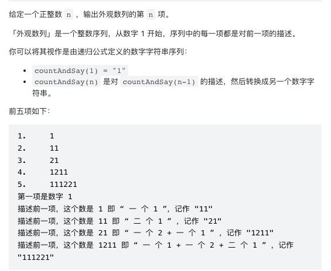
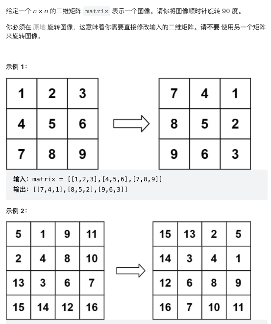
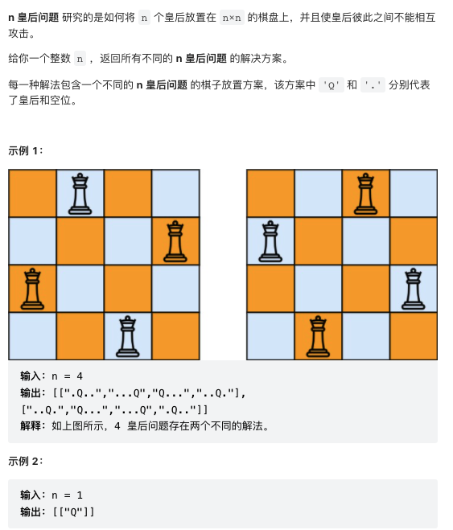
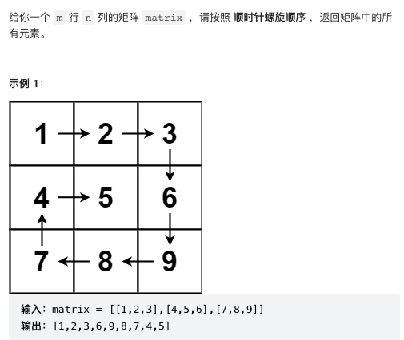
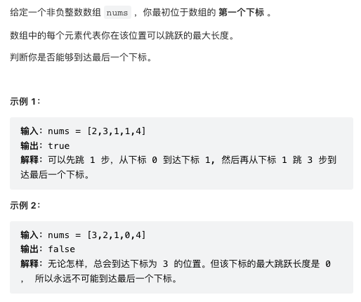
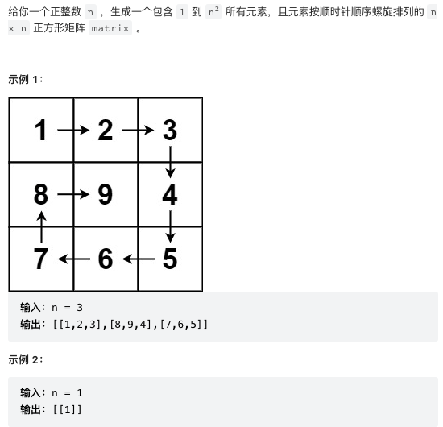
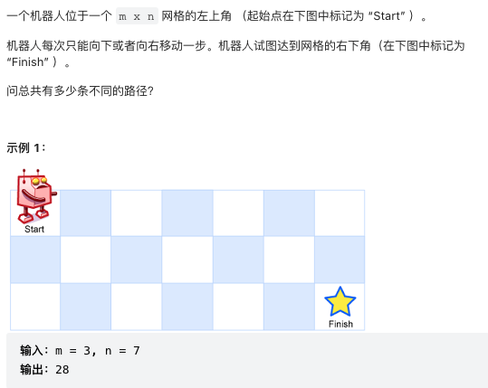
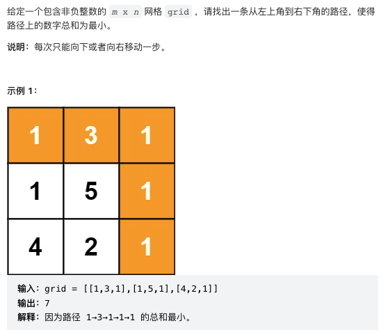

### 36. 有效的数独
```
class Solution:
    def isValidSudoku(self, board: List[List[str]]) -> bool:
        cols = collections.defaultdict(set)
        rows = collections.defaultdict(set)
        squares = collections.defaultdict(set)
        for r in range(9):
            for c in range(9):
                if board[r][c] == '.':
                    continue
                if (board[r][c] in rows[r] or
                    board[r][c] in cols[c] or
                    board[r][c] in squares[(r//3,c//3)]):
                    return False
                cols[c].add(board[r][c])
                rows[r].add(board[r][c])
                squares[(r//3,c//3)].add(board[r][c])
        return True
```
### 38. 外观数列

```
class Solution:
    def countAndSay(self, n: int) -> str:
        seq = '1'
        for i in range(n - 1):
            seq = self.getNext(seq)
        return seq

    def getNext(self, seq):
        i, next_seq = 0, ''
        while i < len(seq):
            count = 1
            while i < len(seq) - 1 and seq[i] == seq[i+1]:
                count += 1
                i += 1
            next_seq += str(count) + seq[i]
            i += 1
        return next_seq
```
### 39. 组合总和
给你一个 无重复元素 的整数数组 candidates 和一个目标整数 target ，找出 candidates 中可以使数字和为目标数 target 的 所有 不同组合 ，并以列表形式返回。你可以按 任意顺序 返回这些组合.candidates 中的 同一个 数字可以 无限制重复被选取 。如果至少一个数字的被选数量不同，则两种组合是不同的。 对于给定的输入，保证和为 target 的不同组合数少于 150 个。
>输入: candidates = [2,3,5], target = 8            
>输出: [[2,2,2,2],[2,3,3],[3,5]]
```
class Solution:
    def combinationSum(self, candidates: List[int], target: int) -> List[List[int]]:
        candidates.sort()
        res = []
        def backtrack(pos, cur, target):
            if target == 0:
                res.append(cur.copy())
            if target < 0:
                return
            for i in range(pos, len(candidates)):
                cur.append(candidates[i])
                backtrack(i, cur, target - candidates[i])
                cur.pop()
        backtrack(0, [], target)
        return res
```
### 43. 字符串相乘
>输入: num1 = "2", num2 = "3"          
>输出: "6"
```
class Solution:
    def multiply(self, num1: str, num2: str) -> str:
        if '0' in [num1, num2]:
            return '0'
        res = [0] * (len(num1) + len(num2))
        num1, num2 = num1[::-1], num2[::-1]
        for i1 in range(len(num1)):
            for i2 in range(len(num2)):
                digit = int(num1[i1]) * int(num2[i2])
                res[i1 + i2] += digit
                res[i1 + i2 + 1] += res[i1 + i2] // 10
                res[i1 + i2] = res[i1 + i2] % 10
        res, beg = res[::-1], 0
        while beg < len(res) and res[beg] == 0:
            beg += 1
        res = map(str, res[beg:])
        return ''.join(res)
```
### 46. 全排列
给定一个不含重复数字的数组 nums ，返回其 所有可能的全排列 。你可以 按任意顺序 返回答案。
>输入：nums = [1,2,3]          
>输出：[[1,2,3],[1,3,2],[2,1,3],[2,3,1],[3,1,2],[3,2,1]]       
```
class Solution:
    def permute(self, nums):
        if len(nums) == 1:
            return [nums]
        ans = []
        for i, num in enumerate(nums):
            n = nums[:i] + [i+1:]
            for y in self.permute(n):
                ans.append([num] + y)
        return ans
```
### 48. 旋转图像

```
class Solution:
    def rotate(self, matrix: List[List[int]]) -> None:
        """
        Do not return anything, modify matrix in-place instead.
        """
        l, r = 0, len(matrix) - 1
        while l < r:
            for i in range(r - l):
                top, bottom = l, r 
                # save the topLeft
                topLeft = matrix[top][l + i]
                # move bottom left into top left
                matrix[top][l + i] = matrix[bottom - i][l]
                # move bottom right into bottom left
                matrix[bottom - i][l] = matrix[bottom][r - i]
                # move top right into bottom right
                matrix[bottom][r - i] = matrix[top + i][r]
                # move top left into top right
                matrix[top + i][r] = topLeft
            l += 1
            r -= 1
```
### 49.字母异位词分组
给你一个字符串数组，请你将 字母异位词 组合在一起。可以按任意顺序返回结果列表。字母异位词 是由重新排列源单词的字母得到的一个新单词，所有源单词中的字母通常恰好只用一次。
>输入: strs = ["eat", "tea", "tan", "ate", "nat", "bat"]           
>输出: [["bat"],["nat","tan"],["ate","eat","tea"]]    
```
class Solution:
    def groupAnagrams(self, strs: List[str]) -> List[List[str]]:
        # defaultdict(list):构建一个默认value为list的字典
        res = defaultdict(list) # mapping charCount to list of Anagrams
        for s in strs:
            count = [0] * 26 # a...z
            for c in s:
                count[ord(c) - ord('a')] += 1
            res[tuple(count)].append(s)
        return list(res.values())
```

### 50. Pow(x, n)
```
class Solution:
    def myPow(self, x: float, n: int) -> float:
        if n == 0:
            return 1
        elif n < 0:
            return self.myPow(1/x, -n)
        elif n % 2 == 0:
            tmp = self.myPow(x, n/2)
            return tmp * tmp
        else:
            return x * self.myPow(x, n-1)
```
### 51. N皇后

```
class Solution:
    def solveNQueens(self, n: int) -> List[List[str]]:
        col = set()
        posDiag = set() # (r + c)
        negDiag = set() # (r - c)
        res = []
        board = [['.'] * n for i in range(n)]

        def backtrack(r):
            if r == n:
                copy = [''.join(row) for row in board]
                res.append(copy)
                return
            for c in range(n):
                if c in col or (r + c) in posDiag or (r - c) in negDiag:
                    continue
                col.add(c)
                posDiag.add(r + c)
                negDiag.add(r - c)
                board[r][c] = 'Q'
                backtrack(r + 1)
                col.remove(c)
                posDiag.remove(r + c)
                negDiag.remove(r - c)
                board[r][c] = '.'
        backtrack(0)
        return res
```
### 53. 最大子数组和
>输入：nums = [-2,1,-3,4,-1,2,1,-5,4]          
>输出：6          
>解释：连续子数组 [4,-1,2,1] 的和最大，为 6 。      
```
class Solution:
    def maxSubArray(self, nums: List[int]) -> int:
        maxSub = nums[0]
        curSum = 0
        for n in nums:
            if curSum < 0:
                curSum = 0
            curSum += n
            maxSub = max(curSum, maxSub)
        return maxSub
```
### 54. 螺旋矩阵

```
class Solution:
    def spiralOrder(self, matrix: List[List[int]]) -> List[int]:
        row = len(matrix)
        if row == 0 or len(matrix[0]) == 0:
            return []
        col = len(matrix[0])
        res = matrix[0]
        if row > 1:
            for i in range(1, row):
                res.append(matrix[i][col-1])
            
            for j in range(col-2, -1, -1):
                res.append(matrix[row-1][j])
            if col > 1:
                for i in range(row-2, 0, -1):
                    res.append(matrix[i][0])
        M = []
        for k in range(1, row - 1):
            t = matrix[k][1:-1]
            M.append(t)

        return res + self.spiralOrder(M)
```
### 55. 跳跃游戏

```
class Solution:
    def canJump(self, nums):
        reach = 0
        for i, n in enumerate(nums):
            if i > reach:
                return False
            reach = max(reach, i + n)
        return True
```
### 56. 合并区间
>输入：intervals = [[1,3],[2,6],[8,10],[15,18]]          
>输出：[[1,6],[8,10],[15,18]]          
>解释：区间 [1,3] 和 [2,6] 重叠, 将它们合并为 [1,6].      
```
class Solution:
    def merge(self, intervals: List[List[int]]) -> List[List[int]]:
        #o(nlog)
        intervals.sort(key=lambda i:i[0])
        output = [intervals[0]]
        for start, end in intervals[1:]:
            lastEnd = output[-1][1]
            if start <= lastEnd:
                output[-1][1] = max(lastEnd, end)
            else:
                output.append([start, end])
        return  output
```
### 57. 插入区间
给你一个 无重叠的 ，按照区间起始端点排序的区间列表。在列表中插入一个新的区间，你需要确保列表中的区间仍然有序且不重叠（如果有必要的话，可以合并区间）。
>输入：intervals = [[1,3],[6,9]], newInterval = [2,5]         
>输出：[[1,5],[6,9]]         
```
class Solution:
    def insert(self, intervals: List[List[int]], newInterval: List[int]) -> List[List[int]]:
        intervals.append(newInterval)
        intervals.sort(key=lambda i:i[0])
        output = [intervals[0]]
        for start, end in intervals[1:]:
            lastEnd = output[-1][1]
            if start <= lastEnd:
                output[-1][1] = max(lastEnd, end)
            else:
                output.append([start, end])
        return output
```
### 58. 最后一个单词的长度
>输入：s = "Hello World"             
>输出：5           
>解释：最后一个单词是“World”，长度为5。     
```
class Solution:
    def lengthOfLastWord(self, s: str) -> int:
        strings = s.strip().split(' ')
        return len(strings[-1])
```
### 59. 螺旋矩阵2

```
class Solution:
    def generateMatrix(self, n: int) -> List[List[int]]:
        matrix = [[0] * n for i in range(n)]
        rowBegin = 0
        rowEnd = n - 1
        colBegin = 0
        colEnd = n - 1
        number = 1
        while rowBegin <= rowEnd and colBegin <= colEnd:
            for i in range(colBegin, colEnd + 1):
                matrix[rowBegin][i] = number
                number += 1
            rowBegin += 1
            for i in range(rowBegin, rowEnd + 1):
                matrix[i][colEnd] = number
                number += 1
            colEnd -= 1
            if rowBegin <= rowEnd:
                for i in range(colEnd, colBegin-1, -1):
                    matrix[rowEnd][i] = number
                    number += 1
                rowEnd -= 1
            if colBegin <= colEnd:
                for i in range(rowEnd, rowBegin-1, -1):
                    matrix[i][colBegin] = number
                    number += 1
                colBegin += 1
        return matrix
```
### 62.不同路径

```
class Solution:
    def uniquePaths(self, m: int, n: int) -> int:
        row = [1] * n
        for i in range(m-1):
            newRow = [1] * n
            for j in range(n-2, -1, -1):
                newRow[j] = newRow[j+1] + row[j]
            row = newRow
        return row[0]
```
### 64.最小路径和

```
class Solution:
    def minPathSum(self, grid: List[List[int]]) -> int:
        ROWS, COLS = len(grid), len(grid[0])
        res = [[float('inf')] * (COLS + 1) for r in range(ROWS + 1)]
        res[ROWS - 1][COLS] = 0
        for r in range(ROWS - 1, -1, -1):
            for c in range(COLS - 1, -1, -1):
                res[r][c] = grid[r][c] + min(res[r + 1][c], res[r][c + 1])
        return res[0][0]
```
### 66.加一
>示例 1：

>输入：digits = [1,2,3]        
>输出：[1,2,4]          
>解释：输入数组表示数字 123。         

>示例 2：

>输入：digits = [4,3,2,1]         
>输出：[4,3,2,2]           
>解释：输入数组表示数字 4321。        
```
class Solution:
    def plusOne(self, digits: List[int]) -> List[int]:
        str_digits = ''.join(list(map(str, digits)))
        process_digits = str(int(str_digits) + 1)
        ret = []
        for i in process_digits:
            ret.append(int(i))
        return ret
```
### 67. 二进制求和
>输入: a = "1010", b = "1011"       
>输出: "10101"
```
class Solution:
    def addBinary(self, a: str, b: str) -> str:
        return bin(int(a,2)+int(b,2))[2:]
```
### 68. 文本左右对齐
>输入: words = ["This", "is", "an", "example", "of", "text", "justification."], maxWidth = 16         
>输出:       
>[                
>   "This    is    an",          
>   "example  of text",           
>   "justification.  "           
>]              
```
class Solution:
    def fullJustify(self, words: List[str], maxWidth: int) -> List[str]:
        lst = []
        res = []
        n = 0
        for w in words:
            while n + len(lst) + len(w) > maxWidth:
                gaps = len(lst) - 1 or 1
                q, rem = divmod(maxWidth - n, gaps)
                for i in range(gaps):
                    lst[i] += ' ' * q + (' ' if i < rem else '')
                res.append(''.join(lst))
                n, lst = 0, []
            lst.append(w)
            n += len(w)
        return res + [' '.join(lst).ljust(maxWidth)] if lst else []
```
### 69. x的平方根
给你一个非负整数 x ，计算并返回 x 的 算术平方根 。由于返回类型是整数，结果只保留 整数部分 ，小数部分将被 舍去 。
>输入：x = 8        
>输出：2           
>解释：8 的算术平方根是 2.82842..., 由于返回类型是整数，小数部分将被舍去。
```
class Solution:
    def mySqrt(self, x):
        left = 0
        right = x
        while left <= right:
            mid = (left + right) // 2
            if mid * mid < x:
                left = mid + 1
            else:
                right = mid - 1
        return int(right)
```
### 70. 爬楼梯
Fibonacci sequence
```
class Solution:
    def climbStairs(self, n):
        prev, curr = 0, 1
        for i in range(n):
            prev, curr = curr, prev + curr
        return curr
```