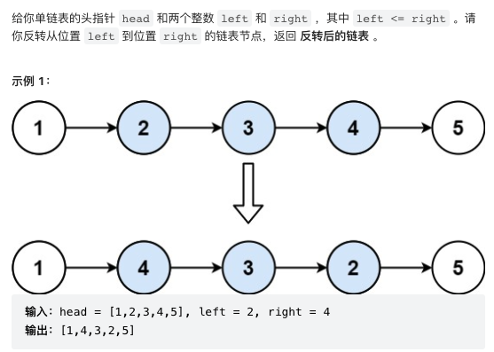

### 71. 简化路径

```
class Solution:
    def simplifyPath(self, path: str) -> str:
        stack = []
        cur = ''
        for c in path + '/':
            if c == '/':
                if cur == '..':
                    if stack: stack.pop()
                elif cur != '' and cur != '.':
                    stack.append(cur)
                cur = ''
            else:
                cur += c
        return '/' + '/'.join(stack)
```
### 83. 删除排序链表中的重复元素

```
class ListNode:
    def __init__(self, val=0, next=None):
        self.val = val
        self.next = next
class Solution:
    def deleteDuplicates(self, head):
        if not head:
            return head
        cur = head
        while cur.next:
            if cur.val == cur.next.val:
                cur.next = cur.next.next
            else:
                cur = cur.next
        return head
```
### 88. 合并两个有序数组
给你两个按 非递减顺序 排列的整数数组 nums1 和 nums2，另有两个整数 m 和 n ，分别表示 nums1 和 nums2 中的元素数目。         
请你 合并 nums2 到 nums1 中，使合并后的数组同样按 非递减顺序 排列。

注意：最终，合并后数组不应由函数返回，而是存储在数组 nums1 中。为了应对这种情况，nums1 的初始长度为 m + n，其中前 m 个元素表示应合并的元素，后 n 个元素为 0 ，应忽略。nums2 的长度为 n 。

示例 1：

>输入：nums1 = [1,2,3,0,0,0], m = 3, nums2 = [2,5,6], n = 3        
>输出：[1,2,2,3,5,6]           
>解释：需要合并 [1,2,3] 和 [2,5,6] 。           
合并结果是 [1,2,2,3,5,6] ，其中斜体加粗标注的为 nums1 中的元素。
```
class Solution:
    def merge(self, nums1, m, nums2, n):
        for i in range(n):
            nums1[m+i] = nums2[i]
        return nums1.sort()
```
### 91. 解码方法

### 92. 反转列表2

```
class Solution:
    def reverseBetween(self, head: ListNode, left: int, right: int) -> ListNode:
        dummy = ListNode(0, head)
        # 1) reach node at position "left"
        leftPrev, cur = dummy, head
        for i in range(left - 1):
            leftPrev, cur = cur, cur.next
        # Now cur='left',leftPrev='node before left'
        # 2) reverse from left to right
        prev = None
        for i in range(right - left + 1):
            tmpNext = cur.next
            cur.next = prev
            prev, cur = cur, tmpNext
        # 3) Update pointers
        leftPrev.next.next = cur
        leftPrev.next = prev
        return dummy.next
```
### 93. 复原IP地址
有效 IP 地址 正好由四个整数（每个整数位于 0 到 255 之间组成，且不能含有前导 0），整数之间用 '.' 分隔。

例如："0.1.2.201" 和 "192.168.1.1" 是 有效 IP 地址，但是 "0.011.255.245"、"192.168.1.312" 和 "192.168@1.1" 是 无效 IP 地址。
```

```
### 96. 不同的二叉搜索树

```
class Solution:
    def numTrees(self, n: int) -> int:
        numTree = [1] * (n + 1)
        for nodes in range(2, n + 1):
            total = 0
            for root in range(1, nodes + 1):
                left = root - 1
                right = nodes - root
                total += numTree[left] * numTree[right]
            numTree[nodes] = total
        return numTree[n]
```
### 100. 相同的树

```
class Solution:
    def isSameTree(self, p: TreeNode, q: TreeNode) -> bool:
        if not p and not q:
            return True
        if not p or not q or (p.val != q.val):
            return False
        return (self.isSameTree(p.left, q.left) and self.isSameTree(p.right, q.right)
```
### 118. 杨辉三角

```
class Solution:
    def generate(self, numRows: int) -> List[List[int]]:
        res = [[1]]
        for i in range(1, numRows):
            temp  = [0] + res[-1] + [0]
            row = []
            for j in range(len(res[-1])+1):
                row.append(temp[j]+temp[j+1])
            res.append(row)
        return res
```
### 128. 最长连续序列
给定一个未排序的整数数组 nums ，找出数字连续的最长序列（不要求序列元素在原数组中连续）的长度。
>输入：nums = [100,4,200,1,3,2]       
>输出：4         
>解释：最长数字连续序列是 [1, 2, 3, 4]。它的长度为 4。      
```
class Solution:
    def longestConsecutive(self, nums: List[int]) -> int:
        numSet = set(nums)
        longest = 0
        for n in nums:
            # check if its the start of a sequence
            if (n-1) not in numSet:
                length = 0
                while (n + length) in numSet:
                    length += 1
                longest = max(length, longest)
        return longest
```