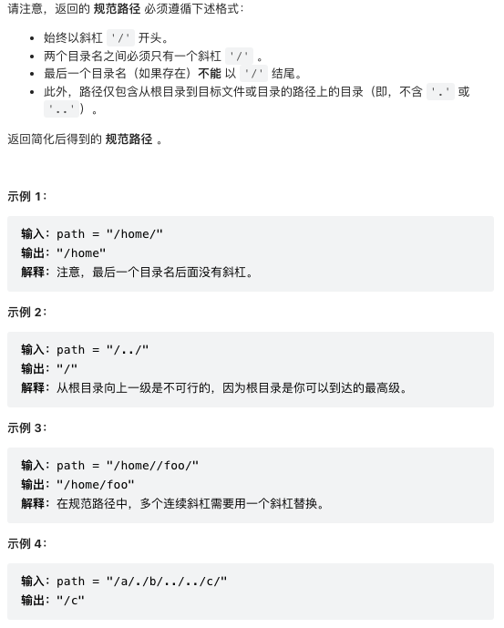
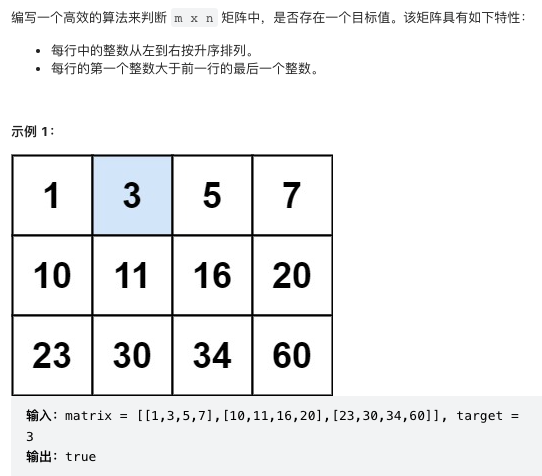
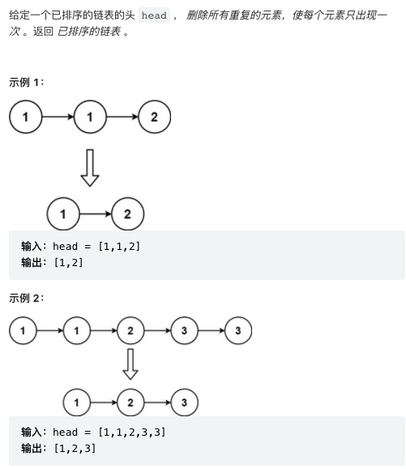

### 71. 简化路径

```
class Solution:
    def simplifyPath(self, path: str) -> str:
        stack = []
        cur = ''
        for c in path + '/':
            if c == '/':
                if cur == '..':
                    if stack: stack.pop()
                elif cur != '' and cur != '.':
                    stack.append(cur)
                cur = ''
            else:
                cur += c
        return '/' + '/'.join(stack)
```
### 73. 矩阵置零

```
class Solution:
    def setZeroes(self, matrix: List[List[int]]) -> None:
        """
        Do not return anything, modify matrix in-place instead.
        """
        m, n = len(matrix), len(matrix[0])
        tmp = []
        for i in range(m):
            for j in range(n):
                if matrix[i][j] == 0:
                    tmp.append([i, j])
        for r, c in tmp:
            for i in range(n):
                matrix[r][i] = 0
            for j in range(m):
                matrix[j][c] = 0
```
### 74. 搜索二维矩阵

```
class Solution:
    def searchMatrix(self, matrix: List[List[int]], target: int) -> bool:
        ROWS, COLS = len(matrix), len(matrix[0])
        top, bot = 0, ROWS - 1
        while top <= bot:
            row = (top + bot) // 2
            if target > matrix[row][-1]:
                top = row + 1
            elif target < matrix[row][0]:
                bot = row - 1
            else:
                break
        if not (top <= bot):
            return False
        row = (top + bot) // 2
        l, r = 0, COLS - 1
        while l <= r:
            m = (l + r) // 2
            if target < matrix[row][m]:
                r = m - 1
            elif target > matrix[row][m]:
                l = m + 1
            else:
                return True
        return False 
```
### 75. 颜色分类
给定一个包含红色、白色和蓝色、共 n 个元素的数组 nums ，原地对它们进行排序，使得相同颜色的元素相邻，并按照红色、白色、蓝色顺序排列。我们使用整数 0、 1 和 2 分别表示红色、白色和蓝色。必须在不使用库的sort函数的情况下解决这个问题。
>输入：nums = [2,0,2,1,1,0]             
>输出：[0,0,1,1,2,2]           
```
class Solution:
    def sortColors(self, nums: List[int]) -> None:
        """
        Do not return anything, modify nums in-place instead.
        """
        l, r = 0, len(nums) - 1
        i = 0
        def swap(i, j):
            nums[i], nums[j] = nums[j], nums[i]
        while i <= r:
            if nums[i] == 0:
                swap(l, i)
                l += 1
            elif nums[i] == 2:
                swap(r, i)
                r -= 1
                i -= 1
            i += 1
```
### 78. 子集
>输入：nums = [1,2,3]          
>输出：[[],[1],[2],[1,2],[3],[1,3],[2,3],[1,2,3]]          
```
class Solution:
    def subsets(self, nums: List[int]) -> List[List[int]]:
        res = []
        subset = []
        def dfs(i):
            if i >= len(nums):
                res.append(subset.copy())
                return 

            # decision to include nums[i]
            subset.append(nums[i])
            dfs(i + 1)

            # decision NOT to include nums[i]
            subset.pop()
            dfs(i + 1)
        dfs(0)
        return res
```
### 79. 单词搜索

```
class Solution:
    def exist(self, board: List[List[str]], word: str) -> bool:
        ROWS, COLS = len(board), len(board[0])
        path = set()
        def dfs(r, c, i):
            if i == len(word):
                return True
            if (r < 0 or c < 0 or r >= ROWS or c >= COLS 
                or word[i] != board[r][c] or (r, c) in path):
                return False
            path.add((r, c))
            res = (dfs(r+1, c, i+1) or dfs(r, c+1, i+1)
                   or dfs(r-1, c, i+1) or dfs(r, c-1, i+1))
            path.remove((r, c))
            return res

        for r in range(ROWS):
            for c in range(COLS):
                if dfs(r, c, 0): return True
        return False
```
### 80. 删除有序数组中的重复项2
给你一个有序数组 nums ，请你 原地 删除重复出现的元素，使每个元素 最多出现两次 ，返回删除后数组的新长度。不要使用额外的数组空间，你必须在 原地 修改输入数组 并在使用 O(1) 额外空间的条件下完成。
>输入：nums = [1,1,1,2,2,3]         
>输出：5, nums = [1,1,2,2,3]        
```
class Solution:
    def removeDuplicates(self, nums: List[int]) -> int:
        i = 0
        for n in nums:
            if i < 2 or n != nums[i-2]:
                nums[i] = n 
                i += 1
        return i
```
### 83. 删除排序链表中的重复元素

```
class ListNode:
    def __init__(self, val=0, next=None):
        self.val = val
        self.next = next
class Solution:
    def deleteDuplicates(self, head):
        if not head:
            return head
        cur = head
        while cur.next:
            if cur.val == cur.next.val:
                cur.next = cur.next.next
            else:
                cur = cur.next
        return head
```
### 88. 合并两个有序数组
给你两个按 非递减顺序 排列的整数数组 nums1 和 nums2，另有两个整数 m 和 n ，分别表示 nums1 和 nums2 中的元素数目。         
请你 合并 nums2 到 nums1 中，使合并后的数组同样按 非递减顺序 排列。

注意：最终，合并后数组不应由函数返回，而是存储在数组 nums1 中。为了应对这种情况，nums1 的初始长度为 m + n，其中前 m 个元素表示应合并的元素，后 n 个元素为 0 ，应忽略。nums2 的长度为 n 。

示例 1：

>输入：nums1 = [1,2,3,0,0,0], m = 3, nums2 = [2,5,6], n = 3        
>输出：[1,2,2,3,5,6]           
>解释：需要合并 [1,2,3] 和 [2,5,6] 。           
合并结果是 [1,2,2,3,5,6] ，其中斜体加粗标注的为 nums1 中的元素。
```
class Solution:
    def merge(self, nums1, m, nums2, n):
        for i in range(n):
            nums1[m+i] = nums2[i]
        return nums1.sort()
```
### 89. 格雷编码

```

```
### 91. 解码方法

### 92. 反转列表2

```
class Solution:
    def reverseBetween(self, head: ListNode, left: int, right: int) -> ListNode:
        dummy = ListNode(0, head)
        # 1) reach node at position "left"
        leftPrev, cur = dummy, head
        for i in range(left - 1):
            leftPrev, cur = cur, cur.next
        # Now cur='left',leftPrev='node before left'
        # 2) reverse from left to right
        prev = None
        for i in range(right - left + 1):
            tmpNext = cur.next
            cur.next = prev
            prev, cur = cur, tmpNext
        # 3) Update pointers
        leftPrev.next.next = cur
        leftPrev.next = prev
        return dummy.next
```
### 93. 复原IP地址
有效 IP 地址 正好由四个整数（每个整数位于 0 到 255 之间组成，且不能含有前导 0），整数之间用 '.' 分隔。

例如："0.1.2.201" 和 "192.168.1.1" 是 有效 IP 地址，但是 "0.011.255.245"、"192.168.1.312" 和 "192.168@1.1" 是 无效 IP 地址。
```

```
### 96. 不同的二叉搜索树

```
class Solution:
    def numTrees(self, n: int) -> int:
        numTree = [1] * (n + 1)
        for nodes in range(2, n + 1):
            total = 0
            for root in range(1, nodes + 1):
                left = root - 1
                right = nodes - root
                total += numTree[left] * numTree[right]
            numTree[nodes] = total
        return numTree[n]
```
### 98. 验证二叉搜索树

```
# Definition for a binary tree node.
# class TreeNode:
#     def __init__(self, val=0, left=None, right=None):
#         self.val = val
#         self.left = left
#         self.right = right
class Solution:
    def isValidBST(self, root: TreeNode) -> bool:
        return self.valid(root, float('-inf'), float('inf'))
    def valid(self, root, min, max):
        if not root:
            return True
        if not (root.val > min and root.val < max ):
            return False
        return self.valid(root.left, min, root.val) and self.valid(root.right, root.val, max)
```
### 100. 相同的树

```
class Solution:
    def isSameTree(self, p: TreeNode, q: TreeNode) -> bool:
        if not p and not q:
            return True
        if not p or not q or (p.val != q.val):
            return False
        return (self.isSameTree(p.left, q.left) and self.isSameTree(p.right, q.right)
```
### 118. 杨辉三角

```
class Solution:
    def generate(self, numRows: int) -> List[List[int]]:
        res = [[1]]
        for i in range(1, numRows):
            temp  = [0] + res[-1] + [0]
            row = []
            for j in range(len(res[-1])+1):
                row.append(temp[j]+temp[j+1])
            res.append(row)
        return res
```
### 128. 最长连续序列
给定一个未排序的整数数组 nums ，找出数字连续的最长序列（不要求序列元素在原数组中连续）的长度。
>输入：nums = [100,4,200,1,3,2]       
>输出：4         
>解释：最长数字连续序列是 [1, 2, 3, 4]。它的长度为 4。      
```
class Solution:
    def longestConsecutive(self, nums: List[int]) -> int:
        numSet = set(nums)
        longest = 0
        for n in nums:
            # check if its the start of a sequence
            if (n-1) not in numSet:
                length = 0
                while (n + length) in numSet:
                    length += 1
                longest = max(length, longest)
        return longest
```