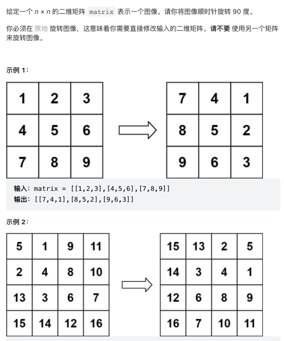
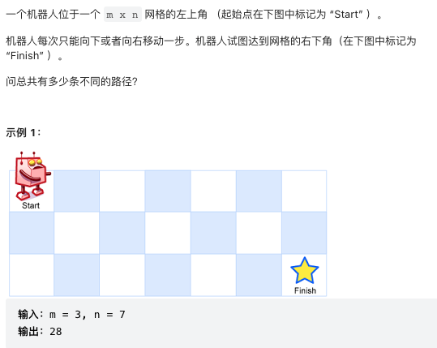
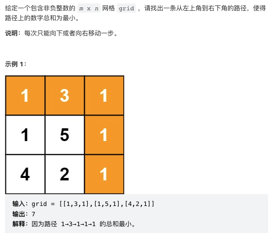

## leetcode 前100道题（easy + medium）

这里总结的主要是我理解的方法

### 1.两数之和
给定一个整数数组 nums 和一个整数目标值 target，请你在该数组中找出和为目标值 target 的那两个整数，并返回它们的数组下标。你可以假设每种输入只会对应一个答案。但是，数组中同一个元素在答案里不能重复出现。你可以按任意顺序返回答案。
>输入：nums = [2,7,11,15], target = 9        
>输出：[0,1]        
>解释：因为 nums[0] + nums[1] == 9 ，返回 [0, 1] 
```
class Solution:
    def twoSum(self, nums, target):
        hashtable = {}
        for i, num in enumerate(nums):
            if target - num not in hashtable:
                hashtable[num] = i
            else:
                return hashtable[target - num], i
```
### 2.两数相加


```
class ListNode:
    def __init__(self, val=0, next=None):
        self.val = val
        self.next = next
class Solution:
    def addTwoNumbers(self, l1, l2):
        curr = dummy = ListNode()
        count = 0
        while l1 or l2 or count:
            num = 0
            if l1:
                num += l1.val
                l1 = l1.next
            if l2:
                num += l2.val
                l2 = l2.next
            count, num = divmod(num + count, 10)
            curr.next = ListNode(num)
            curr = curr.next
        return dummy.next
```
### 3. 无重复字符的最长子串
给定一个字符串 s ，请你找出其中不含有重复字符的 最长子串 的长度。
>输入: s = "abcabcbb"        
>输出: 3          
>解释: 因为无重复字符的最长子串是 "abc"，所以其长度为 3。           
```
class Solution:
    def lengthOfLongestSubstring(self, s):
        ans = ''
        tmp = ''
        for i in s:
            if i not in tmp:
                tmp += i
            else:
                tmp = tmp[tmp.index(i)+1:] + i
            if len(tmp) > len(ans):
                ans = tmp
        return len(ans)
```
### 4.寻找两个正序数组的中位数 
给定两个大小分别为 m 和 n 的正序（从小到大）数组 nums1 和 nums2。请你找出并返回这两个正序数组的中位数 
>示例 1：        
>输入：nums1 = [1,3], nums2 = [2]        
>输出：2.00000     
>
>输入：nums1 = [1,2], nums2 = [3,4]         
>输出：2.50000
```
class Solution:
    def findMedianSortedArrays(self, nums1, nums2):
        nums = nums1 + nums2
        nums.sort()
        if len(nums) % 2 == 0:
            index = int(len(nums) / 2)
            return (nums[index-1]+nums[index])/2.0
        else:
            index = int((len(nums)+1)/2)
            return nums[index-1]
```
### 5. 最长回文子串
给你一个字符串 s，找到 s 中最长的回文子串。
>输入：s = "babad"         
>输出："bab"
```
class Solution:
    def longestPalindrome(self, s: str) -> str:
        res = ''
        resLen = 0
        for i in range(len(s)):
            # odd length
            l, r = i, i
            while l >= 0 and r < len(s) and s[l] == s[r]:
                if (r + 1 - l) > resLen:
                    res = s[l: r+1]
                    resLen = r - l + 1
                l -= 1
                r += 1
            # even length
            l, r = i, i+1
            while l >= 0 and r < len(s) and s[l] == s[r]:
                if (r + 1 - l) > resLen:
                    res = s[l: r+1]
                    resLen = r - l + 1
                l -= 1
                r += 1
        return res
```
### 6. Z字形变换
将一个给定字符串 s 根据给定的行数 numRows ，以从上往下、从左到右进行 Z 字形排列。
比如输入字符串为 "PAYPALISHIRING" 行数为 3 时，排列如下：
>P   A   H   N      
>A P L S I I G        
>Y   I   R            
之后，你的输出需要从左往右逐行读取，产生出一个新的字符串，比如："PAHNAPLSIIGYIR"。
```
class Solution:
    def convert(self, s, numRows):
        if numRows == 1:
            return s
        row_map = {row:"" for row in range(1,numRows+1)}
        row = 1
        up = True
        for letter in s:
            row_map[row] += letter
            if (row == 1) or ((row < numRows and up)):
                row += 1
                up = True
            else:
                row -= 1
                up = False
        convert = ''
        for row in range(1, numRows+1):
            convert += row_map[row]
        return convert
```
### 7.整数反转
给你一个 32 位的有符号整数 x ，返回将 x 中的数字部分反转后的结果。
如果反转后整数超过 32 位的有符号整数的范围 $[−2^{31},  2^{31} − 1]$ ，就返回 0。
```
class Solution:
    def reverse(self, x: int) -> int:
        if x >= 0:
            x = int(str(x)[::-1])
        else:
            x = str(x)[1:][::-1]
            x = '-' + x
            x = int(x)
        if abs(x) > 2 ** 31:
            return 0
        else:
            return x
```
### 8.字符串转换整数(atoi)
请你来实现一个 myAtoi(string s) 函数，使其能将字符串转换成一个 32 位有符号整数（类似 C/C++ 中的 atoi 函数）。

函数 myAtoi(string s) 的算法如下：

1. 读入字符串并丢弃无用的前导空格
2. 检查下一个字符（假设还未到字符末尾）为正还是负号，读取该字符（如果有）。 确定最终结果是负数还是正数。 如果两者都不存在，则假定结果为正。
3. 读入下一个字符，直到到达下一个非数字字符或到达输入的结尾。字符串的其余部分将被忽略。
4. 将前面步骤读入的这些数字转换为整数（即，"123" -> 123， "0032" -> 32）。如果没有读入数字，则整数为 0 。必要时更改符号（从步骤 2 开始）。
5. 如果整数数超过 32 位有符号整数范围 $[−2^{31},  2^{31} − 1]$ ，需要截断这个整数，使其保持在这个范围内。具体来说，小于 $[−2^{31}$ 的整数应该被固定为 $[−2^{31}$ ，大于 $2^{31} − 1]$ 的整数应该被固定为 $2^{31} − 1]$ 。
返回整数作为最终结果。
注意：
本题中的空白字符只包括空格字符 ' ' 。
除前导空格或数字后的其余字符串外，请勿忽略 任何其他字符。
```
import re
class Solution:
    def myAtoi(self, s: str) -> int:
        return max(min(int(*re.findall('^[\+\-]?\d+', s.lstrip())), 2**31 - 1), -2**31)
```
### 9. 回文数
回文数是指正序（从左向右）和倒序（从右向左）读都是一样的整数。
```
class Solution:
    def isPalindrome(self, x: int) -> bool:
        y = str(x)[::-1]
        if str(x) == y:
            return True
        else:
            return False
```
### 10. 正则表达式匹配
### 11. 盛最多水的容器

```
class Solution:
    def maxArea(self, height):
        largest = 0
        start = 0
        end = len(height) - 1
        while (start != end):
            next_area = min(height[start], height[end])*(end-start)
            if next_area > largest:
                largest = next_area
            if height[start] < height[end]:
                start += 1
            else:
                end -= 1
        return largest 
```
### 12. 整数转罗马数字

```
class Solution:
    def intToRoman(self, num):
        # 注意：value_map的key是有顺序的，必须是从大到小
        value_map = {1000: "M",900: "CM",500: "D",400: "CD",100: "C",90: "XC",50: "L",40: "XL",10: "X",9: "IX",5: "V",4: "IV",1: "I",}
        res = ''
        for i in value_map:
            count = num // i
            if count:
                res += count * value_map[i]
                num %= i
        return res
```
### 13. 罗马数字转整数
```
class Solution:
    def romanToInt(self, s: str) -> int:
        dic = {'I':1,'V':5,'X':10,'L':50,'C':100,'D':500,'M':1000}
        sum = 0
        for i in range(len(s)-1):
            if dic[s[i]] < dic[s[i+1]]:
                sum -= dic[s[i]]
            else:
                sum += dic[s[i]]
        return sum+dic[s[-1]]
```
### 14. 最长公共前缀
编写一个函数来查找字符串数组中的最长公共前缀。
如果不存在公共前缀，返回空字符串 ""。         
>示例 1：
>输入：strs = ["flower","flow","flight"]     
>输出："fl"         
>示例 2：       
>输入：strs = ["dog","racecar","car"]          
>输出：""         
>解释：输入不存在公共前缀。       
```
class Solution:
    def longestCommonPrefix(self, strs):
        commonPrefix = ''
        length = min(len(word) for word in strs)
        strs = [word.lower() for word in strs]
        for i in range(length):
            dic = set([word[i] for word in strs])
            if len(list(dic)) == 1:
                commonPrefix += strs[0][i]
            else:
                break
        return commonPrefix
```
### 15. 三数之和
给你一个包含 n 个整数的数组 nums，判断 nums 中是否存在三个元素 a，b，c ，使得 a + b + c = 0 ？请你找出所有和为 0 且不重复的三元组。
>输入：nums = [-1,0,1,2,-1,-4]           
>输出：[[-1,-1,2],[-1,0,1]]
```
class Solution:
    def threeSum(self, nums: List[int]) -> int:
        nums.sort()
        res = []
        for i in range(len(nums) - 2):
            if i > 0 and nums[i] == nums[i-1]:
                continue
            l = i + 1
            r = len(nums) - 1
            while l < r:
                threeSum = nums[i] + nums[l] + nums[r]
                if threeSum == 0:
                    res.append([nums[i], nums[l], nums[r]])
                    l += 1
                    while nums[l] == nums[l - 1] and l < r:
                        l += 1
                # 注意：条件也是有顺序的，先看小于0的，后看大于0的，如果颠倒就不对了
                if threeSum < 0: 
                    l += 1
                else:
                    r -= 1
        return res
```
### 16. 最接近的三数之和
给你一个长度为 n 的整数数组 nums 和 一个目标值 target。请你从 nums 中选出三个整数，使它们的和与target 最接近。返回这三个数的和。假定每组输入只存在恰好一个解。
>输入：nums = [-1,2,1,-4], target = 1          
>输出：2           
>解释：与 target 最接近的和是 2 (-1 + 2 + 1 = 2) 。             
```
class Solution:
    def threeSumClosest(self, nums: List[int], target: int) -> int:
        nums.sort()
        res = sum(nums[:3])
        for i in range(len(nums) - 2):
            l = i + 1
            r = len(nums) - 1
            while l < r:
                threeSum = nums[i] + nums[l] + nums[r]
                if abs(threeSum - target) < abs(res - target):
                    res = threeSum
                if threeSum < target:
                    l += 1
                else:
                    r -= 1
        return res
```
### 17. 电话号码的字母组合

```
class Solution:
    def letterCombinations(self, digits: str) -> List[str]:
        phone_map = {'2':'abc','3':'def','4':'ghi','5':'jkl','6':'mno','7':'pqrs','8':'tuv','9':'wxyz'}
        if len(digits) == 0:
            return []
        numbers = list(phone_map[digits[0]])
        for digit in digits[1:]:
            numbers = [old+new for old in numbers for new in list(phone_map[digit])]
        return numbers
```
### 18. 
### 19. 删除链表的倒数第N个节点

```
class ListNode:
    def __init__(self, val=0, next=None):
        self.val = val
        self.next = next
class Solution:
    def removeNthFromEnd(self, head, n):
        if not head:
            return head
        slow = ListNode()
        slow.next = head
        fast = slow
        for i in range(n):
            fast = fast.next
        while (fast.next != None):
            slow = slow.next
            fast = fast.next
        if slow.next = head:
            head = head.next
        else:
            slow.next = slow.next.next
        return head
```
### 20. 有效的括号
>输入：s = "()"      
>输出：true        
>输入：s = "([)]"          
>输出：false      
```
class Solution:
    def isValid(self, s):
        stack = []
        for i in s:
            if i in '([{':
                stack.append(i)
            if i == ')' and stack and stack[-1] == '(':
                stack.pop()
            if i == ']' and stack and stack[-1] == '[':
                stack.pop()
            if i == '}' and stack and stack[-1] == '{':
                stack.pop()
            else:
                return False
        if stack:
            return False
        else:
            return True
```
### 21.合并两个有序链表

```
class ListNode:
    def __init__(self, val=0, next=None):
        self.val = val
        self.next = next
class Solution:
    def mergeTwoLists(self, list1, list2):
        curr = dummy = ListNode(0)
        while list1 and list2:
            if list1.val > list2.val:
                curr.next = list2
                list2 = list2.next
            else:
                curr.next = list1
                list1 = list1.next
            curr = curr.next
        curr.next = list1 or list2
        return dummy.next
```
### 22. 括号生成
数字 n 代表生成括号的对数，请你设计一个函数，用于能够生成所有可能的并且 有效的 括号组合。
>输入：n = 3
>输出：["((()))","(()())","(())()","()(())","()()()"]
```
class Solution:
    def generateParenthesis(self, n: int) -> List[str]:
        if n == 0:
            return []
        result = []
        self.helper(n, n, '', result)
        return result
    
    def helper(self, l, r, item, result):
        if r < l:
            return 
        if l > 0:
            self.helper(l-1, r, item + '(', result)
        if r > 0:
            self.helper(l, r-1, item + ')', result)
        if l == 0 and r == 0:
            result.append(item)
```
### 23. 合并K个升序链表
>输入：lists = [[1,4,5],[1,3,4],[2,6]]           
>输出：[1,1,2,3,4,4,5,6]           
>解释：链表数组如下：          
>[           
> 1->4->5,         
>  1->3->4,         
>  2->6         
>]          
>将它们合并到一个有序链表中得到。            
>1->1->2->3->4->4->5->6         
```
class ListNode:
    def __init__(self, val=0, next=None):
        self.val = val
        self.next = next

class Solution:
    def mergeKLists(self, lists: List[Optional[ListNode]]) -> Optional[ListNode]:
        if not lists:
            return
        if len(lists) == 1:
            return lists[0]
        mid = len(lists) // 2
        l = self.mergeKLists(lists[:mid])
        r = self.mergeKLists(lists[mid:])
        return self.merge(l, r)
    
    def merge(self, l1, l2):
        curr = dummy = ListNode(0)
        while l1 and l2:
            if l1.val <= l2.val:
                curr.nex t = l1
                l1 = l1.next
            else:
                curr.next = l2
                l2 = l2.next
            curr = curr.next
        curr.next = l1 or l2
        return dummy.next
```
### 24.两两交换链表中的节点

```
class ListNode:
    def __init__(self, val=0, next=None):
        self.val = val
        self.next = next
class Solution:
    def swapPairs(self, head: ListNode) -> ListNode:
        dummy = ListNode(0)
        res = dummy
        dummy.next = head
        while dummy.next and dummy.next.next:
            first = dummy.next
            second = dummy.next.next
            first.next = second.next
            second.next = first
            dummy.next = second
            dummy = dummy.next.next
        return res.next
```
### 25. K个一组翻转链表
给你一个链表，每 k 个节点一组进行翻转，请你返回翻转后的链表。k 是一个正整数，它的值小于或等于链表的长度。如果节点总数不是 k 的整数倍，那么请将最后剩余的节点保持原有顺序。

```
```
### 26. 删除有序数组中的重复项
>输入：nums = [0,0,1,1,1,2,2,3,3,4]        
>输出：5, nums = [0,1,2,3,4]
```
class Solution:
    def removeDuplicates(self, nums):
        position = 1
        while position < len(nums):
            if nums[position] == nums[position - 1]:
                nums.pop(position)
            else:
                position += 1
        return len(nums)
```
### 27. 移除元素
>输入：nums = [3,2,2,3], val = 3           
>输出：2, nums = [2,2]      
```
class Solution:
    def removeElement(self, nums, val):
        position = 0
        while position < len(nums):
            if nums[position] == val:
                nums.pop(position)
            else:
                position += 1
        return len(nums)
```
### 28. 实现strStr()
给你两个字符串 haystack 和 needle ，请你在 haystack 字符串中找出 needle 字符串出现的第一个位置（下标从 0 开始）。如果不存在，则返回  -1 。对于本题而言，当 needle 是空字符串时我们应当返回 0 。
```
class Solution:
    def strStr(self, haystack, needle):
        return 0 if needle == '' else haystack.find(needle)
```
### 29. 两数相除
给定两个整数，被除数 dividend 和除数 divisor。将两数相除，要求不使用乘法、除法和 mod 运算符。返回被除数 dividend 除以除数 divisor 得到的商。
```
class Solution:
    def divide(self, dividend: int, divisor: int) -> int:
        #2147483647
        d = abs(dividend)
        dv = abs(divisor)
        output = 0
        while d >= dv:
            tmp = dv
            mul = 1
            while d >= tmp:
                d -= tmp
                output += mul
                mul += mul
                tmp += tmp
        if (dividend < 0 and divisor >= 0) or (divisor < 0 and dividend >= 0):
            output = -output
        return min(2**31-1,output)
```
### 31. 下一个排列
整数数组的 下一个排列 是指其整数的下一个字典序更大的排列。更正式地，如果数组的所有排列根据其字典顺序从小到大排列在一个容器中，那么数组的 下一个排列 就是在这个有序容器中排在它后面的那个排列。如果不存在下一个更大的排列，那么这个数组必须重排为字典序最小的排列（即，其元素按升序排列）。
>nums = [5,4,3,2,1]      
>out -> [1,2,3,4,5] 

>nums = [1,2,7,9,6,4,1]             
>out -> [1,2,9,1,4,6,7]        

>nums = [1,7,9,9,8,3]       
>out -> [1,8,3,7,9,9]
```
class Solution:
    def nextPermutation(self, nums):
        """
        Do not return anything, modify nums in-place instead.
        """
        N = len(nums)
        pivot = 0
        # find pivot
        for i in range(N-1, 0, -1):
            if nums[i-1] < nums[i]:
                pivot = i
                break
        if pivot == 0:
            nums.sort()
            return
        # then find the swap which first number > swap
        swap = N - 1
        while nums[pivot - 1] >= nums[swap]:
            swap -= 1
        # swap
        nums[pivot - 1], nums[swap] = nums[swap], nums[pivot - 1]
        nums[pivot:] = sorted(nums[pivot:])
```
### 32. 最长有效括号
```

```
给你一个只包含 '(' 和 ')' 的字符串，找出最长有效（格式正确且连续）括号子串的长度。
>输入：s = "(()"
>输出：2
>解释：最长有效括号子串是 "()"
### 33. 搜索旋转排序数组
整数数组 nums 按升序排列，数组中的值 互不相同 。

在传递给函数之前，nums 在预先未知的某个下标 k（0 <= k < nums.length）上进行了 旋转，使数组变为 [nums[k], nums[k+1], ..., nums[n-1], nums[0], nums[1], ..., nums[k-1]]（下标 从 0 开始 计数）。例如， [0,1,2,4,5,6,7] 在下标 3 处经旋转后可能变为 [4,5,6,7,0,1,2] 。

给你 旋转后 的数组 nums 和一个整数 target ，如果 nums 中存在这个目标值 target ，则返回它的下标，否则返回 -1 。
>输入：nums = [4,5,6,7,0,1,2], target = 0            
>输出：4
```
class Solution:
    def search(self, nums: List[int], target: int) -> int:
        left, right = 0, len(nums) - 1
        while left <= right:
            mid = (left + right) // 2
            if nums[mid] == target:
                return mid
            if target >= nums[0]:
                if nums[mid] >= nums[0] and target > nums[mid]:
                    left = mid + 1
                else:
                    right = mid - 1
            else:
                if nums[mid] >= nums[0] or target > nums[mid]:
                    left += 1
                else:
                    right = mid - 1
        return -1
```
### 34.在排序数组中查找元素的第一个和最后一个位置
给定一个按照升序排列的整数数组 nums，和一个目标值 target。找出给定目标值在数组中的开始位置和结束位置。如果数组中不存在目标值 target，返回 [-1, -1]。进阶：你可以设计并实现时间复杂度为 O(log n) 的算法解决此问题吗？
>输入：nums = [5,7,7,8,8,10], target = 8             
>输出：[3,4]
```
class Solution:
    def searchRange(self, nums: List[int], target: int) -> List[int]:
        left = self.binSearch(nums, target, True)
        right = self.binSearch(nums, target, False)
        return [left, right]

    def binSearch(self, nums, target, leftBias):
        l, r = 0, len(nums) - 1
        i = -1
        while l <= r:
            m = (l + r) // 2
            if target > nums[m]:
                l = m + 1
            elif target < nums[m]:
                r = m - 1
            else:
                i = m
                if leftBias:
                    r = m - 1
                else:
                    l = m + 1
        return i
```
### 35.搜索插入位置
给定一个排序数组和一个目标值，在数组中找到目标值，并返回其索引。如果目标值不存在于数组中，返回它将会被按顺序插入的位置。要求O(logn)
>输入: nums = [1,3,5,6], target = 5          
>输出: 2       
```
        left = 0
        right = len(nums) - 1
        while left <= right:
            mid = (left + right) // 2
            if target > nums[mid]:
                left = mid + 1
            elif target < nums[mid]:
                right = mid - 1
            else:
                return mid
        return left
```
### 36. 有效的数独
```
class Solution:
    def isValidSudoku(self, board: List[List[str]]) -> bool:
        cols = collections.defaultdict(set)
        rows = collections.defaultdict(set)
        squares = collections.defaultdict(set)
        for r in range(9):
            for c in range(9):
                if board[r][c] == '.':
                    continue
                if (board[r][c] in rows[r] or
                    board[r][c] in cols[c] or
                    board[r][c] in squares[(r//3,c//3)]):
                    return False
                cols[c].add(board[r][c])
                rows[r].add(board[r][c])
                squares[(r//3,c//3)].add(board[r][c])
        return True
```
### 38. 外观数列

```
class Solution:
    def countAndSay(self, n: int) -> str:
        seq = '1'
        for i in range(n - 1):
            seq = self.getNext(seq)
        return seq

    def getNext(self, seq):
        i, next_seq = 0, ''
        while i < len(seq):
            count = 1
            while i < len(seq) - 1 and seq[i] == seq[i+1]:
                count += 1
                i += 1
            next_seq += str(count) + seq[i]
            i += 1
        return next_seq
```
### 39. 组合总和
给你一个 无重复元素 的整数数组 candidates 和一个目标整数 target ，找出 candidates 中可以使数字和为目标数 target 的 所有 不同组合 ，并以列表形式返回。你可以按 任意顺序 返回这些组合.candidates 中的 同一个 数字可以 无限制重复被选取 。如果至少一个数字的被选数量不同，则两种组合是不同的。 对于给定的输入，保证和为 target 的不同组合数少于 150 个。
>输入: candidates = [2,3,5], target = 8            
>输出: [[2,2,2,2],[2,3,3],[3,5]]
```
class Solution:
    def combinationSum(self, candidates: List[int], target: int) -> List[List[int]]:
        candidates.sort()
        res = []
        def backtrack(pos, cur, target):
            if target == 0:
                res.append(cur.copy())
            if target < 0:
                return
            for i in range(pos, len(candidates)):
                cur.append(candidates[i])
                backtrack(i, cur, target - candidates[i])
                cur.pop()
        backtrack(0, [], target)
        return res
```
### 40. 组合总和2

```
class Solution:
    def combinationSum2(self, candidates: List[int], target: int) -> List[List[int]]:
        candidates.sort()
        res = []
        def backtrack(cur, pos, target):
            if target == 0:
                res.append(cur.copy())
            if target < 0:
                return
            prev = -1
            for i in range(pos, len(candidates)):
                if candidates[i] == prev:
                    continue
                cur.append(candidates[i])
                backtrack(cur, i+1, target-candidates[i])
                cur.pop()
                prev = candidates[i]
        backtrack([],0,target)
        return res
```
### 43. 字符串相乘
>输入: num1 = "2", num2 = "3"          
>输出: "6"
```
class Solution:
    def multiply(self, num1: str, num2: str) -> str:
        if '0' in [num1, num2]:
            return '0'
        res = [0] * (len(num1) + len(num2))
        num1, num2 = num1[::-1], num2[::-1]
        for i1 in range(len(num1)):
            for i2 in range(len(num2)):
                digit = int(num1[i1]) * int(num2[i2])
                res[i1 + i2] += digit
                res[i1 + i2 + 1] += res[i1 + i2] // 10
                res[i1 + i2] = res[i1 + i2] % 10
        res, beg = res[::-1], 0
        while beg < len(res) and res[beg] == 0:
            beg += 1
        res = map(str, res[beg:])
        return ''.join(res)
```
### 45. 跳跃游戏2
给你一个非负整数数组 nums ，你最初位于数组的第一个位置。数组中的每个元素代表你在该位置可以跳跃的最大长度。你的目标是使用最少的跳跃次数到达数组的最后一个位置。假设你总是可以到达数组的最后一个位置。
>输入: nums = [2,3,1,1,4]              
>输出: 2              
>解释: 跳到最后一个位置的最小跳跃数是 2。从下标为 0 跳到下标为 1 的位置，跳 1 步，然后跳 3 步到达数组的最后一个位置       
```
class Solution:
    def jump(self, nums):
        res = 0
        l = r = 0
        while r < len(nums) - 1:
            farthest = 0
            for i in range(l, r+1):
                farthest = max(farthest, i + nums[i])
            l = r + 1
            r = farthest
            res += 1
        return res
```
### 46. 全排列
给定一个不含重复数字的数组 nums ，返回其 所有可能的全排列 。你可以 按任意顺序 返回答案。
>输入：nums = [1,2,3]          
>输出：[[1,2,3],[1,3,2],[2,1,3],[2,3,1],[3,1,2],[3,2,1]]       
```
class Solution:
    def permute(self, nums):
        if len(nums) == 1:
            return [nums]
        ans = []
        for i, num in enumerate(nums):
            n = nums[:i] + nums[i+1:]
            for y in self.permute(n):
                ans.append([num] + y)
        return ans
```
### 47. 全排列
给定一个可包含重复数字的序列 nums ，按任意顺序 返回所有不重复的全排列。
>输入：nums = [1,1,2]            
>输出：                 
>[[1,1,2],[1,2,1],[2,1,1]]            
```
class Solution:
    def permuteUnique(self, nums):
        res = []
        used = [false] * len(nums)
        path = []
        nums = sorted(nums)
        self.dfs(nums, used, path, res)
        return res
    def dfs(self, nums, used, path, res):
        if len(path) == len(nums):
            res.append(path[:])
            return
        for i in range(len(nums)):
            if used[i] or (i>0 and nums[i] == nums[i-1] and not used[i-1]):
                continue
            used[i] = True
            self.dfs(nums, used, path + [nums[i]], res)
            used[i] = False
```
### 48. 旋转图像

```
class Solution:
    def rotate(self, matrix: List[List[int]]) -> None:
        """
        Do not return anything, modify matrix in-place instead.
        """
        l, r = 0, len(matrix) - 1
        while l < r:
            for i in range(r - l):
                top, bottom = l, r 
                # save the topLeft
                topLeft = matrix[top][l + i]
                # move bottom left into top left
                matrix[top][l + i] = matrix[bottom - i][l]
                # move bottom right into bottom left
                matrix[bottom - i][l] = matrix[bottom][r - i]
                # move top right into bottom right
                matrix[bottom][r - i] = matrix[top + i][r]
                # move top left into top right
                matrix[top + i][r] = topLeft
            l += 1
            r -= 1
```
### 49.字母异位词分组
给你一个字符串数组，请你将 字母异位词 组合在一起。可以按任意顺序返回结果列表。字母异位词 是由重新排列源单词的字母得到的一个新单词，所有源单词中的字母通常恰好只用一次。
>输入: strs = ["eat", "tea", "tan", "ate", "nat", "bat"]           
>输出: [["bat"],["nat","tan"],["ate","eat","tea"]]    
```
class Solution:
    def groupAnagrams(self, strs: List[str]) -> List[List[str]]:
        # defaultdict(list):构建一个默认value为list的字典
        res = defaultdict(list) # mapping charCount to list of Anagrams
        for s in strs:
            count = [0] * 26 # a...z
            for c in s:
                count[ord(c) - ord('a')] += 1
            res[tuple(count)].append(s)
        return list(res.values())
```
### 50. Pow(x, n)
```
class Solution:
    def myPow(self, x: float, n: int) -> float:
        if n == 0:
            return 1
        elif n < 0:
            return self.myPow(1/x, -n)
        elif n % 2 == 0:
            tmp = self.myPow(x, n/2)
            return tmp * tmp
        else:
            return x * self.myPow(x, n-1)
```
### 51. N皇后

```
class Solution:
    def solveNQueens(self, n: int) -> List[List[str]]:
        col = set()
        posDiag = set() # (r + c)
        negDiag = set() # (r - c)
        res = []
        board = [['.'] * n for i in range(n)]

        def backtrack(r):
            if r == n:
                copy = [''.join(row) for row in board]
                res.append(copy)
                return
            for c in range(n):
                if c in col or (r + c) in posDiag or (r - c) in negDiag:
                    continue
                col.add(c)
                posDiag.add(r + c)
                negDiag.add(r - c)
                board[r][c] = 'Q'
                backtrack(r + 1)
                col.remove(c)
                posDiag.remove(r + c)
                negDiag.remove(r - c)
                board[r][c] = '.'
        backtrack(0)
        return res
```
### 53. 最大子数组和
>输入：nums = [-2,1,-3,4,-1,2,1,-5,4]          
>输出：6          
>解释：连续子数组 [4,-1,2,1] 的和最大，为 6 。      
```
class Solution:
    def maxSubArray(self, nums: List[int]) -> int:
        maxSub = nums[0]
        curSum = 0
        for n in nums:
            if curSum < 0:
                curSum = 0
            curSum += n
            maxSub = max(curSum, maxSub)
        return maxSub
```
### 54. 螺旋矩阵

```
class Solution:
    def spiralOrder(self, matrix: List[List[int]]) -> List[int]:
        row = len(matrix)
        if row == 0 or len(matrix[0]) == 0:
            return []
        col = len(matrix[0])
        res = matrix[0]
        if row > 1:
            for i in range(1, row):
                res.append(matrix[i][col-1])
            
            for j in range(col-2, -1, -1):
                res.append(matrix[row-1][j])
            if col > 1:
                for i in range(row-2, 0, -1):
                    res.append(matrix[i][0])
        M = []
        for k in range(1, row - 1):
            t = matrix[k][1:-1]
            M.append(t)

        return res + self.spiralOrder(M)
```
### 55. 跳跃游戏

```
class Solution:
    def canJump(self, nums):
        reach = 0
        for i, n in enumerate(nums):
            if i > reach:
                return False
            reach = max(reach, i + n)
        return True
```
### 56. 合并区间
>输入：intervals = [[1,3],[2,6],[8,10],[15,18]]          
>输出：[[1,6],[8,10],[15,18]]          
>解释：区间 [1,3] 和 [2,6] 重叠, 将它们合并为 [1,6].      
```
class Solution:
    def merge(self, intervals: List[List[int]]) -> List[List[int]]:
        #o(nlog)
        intervals.sort(key=lambda i:i[0])
        output = [intervals[0]]
        for start, end in intervals[1:]:
            lastEnd = output[-1][1]
            if start <= lastEnd:
                output[-1][1] = max(lastEnd, end)
            else:
                output.append([start, end])
        return  output
```
### 57. 插入区间
给你一个 无重叠的 ，按照区间起始端点排序的区间列表。在列表中插入一个新的区间，你需要确保列表中的区间仍然有序且不重叠（如果有必要的话，可以合并区间）。
>输入：intervals = [[1,3],[6,9]], newInterval = [2,5]         
>输出：[[1,5],[6,9]]         
```
class Solution:
    def insert(self, intervals: List[List[int]], newInterval: List[int]) -> List[List[int]]:
        intervals.append(newInterval)
        intervals.sort(key=lambda i:i[0])
        output = [intervals[0]]
        for start, end in intervals[1:]:
            lastEnd = output[-1][1]
            if start <= lastEnd:
                output[-1][1] = max(lastEnd, end)
            else:
                output.append([start, end])
        return output
```
### 58. 最后一个单词的长度
>输入：s = "Hello World"             
>输出：5           
>解释：最后一个单词是“World”，长度为5。     
```
class Solution:
    def lengthOfLastWord(self, s: str) -> int:
        strings = s.strip().split(' ')
        return len(strings[-1])
```
### 59. 螺旋矩阵2

```
class Solution:
    def generateMatrix(self, n: int) -> List[List[int]]:
        matrix = [[0] * n for i in range(n)]
        rowBegin = 0
        rowEnd = n - 1
        colBegin = 0
        colEnd = n - 1
        number = 1
        while rowBegin <= rowEnd and colBegin <= colEnd:
            for i in range(colBegin, colEnd + 1):
                matrix[rowBegin][i] = number
                number += 1
            rowBegin += 1
            for i in range(rowBegin, rowEnd + 1):
                matrix[i][colEnd] = number
                number += 1
            colEnd -= 1
            if rowBegin <= rowEnd:
                for i in range(colEnd, colBegin-1, -1):
                    matrix[rowEnd][i] = number
                    number += 1
                rowEnd -= 1
            if colBegin <= colEnd:
                for i in range(rowEnd, rowBegin-1, -1):
                    matrix[i][colBegin] = number
                    number += 1
                colBegin += 1
        return matrix
```
### 62.不同路径

```
class Solution:
    def uniquePaths(self, m: int, n: int) -> int:
        row = [1] * n
        for i in range(m-1):
            newRow = [1] * n
            for j in range(n-2, -1, -1):
                newRow[j] = newRow[j+1] + row[j]
            row = newRow
        return row[0]
```
### 64.最小路径和

```
class Solution:
    def minPathSum(self, grid: List[List[int]]) -> int:
        ROWS, COLS = len(grid), len(grid[0])
        res = [[float('inf')] * (COLS + 1) for r in range(ROWS + 1)]
        res[ROWS - 1][COLS] = 0
        for r in range(ROWS - 1, -1, -1):
            for c in range(COLS - 1, -1, -1):
                res[r][c] = grid[r][c] + min(res[r + 1][c], res[r][c + 1])
        return res[0][0]
```
### 66.加一
>示例 1：

>输入：digits = [1,2,3]        
>输出：[1,2,4]          
>解释：输入数组表示数字 123。         

>示例 2：

>输入：digits = [4,3,2,1]         
>输出：[4,3,2,2]           
>解释：输入数组表示数字 4321。        
```
class Solution:
    def plusOne(self, digits: List[int]) -> List[int]:
        str_digits = ''.join(list(map(str, digits)))
        process_digits = str(int(str_digits) + 1)
        ret = []
        for i in process_digits:
            ret.append(int(i))
        return ret
```
### 67. 二进制求和
>输入: a = "1010", b = "1011"       
>输出: "10101"
```
class Solution:
    def addBinary(self, a: str, b: str) -> str:
        return bin(int(a,2)+int(b,2))[2:]
```
### 68. 文本左右对齐
>输入: words = ["This", "is", "an", "example", "of", "text", "justification."], maxWidth = 16         
>输出:       
>[                
>   "This    is    an",          
>   "example  of text",           
>   "justification.  "           
>]              
```
class Solution:
    def fullJustify(self, words: List[str], maxWidth: int) -> List[str]:
        lst = []
        res = []
        n = 0
        for w in words:
            while n + len(lst) + len(w) > maxWidth:
                gaps = len(lst) - 1 or 1
                q, rem = divmod(maxWidth - n, gaps)
                for i in range(gaps):
                    lst[i] += ' ' * q + (' ' if i < rem else '')
                res.append(''.join(lst))
                n, lst = 0, []
            lst.append(w)
            n += len(w)
        return res + [' '.join(lst).ljust(maxWidth)] if lst else []
```
### 69. x的平方根
给你一个非负整数 x ，计算并返回 x 的 算术平方根 。由于返回类型是整数，结果只保留 整数部分 ，小数部分将被 舍去 。
>输入：x = 8        
>输出：2           
>解释：8 的算术平方根是 2.82842..., 由于返回类型是整数，小数部分将被舍去。
```
class Solution:
    def mySqrt(self, x):
        left = 0
        right = x
        while left <= right:
            mid = (left + right) // 2
            if mid * mid < x:
                left = mid + 1
            else:
                right = mid - 1
        return int(right)
```
### 70. 爬楼梯
Fibonacci sequence
```
class Solution:
    def climbStairs(self, n):
        prev, curr = 0, 1
        for i in range(n):
            prev, curr = curr, prev + curr
        return curr
```
### 71. 简化路径

```
class Solution:
    def simplifyPath(self, path: str) -> str:
        stack = []
        cur = ''
        for c in path + '/':
            if c == '/':
                if cur == '..':
                    if stack: stack.pop()
                elif cur != '' and cur != '.':
                    stack.append(cur)
                cur = ''
            else:
                cur += c
        return '/' + '/'.join(stack)
```
### 73. 矩阵置零

```
class Solution:
    def setZeroes(self, matrix: List[List[int]]) -> None:
        """
        Do not return anything, modify matrix in-place instead.
        """
        m, n = len(matrix), len(matrix[0])
        tmp = []
        for i in range(m):
            for j in range(n):
                if matrix[i][j] == 0:
                    tmp.append([i, j])
        for r, c in tmp:
            for i in range(n):
                matrix[r][i] = 0
            for j in range(m):
                matrix[j][c] = 0
```
### 74. 搜索二维矩阵

```
class Solution:
    def searchMatrix(self, matrix: List[List[int]], target: int) -> bool:
        ROWS, COLS = len(matrix), len(matrix[0])
        top, bot = 0, ROWS - 1
        while top <= bot:
            row = (top + bot) // 2
            if target > matrix[row][-1]:
                top = row + 1
            elif target < matrix[row][0]:
                bot = row - 1
            else:
                break
        if not (top <= bot):
            return False
        row = (top + bot) // 2
        l, r = 0, COLS - 1
        while l <= r:
            m = (l + r) // 2
            if target < matrix[row][m]:
                r = m - 1
            elif target > matrix[row][m]:
                l = m + 1
            else:
                return True
        return False 
```
### 75. 颜色分类
给定一个包含红色、白色和蓝色、共 n 个元素的数组 nums ，原地对它们进行排序，使得相同颜色的元素相邻，并按照红色、白色、蓝色顺序排列。我们使用整数 0、 1 和 2 分别表示红色、白色和蓝色。必须在不使用库的sort函数的情况下解决这个问题。
>输入：nums = [2,0,2,1,1,0]             
>输出：[0,0,1,1,2,2]           
```
class Solution:
    def sortColors(self, nums: List[int]) -> None:
        """
        Do not return anything, modify nums in-place instead.
        """
        l, r = 0, len(nums) - 1
        i = 0
        def swap(i, j):
            nums[i], nums[j] = nums[j], nums[i]
        while i <= r:
            if nums[i] == 0:
                swap(l, i)
                l += 1
            elif nums[i] == 2:
                swap(r, i)
                r -= 1
                i -= 1
            i += 1
```
### 78. 子集
>输入：nums = [1,2,3]          
>输出：[[],[1],[2],[1,2],[3],[1,3],[2,3],[1,2,3]]          
```
class Solution:
    def subsets(self, nums: List[int]) -> List[List[int]]:
        res = []
        subset = []
        def dfs(i):
            if i >= len(nums):
                res.append(subset.copy())
                return 

            # decision to include nums[i]
            subset.append(nums[i])
            dfs(i + 1)

            # decision NOT to include nums[i]
            subset.pop()
            dfs(i + 1)
        dfs(0)
        return res
```
### 79. 单词搜索

```
class Solution:
    def exist(self, board: List[List[str]], word: str) -> bool:
        ROWS, COLS = len(board), len(board[0])
        path = set()
        def dfs(r, c, i):
            if i == len(word):
                return True
            if (r < 0 or c < 0 or r >= ROWS or c >= COLS 
                or word[i] != board[r][c] or (r, c) in path):
                return False
            path.add((r, c))
            res = (dfs(r+1, c, i+1) or dfs(r, c+1, i+1)
                   or dfs(r-1, c, i+1) or dfs(r, c-1, i+1))
            path.remove((r, c))
            return res

        for r in range(ROWS):
            for c in range(COLS):
                if dfs(r, c, 0): return True
        return False
```
### 80. 删除有序数组中的重复项2
给你一个有序数组 nums ，请你 原地 删除重复出现的元素，使每个元素 最多出现两次 ，返回删除后数组的新长度。不要使用额外的数组空间，你必须在 原地 修改输入数组 并在使用 O(1) 额外空间的条件下完成。
>输入：nums = [1,1,1,2,2,3]         
>输出：5, nums = [1,1,2,2,3]        
```
class Solution:
    def removeDuplicates(self, nums: List[int]) -> int:
        i = 0
        for n in nums:
            if i < 2 or n != nums[i-2]:
                nums[i] = n 
                i += 1
        return i
```
### 83. 删除排序链表中的重复元素

```
class ListNode:
    def __init__(self, val=0, next=None):
        self.val = val
        self.next = next
class Solution:
    def deleteDuplicates(self, head):
        if not head:
            return head
        cur = head
        while cur.next:
            if cur.val == cur.next.val:
                cur.next = cur.next.next
            else:
                cur = cur.next
        return head
```
### 88. 合并两个有序数组
给你两个按 非递减顺序 排列的整数数组 nums1 和 nums2，另有两个整数 m 和 n ，分别表示 nums1 和 nums2 中的元素数目。         
请你 合并 nums2 到 nums1 中，使合并后的数组同样按 非递减顺序 排列。

注意：最终，合并后数组不应由函数返回，而是存储在数组 nums1 中。为了应对这种情况，nums1 的初始长度为 m + n，其中前 m 个元素表示应合并的元素，后 n 个元素为 0 ，应忽略。nums2 的长度为 n 。

示例 1：

>输入：nums1 = [1,2,3,0,0,0], m = 3, nums2 = [2,5,6], n = 3        
>输出：[1,2,2,3,5,6]           
>解释：需要合并 [1,2,3] 和 [2,5,6] 。           
合并结果是 [1,2,2,3,5,6] ，其中斜体加粗标注的为 nums1 中的元素。
```
class Solution:
    def merge(self, nums1, m, nums2, n):
        for i in range(n):
            nums1[m+i] = nums2[i]
        return nums1.sort()
```
### 89. 格雷编码

```

```
### 91. 解码方法

>1,n=0             
>f(n-1)+f(n-2), else if n>=2 and if s[n-1]>0 and 10<=s[n-2:n]<=26             
>f(n-1), else if n>=1 and s[n-1]>0 #'32'               
>f(n-2), else if n>=2 and 10<=s[n-2:n]<=26 #'10'            
>0, otherwise #'0'           

### 92. 反转列表2

```
class Solution:
    def reverseBetween(self, head: ListNode, left: int, right: int) -> ListNode:
        dummy = ListNode(0, head)
        # 1) reach node at position "left"
        leftPrev, cur = dummy, head
        for i in range(left - 1):
            leftPrev, cur = cur, cur.next
        # Now cur='left',leftPrev='node before left'
        # 2) reverse from left to right
        prev = None
        for i in range(right - left + 1):
            tmpNext = cur.next
            cur.next = prev
            prev, cur = cur, tmpNext
        # 3) Update pointers
        leftPrev.next.next = cur
        leftPrev.next = prev
        return dummy.next
```
### 93. 复原IP地址
有效 IP 地址 正好由四个整数（每个整数位于 0 到 255 之间组成，且不能含有前导 0），整数之间用 '.' 分隔。

例如："0.1.2.201" 和 "192.168.1.1" 是 有效 IP 地址，但是 "0.011.255.245"、"192.168.1.312" 和 "192.168@1.1" 是 无效 IP 地址。
```
class Solution:
    def restoreIpAddresses(self, s: str) -> list:
        """
            一共四位，每一位都可以取 0 - 255之间这些数字，也就是，每一位都可以取 1 - 3位，也就是每一位都有三种取法。
            抽象出来就是四层，三叉树。
            从中去掉不符合规则的就可以了。
        """
        if len(s) < 4: return []
        
        rst = []
        def getIP(IP: list, idx):
            if len(IP) == 4:
                if idx == len(s):
                    rst.append('.'.join(IP))
                return 
                
            for i in range(1, 4):
                if idx + i > len(s):
                    continue
                sub = s[idx: idx + i]
                if len(sub) > 1 and sub[0] == '0':
                    continue
                if int(sub) > 255:
                    continue
                IP.append(sub)
                getIP(IP, idx + i)
                IP.pop()
            
        getIP([], 0)
        return rst
```
### 94. 二叉树的中序遍历
             1
            / \
           2   5
          / \ / \
         3  4 6  7
inorderTraversal:[3,2,4,1,6,5,7]
方法1：         
```
class Solution:
    def inorderTraversal(self,root):
        if root is None:
            return []
        return self.inorderTraversal(root.left)+[root.val]+self.inorderTraversal(root.right)
```
方法2：           
```
class Solution:
    def inorderTraversal(self, root):
        stack = []
        result = []
        while root is not None or stack != []:
            while root is not None:
                stack.append(root)
                root = root.left
            root = stack.pop()
            result.append(root.val)
            root = root.right
        return result
```
### 96. 不同的二叉搜索树

```
class Solution:
    def numTrees(self, n: int) -> int:
        numTree = [1] * (n + 1)
        for nodes in range(2, n + 1):
            total = 0
            for root in range(1, nodes + 1):
                left = root - 1
                right = nodes - root
                total += numTree[left] * numTree[right]
            numTree[nodes] = total
        return numTree[n]
```
### 98. 验证二叉搜索树

```
# Definition for a binary tree node.
# class TreeNode:
#     def __init__(self, val=0, left=None, right=None):
#         self.val = val
#         self.left = left
#         self.right = right
class Solution:
    def isValidBST(self, root: TreeNode) -> bool:
        return self.valid(root, float('-inf'), float('inf'))
    def valid(self, root, min, max):
        if not root:
            return True
        if not (root.val > min and root.val < max ):
            return False
        return self.valid(root.left, min, root.val) and self.valid(root.right, root.val, max)
```
### 100. 相同的树

```
class Solution:
    def isSameTree(self, p: TreeNode, q: TreeNode) -> bool:
        if not p and not q:
            return True
        if not p or not q or (p.val != q.val):
            return False
        return (self.isSameTree(p.left, q.left) and self.isSameTree(p.right, q.right)
```
### 118. 杨辉三角

```
class Solution:
    def generate(self, numRows: int) -> List[List[int]]:
        res = [[1]]
        for i in range(1, numRows):
            temp  = [0] + res[-1] + [0]
            row = []
            for j in range(len(res[-1])+1):
                row.append(temp[j]+temp[j+1])
            res.append(row)
        return res
```
### 128. 最长连续序列
给定一个未排序的整数数组 nums ，找出数字连续的最长序列（不要求序列元素在原数组中连续）的长度。
>输入：nums = [100,4,200,1,3,2]       
>输出：4         
>解释：最长数字连续序列是 [1, 2, 3, 4]。它的长度为 4。      
```
class Solution:
    def longestConsecutive(self, nums: List[int]) -> int:
        numSet = set(nums)
        longest = 0
        for n in nums:
            # check if its the start of a sequence
            if (n-1) not in numSet:
                length = 0
                while (n + length) in numSet:
                    length += 1
                longest = max(length, longest)
        return longest
```