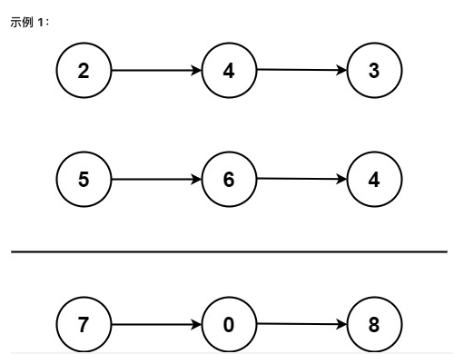
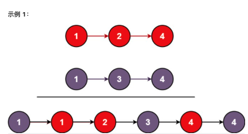

## leetcode 前100道题（easy + medium）

这里总结的主要是我理解的方法

### 1.两数之和
给定一个整数数组 nums 和一个整数目标值 target，请你在该数组中找出和为目标值 target 的那两个整数，并返回它们的数组下标。你可以假设每种输入只会对应一个答案。但是，数组中同一个元素在答案里不能重复出现。你可以按任意顺序返回答案。
>输入：nums = [2,7,11,15], target = 9        
>输出：[0,1]        
>解释：因为 nums[0] + nums[1] == 9 ，返回 [0, 1] 
```
class Solution:
    def twoSum(self, nums, target):
        hashtable = {}
        for i, num in enumerate(nums):
            if target - num not in hashtable:
                hashtable[num] = i
            return hashtable[target - num], i
```
### 2.两数相加



```
class ListNode:
    def __init__(self, val=0, next=None):
        self.val = val
        self.next = next
class Solution:
    def addTwoNumbers(self, l1, l2):
        curr = dummy = ListNode()
        count = 0
        while l1 or l2 or count:
            num = 0
            if l1:
                num += l1.val
                l1 = l1.next
            if l2:
                num += l2.val
                l2 = l2.next
            count, num = divmod(num + count, 10)
            curr.next = ListNode(num)
            curr = curr.next
        return dummy.next
```
### 3. 无重复字符的最长子串
给定一个字符串 s ，请你找出其中不含有重复字符的 最长子串 的长度。
>输入: s = "abcabcbb"        
>输出: 3          
>解释: 因为无重复字符的最长子串是 "abc"，所以其长度为 3。           
```
class Solution:
    def lengthOfLongestSubstring(self, s):
        ans = ''
        tmp = ''
        for i in s:
            if i not in s:
                tmp += i
            else:
                tmp = tmp[tmp.index(i)+1:] + i
            if len(tmp) > len(ans):
                ans = tmp
        return len(ans)
```
### 4.寻找两个正序数组的中位数 
给定两个大小分别为 m 和 n 的正序（从小到大）数组 nums1 和 nums2。请你找出并返回这两个正序数组的中位数 
>示例 1：        
>输入：nums1 = [1,3], nums2 = [2]        
>输出：2.00000     
>
>输入：nums1 = [1,2], nums2 = [3,4]         
>输出：2.50000
```
class Solution:
    def findMedianSortedArrays(self, nums1, nums2):
        nums = nums1 + nums2
        nums.sort()
        if len(nums) % 2 == 0:
            index = int(len(nums) / 2)
            return (nums[index-1]+nums[index])/2.0
        else:
            index = int((len(nums)+1)/2)
            return nums[index-1]
```
### 5. 最长回文子串
给你一个字符串 s，找到 s 中最长的回文子串。
>输入：s = "babad"         
>输出："bab"
```
class Solution:
    def longestPalindrome(self, s: str) -> str:
        res = ''
        resLen = 0
        for i in range(len(s)):
            # odd length
            l, r = i, i
            while l >= 0 and r < len(s) and s[l] == s[r]:
                if (r - l + 1) > resLen:
                    res = s[l: r+1]
                    resLen = r - l + 1
                l -= 1
                r += 1
            # even length
            l, r = i, i+1
            while l >= 0 and r < len(s) and s[l] == s[r]:
                if (r - l + 1) > resLen:
                    res = s[l: r+1]
                    resLen = r - l + 1
                l -= 1
                r += 1
        return res
```
### 6. Z字形变换
将一个给定字符串 s 根据给定的行数 numRows ，以从上往下、从左到右进行 Z 字形排列。
比如输入字符串为 "PAYPALISHIRING" 行数为 3 时，排列如下：
>P   A   H   N      
>A P L S I I G        
>Y   I   R            
之后，你的输出需要从左往右逐行读取，产生出一个新的字符串，比如："PAHNAPLSIIGYIR"。
```
class Solution:
    def convert(self, s, numRows):
        if numRows == 1:
            return s
        row_map = {row:"" for row in range(1,numRows+1)}
        row = 1
        up = True
        for letter in s:
            row_map[row] += letter
            if (row == 1) or ((row < numRows and up)):
                row += 1
                up = True
            else:
                row -= 1
                up = False
        convert = ''
        for row in range(1, numRows+1):
            convert += row_map[row]
        return convert
```
### 7.整数反转
给你一个 32 位的有符号整数 x ，返回将 x 中的数字部分反转后的结果。
如果反转后整数超过 32 位的有符号整数的范围 $[−2^{31},  2^{31} − 1]$ ，就返回 0。
```
class Solution:
    def reverse(self, x: int) -> int:
        if x >= 0:
            x = int(str(x)[::-1])
        else:
            x = str(x)[1:][::-1]
            x = '-' + x
            x = int(x)
        if abs(x) > 2 ** 31:
            return 0
        else:
            return x
```
### 8.字符串转换整数(atoi)
请你来实现一个 myAtoi(string s) 函数，使其能将字符串转换成一个 32 位有符号整数（类似 C/C++ 中的 atoi 函数）。

函数 myAtoi(string s) 的算法如下：

1. 读入字符串并丢弃无用的前导空格
2. 检查下一个字符（假设还未到字符末尾）为正还是负号，读取该字符（如果有）。 确定最终结果是负数还是正数。 如果两者都不存在，则假定结果为正。
3. 读入下一个字符，直到到达下一个非数字字符或到达输入的结尾。字符串的其余部分将被忽略。
4. 将前面步骤读入的这些数字转换为整数（即，"123" -> 123， "0032" -> 32）。如果没有读入数字，则整数为 0 。必要时更改符号（从步骤 2 开始）。
5. 如果整数数超过 32 位有符号整数范围 $[−2^{31},  2^{31} − 1]$ ，需要截断这个整数，使其保持在这个范围内。具体来说，小于 $[−2^{31}$ 的整数应该被固定为 $[−2^{31}$ ，大于 $2^{31} − 1]$ 的整数应该被固定为 $2^{31} − 1]$ 。
返回整数作为最终结果。
注意：
本题中的空白字符只包括空格字符 ' ' 。
除前导空格或数字后的其余字符串外，请勿忽略 任何其他字符。
```
import re
class Solution:
    def myAtoi(self, s: str) -> int:
        return max(min(int(*re.findall('^[\+\-]?\d+', s.lstrip())), 2**31 - 1), -2**31)
```
### 9. 回文数
回文数是指正序（从左向右）和倒序（从右向左）读都是一样的整数。
```
class Solution:
    def isPalindrome(self, x: int) -> bool:
        y = str(x)[::-1]
        if str(x) == y:
            return True
        else:
            return False
```
### 10. 正则表达式匹配
### 11. 盛最多水的容器

```
class Solution:
    def maxArea(self, height):
        largest = 0
        start = 0
        end = len(height) - 1
        while (start != end):
            next_area = min(height[start], height[end])*(end-start)
            if next_area > largest:
                largest = next_area
            if height[start] < height[end]:
                start += 1
            else:
                end -= 1
        return largest 
```
### 12. 整数转罗马数字

```
class Solution:
    def intToRoman(self, num):
        value_map = {1000: "M",900: "CM",500: "D",400: "CD",100: "C",90: "XC",
                     50: "L",40: "XL",10: "X",9: "IX",5: "V",4: "IV",1: "I",}
        res = ''
        for i in value_map:
            count = num // i
            if count:
                res += count * value_map[i]
                num %= i
        return res
```
### 13. 罗马数字转整数
```
class Solution:
    def romanToInt(self, s: str) -> int:
        dic = {'I':1,'V':5,'X':10,'L':50,'C':100,'D':500,'M':1000}
        sum = 0
        for i in range(len(s)-1):
            if dic[s[i]] < dic[s[i+1]]:
                sum -= dic[s[i]]
            else:
                sum += dic[s[i]]
        return sum+dic[s[-1]]
```
### 14. 最长公公前缀
编写一个函数来查找字符串数组中的最长公共前缀。
如果不存在公共前缀，返回空字符串 ""。         
>示例 1：
>输入：strs = ["flower","flow","flight"]     
>输出："fl"         
>示例 2：       
>输入：strs = ["dog","racecar","car"]          
>输出：""         
>解释：输入不存在公共前缀。       
```
class Solution:
    def longestCommonPrefix(self, strs):
        commonPrefix = ''
        length = min(len(word) for word in strs)
        strs = [word.lower() for word in strs]
        for i in range(length):
            dic = set([word[i] for word in strs])
            if len(list(dic)) == 1:
                commonPrefix += strs[0][i]
            else:
                break
        return commonPrefix
```
### 15. 三数之和
给你一个包含 n 个整数的数组 nums，判断 nums 中是否存在三个元素 a，b，c ，使得 a + b + c = 0 ？请你找出所有和为 0 且不重复的三元组。
>输入：nums = [-1,0,1,2,-1,-4]           
>输出：[[-1,-1,2],[-1,0,1]]
```
class Solution:
    def threeSum(self, nums: List[int]) -> List[List[int]]:
        res = []
        nums.sort()
        for i, a in enumerate(nums):
            if i > 0 and a == nums[i-1]:
                continue
            l, r = i+1, len(nums)-1
            while l < r:
                threeSum = a + nums[l] + nums[r]
                if threeSum > 0:
                    r -= 1
                elif threeSum < 0:
                    l += 1
                else:
                    res.append([a, nums[l], nums[r]])
                    l += 1
                    while nums[l] == nums[l - 1] and l < r:
                        l += 1
        return res
```


### 20. 有效的括号
>输入：s = "()"      
>输出：true        
>输入：s = "([)]"          
>输出：false      
```
class Solution:
    def isValid(self, s):
        stack = []
        for i in s:
            if i in '([{':
                stack.append(i)
            if i == ')' and stack and stack[-1] == '(':
                stack.pop()
            if i == ']' and stack and stack[-1] == '[':
                stack.pop()
            if i == '}' and stack and stack[-1] == '{':
                stack.pop()
            else:
                return False
        if stack:
            return False
        else:
            return True
```
### 21.合并两个有序链表

```
class ListNode:
    def __init__(self, val=0, next=None):
        self.val = val
        self.next = next
class Solution:
    def mergeTwoLists(self, list1, list2):
        curr = dummy = ListNode(0)
        while list1 and list2:
            if list1.val > list2.val:
                curr.next = list2
                list2 = list2.next
            else:
                curr.next = list1
                list1 = list1.next
            curr = curr.next
        curr.next = list1 or list2
        return dummy.next
```


### 26. 删除有序数组中的重复项
>输入：nums = [0,0,1,1,1,2,2,3,3,4]        
>输出：5, nums = [0,1,2,3,4]
```
class Solution:
    def removeDuplicates(self, nums):
        position = 1
        while position < len(nums):
            if nums[position] == nums[position - 1]:
                nums.pop(position)
            else:
                position += 1
        return len(nums)
```
### 27. 移除元素
>输入：nums = [3,2,2,3], val = 3           
>输出：2, nums = [2,2]      
```
class Solution:
    def removeElement(self, nums, val):
        position = 0
        while position < len(nums):
            if nums[position] == val:
                nums.pop(position)
            else:
                position += 1
        return len(nums)
```
### 28. 实现strStr()
给你两个字符串 haystack 和 needle ，请你在 haystack 字符串中找出 needle 字符串出现的第一个位置（下标从 0 开始）。如果不存在，则返回  -1 。对于本题而言，当 needle 是空字符串时我们应当返回 0 。
```
class Solution:
    def strStr(self, haystack, needle):
        return 0 if needle == '' else haystack.find(needle)
```
### 35.搜索插入位置
给定一个排序数组和一个目标值，在数组中找到目标值，并返回其索引。如果目标值不存在于数组中，返回它将会被按顺序插入的位置。
>输入: nums = [1,3,5,6], target = 5          
>输出: 2       
```
class Solution:
    def searchInsert(self, nums, target):
        if target not in nums:
            nums.append(target)
        return sorted(nums).index(target)
```